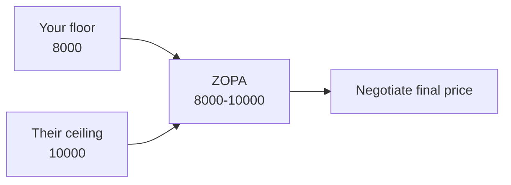

# Negotiation and game theory

When your outcome depends on someone else's choice too, classical decision theory isn't enough. **Game theory** studies strategic interactions formally.

## 1. Integrative vs distributive negotiation

- **Distributive**: fixed pie. Your gain is the other's loss (zero-sum). Used-car price haggling.
- **Integrative**: pie can grow. Looking at interests (not positions) reveals positive-sum deals.

Classic example (Fisher-Ury *Getting to Yes*, 1981): two sisters fight over an orange, split it 50/50. One wanted the peel for a cake, the other the pulp for juice. Understanding interests would have given each 100% of what they wanted. Positions ("I want the orange") hid interests ("I want the peel"); negotiating on positions destroys value.

## 2. Harvard's four principles (Fisher-Ury)

1. **Separate people from the problem**: dispute about merits ≠ personal attack.
2. **Focus on interests, not positions**: ask why you want X.
3. **Generate options for mutual gain** before deciding (brainstorm without judgment).
4. **Use objective criteria**: market standards, precedents, laws.

## 3. BATNA and ZOPA

**BATNA** (Best Alternative To a Negotiated Agreement): your plan B. The better your BATNA, the stronger your bargaining position.

**ZOPA** (Zone Of Possible Agreement): the range of mutually acceptable deals.

Example: sell car. Min acceptable: €8000. Buyer max: €10000. ZOPA = [8000, 10000]. No ZOPA = no deal possible.

## 4. Game theory basics

### Payoff matrix

Row = your strategy, column = opponent's, cell = (your payoff, their payoff).

### Dominant strategy

Better than all alternatives no matter what the other does. If both have a dominant strategy, equilibrium is trivial.

### Nash equilibrium

No player can improve by unilaterally changing strategy (given the other's choice). Nash (1950) proved every finite game has at least one equilibrium in mixed strategies.

## 5. Prisoner's dilemma

Two suspects, interrogated separately. Confess or stay silent?

| | They silent | They confess |
|---|---|---|
| **You silent** | -1, -1 | -10, 0 |
| **You confess** | 0, -10 | -5, -5 |

Years in prison (negative). Dominant strategy: confess (better whatever the other does). Equilibrium: both confess (-5 each). But if both had stayed silent: -1 each.

**Individually rational equilibrium is collectively irrational**. Foundational example in cooperation literature.

### Repeated games: tit-for-tat

If the game repeats, cooperation can emerge. Axelrod (1980) tournament: **tit-for-tat** (Rapoport) wins:

1. First round: cooperate.
2. Then: copy the opponent's last move.

Nice (never defects first), retaliatory (punishes immediately), forgiving (returns to cooperation), clear.

## 6. Other canonical games

### Coordination

| | A | B |
|---|---|---|
| **Stadium** | 2,2 | 0,0 |
| **Cinema** | 0,0 | 1,1 |

Two equilibria. Coordinating on the better one requires communication.

### Chicken

| | Swerve | Straight |
|---|---|---|
| **Swerve** | 0, 0 | -1, 1 |
| **Straight** | 1, -1 | -10, -10 |

Pure equilibria: (swerve, straight), (straight, swerve). Mixed: swerve with probability < 1.

Applications: nuclear standoffs (Cuba 1962), Brexit negotiations.

### Battle of the sexes

Coordinate on an activity, each prefers different. Multiple asymmetric equilibria.

## 7. Mixed strategies

When no pure equilibrium exists, randomize. In rock-paper-scissors, equilibrium: 1/3 each.

## 8. Sequential games

Extensive form: decision tree. **Backward induction**: from leaves, compute optimal payoff, propagate backward.

### Ultimatum game

A proposes splitting $100. B accepts or rejects. Reject → both get 0.

Theoretical equilibrium: B accepts any positive offer (1 > 0). A offers 1, keeps 99.

Real result (Güth 1982): most humans reject offers < 30%. Fairness, not narrow rationality. Standard game theory fails to predict — input for behavioral economics.

## 9. Mechanism design (brief)

Inverse problem: given that people play strategically, how do I design **rules** to get the social outcome I want?

- Auctions: Vickrey second-price (1961) induces truthful bidding.
- Voting: Arrow's impossibility — no perfect voting system.
- Matching: Gale-Shapley deferred acceptance for doctors-hospitals, students-schools.

## Exercises

  
Selling a startup, what's your BATNA?

Best non-negotiated option: sell to another buyer, keep running, merge with another. Better BATNA = can refuse low offers. Weak BATNA ("no other buyer, company is decaying") = must accept narrow ZOPA.

  
Build a prisoner's dilemma for "two nations reducing CO2 emissions".

| | Other reduces | Other doesn't |
|---|---|---|
| **You reduce** | climate ok, cost, cost | climate ok-ish, cost, free |
| **You don't reduce** | climate ok-ish, free, cost | climate bad, free, free |

"Don't reduce" is dominant for each. Result: neither reduces. Classic "tragedy of the commons" (Hardin 1968). Real solutions: binding agreements (Paris), sanctions, carbon pricing — modify the payoff matrix.

## Summary

- Integrative negotiation reveals expandable pies behind rigid positions.
- Four Harvard principles: separate people, focus interests, multiple options, objective criteria.
- BATNA = your strength. ZOPA = deal space.
- Nash equilibrium: no unilateral improvement.
- Prisoner's dilemma: individual rationality, collective suboptimum.
- Tit-for-tat wins repeated games.
- Ultimatum game: humans aren't pure homo economicus — fairness matters.

## Further reading

- Fisher, Ury, Patton, *Getting to Yes* (1981/2011).
- Axelrod, *The Evolution of Cooperation* (1984).
- Nash, *Equilibrium Points in n-Person Games*, PNAS (1950).
- Camerer, *Behavioral Game Theory* (2003).
