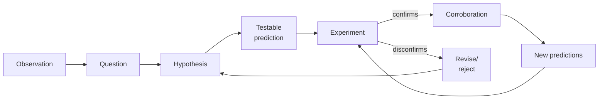

# Scientific method, Popper, falsifiability

"The scientific method" is one of those things taught as if settled — "observation, hypothesis, experiment, conclusion" — when in fact what exactly it is, and how to draw the science/non-science line, remains debated.

## 1. Classical induction (Bacon, Mill)

Francis Bacon (*Novum Organum*, 1620): overturn Aristotelian top-down deduction. Start from **observations**, build progressive generalizations.

John Stuart Mill (*A System of Logic*, 1843) formalizes causal canons: Agreement, Difference, Residues, Concomitant Variation. Ancestors of modern **experimental design** (RCT, controls).

## 2. The problem of induction (Hume 1748)

David Hume: how do you justify induction? "The sun has risen for millennia, therefore it will rise tomorrow" — justified?

Hume's argument:

1. Inferring the future from past requires the **uniformity of nature** principle (UNP).
2. UNP comes from? Either a priori (no — uniformity is contingent) or from experience (i.e. inductively: nature has been uniform, so it'll be).
3. The second route is **circular**: induction to justify induction.

Conclusion: induction has no rational justification — only a **psychological habit**. Useful, but unjustified.

Goodman (1955) aggravates with **grue/bleen**: how do I decide "all emeralds are green" vs "all emeralds are *grue*" (green until 2050, then blue)? Past data supports both.

## 3. Popper's response: falsificationism

Karl Popper, *Logik der Forschung* (1934; *The Logic of Scientific Discovery*, 1959). Thesis: science **doesn't proceed by induction**. It proceeds by **conjectures and refutations**:

1. Propose bold hypotheses.
2. Deductively derive testable predictions.
3. Attempt to **falsify**.
4. Hypotheses surviving falsification are *corroborated* — never *verified*. They remain provisional.

### Verification/falsification asymmetry

"All swans are white" can't be verified (would need to check every swan). But it's **falsifiable**: one black swan suffices. Australia found black swans in 1697; the claim fell.

For Popper, falsifiability **demarcates** science. Unfalsifiable theories may be true, meaningful, important — but not scientific.

### Popper examples

- Einstein's GR: "sun deflects starlight by X arcseconds". Eddington 1919 measured and confirmed. Could have falsified — the theory was at risk.
- Marxism, psychoanalysis: too flexible to falsify. Explain anything post hoc. Pseudoscience.

## 4. Demarcation criterion

**Falsifiability = science**.

| Claim | Falsifiable? | Scientific? |
|---|---|---|
| All metals expand with heat | yes (find one that contracts) | yes |
| Auras surround individuals | depends on operationalization | dubious |
| God acts in history via inscrutable events | no | no (not "false", just not scientific) |
| Homeopathy works beyond placebo | yes (RCT) — and has been falsified | scientific (and falsified) |

### Astrology vs astronomy

Astronomical predictions on an eclipse are falsifiable to the second. Astrological predictions ("you'll meet someone important") are vague enough to survive any outcome. **That vagueness is the symptom of non-science.**

## 5. Limits of naive falsificationism

### Duhem-Quine thesis

A theory is never tested alone. Always with **auxiliary hypotheses**: instruments, measurement, boundary conditions. If experiment contradicts theory, you can reject the theory *or* an auxiliary.

Historical example: Uranus didn't obey Newtonian mechanics. Options: (a) falsify Newton, (b) postulate an unknown perturbing planet. They chose (b) — and in 1846 found **Neptune** exactly where calculated.

Good auxiliary: new planet verified. Bad auxiliary: theory survives only via *ad hoc rescues* — Lakatos's **degenerating programmes** (see [Kuhn-Lakatos-Feyerabend](44-kuhn-lakatos-feyerabend.html)).

### Statistical falsification

Statistical theories don't falsify with one counterexample. "Smoking raises lung cancer risk" isn't falsified by a healthy smoker. Aggregate data and statistical models do the work.

### Psychological asymmetry

Researchers (humans) prefer confirmations to falsifications. Institutional science (peer review, replication) must compensate. The replication crisis (Ioannidis 2005) shows the system often fails.

## 6. The method in practice

- Iterative, not linear.
- "Observation" is theory-laden.
- "Corroboration" ≠ "proof".

## 7. Astrology test

Shawn Carlson (*Nature*, 1985): astrologers had to match 116 psychological profiles to horoscopes (double-blind). Astrological prediction: hit rate > 50%. Result: 34% — **no better than chance**. Clean falsification.

## Exercises

  
"Crystals emit healing energies." Falsifiable?

Yes. Operationalize "healing": e.g. "reduce VAS lower-back pain after 4 weeks". RCT: group A crystal vs group B indistinguishable rock. Compare. Result: no difference statistically. Falsified.

Typical defense: "doesn't work in lab due to electrical interference" — ad hoc rescue → degenerating.

  
Would Popper count Darwin's theory as scientific?

Initially Popper called it "metaphysical" (weak predictions). In *Unended Quest* (1974) he reversed: evolution is scientific. "Survival of the fittest" is near-tautological, but concrete predictions of evolution (comparative anatomy, biogeography, intermediate fossils, DNA sequences) are falsifiable and corroborated. Core = fertile metaphysics, specific applications = falsifiable science.

## Summary

- Hume: induction unjustified — habit.
- Popper: science = conjectures + falsification attempts.
- Falsifiability = demarcation criterion.
- Duhem-Quine: never test theory alone; ad hoc rescues degrade.
- Replication crisis shows institutional method often fails.

## Further reading

- Hume, *Enquiry Concerning Human Understanding* (1748).
- Popper, *Logic of Scientific Discovery* (1959).
- Popper, *Conjectures and Refutations* (1963).
- Goodman, *Fact, Fiction, and Forecast* (1955).
- Ioannidis, *Why Most Published Research Findings Are False*, PLOS Med (2005).
