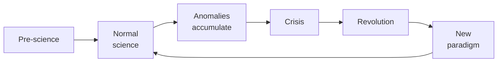

# Paradigms: Kuhn, Lakatos, Feyerabend

Popper's vision was idealized: scientists propose bold conjectures and try to falsify them. The actual history of science is different. In the 1960s-70s, Kuhn, Lakatos, Feyerabend described science as **social-historical practice**, not idealized algorithm.

## 1. Thomas Kuhn — *The Structure of Scientific Revolutions* (1962)

The most influential 20th-century book in philosophy of science. Kuhn was originally a historian of physics.

### Cycle of science

- **Normal science**: community works within a shared **paradigm**. Solves "puzzles".
- **Anomalies**: results not fitting. Initially ignored or reinterpreted.
- **Crisis**: too many anomalies.
- **Revolution**: a rival, incompatible paradigm emerges. Community battle. New wins (often as old guard retires).

### Paradigm

Polysemic (Kuhn himself counted 21 uses). It means:

- **Exemplary model** (Maxwell's equations, double helix).
- **Disciplinary matrix**: symbols, ontological models, values (what counts as "good explanation"), paradigmatic exemplars.

### Incommensurability

Most discussed concept. Two paradigms are **incommensurable** if they share no neutral language for comparison. "Mass" in Newton vs Einstein "means" different things — embedded in different theories. Consequence: paradigm change isn't "linear cumulative progress".

Kuhn later reformulated to "local incommensurability".

### Historical examples

Ptolemaic → Copernican (1543). Phlogiston → oxygen (Lavoisier). Newton → Einstein. Spontaneous generation → biogenesis. Continental drift (Wegener 1912, accepted 1960s as plate tectonics).

## 2. Imre Lakatos — *Methodology of Scientific Research Programmes* (1970)

Synthesis between Popper and Kuhn. Real theories aren't dropped at first counterexample (contra naive Popper); but Kuhn's view is too "irrationalist".

### Research programmes

A **scientific research programme** has:

- **Hard core**: fundamental, non-negotiable assumptions. E.g. "F=ma".
- **Protective belt**: auxiliary hypotheses, boundary conditions, instruments. Modifiable.

When anomaly arrives, modify the belt, not the core.

### Progressive vs degenerating

- **Progressive**: belt modifications produce **new predictions that get confirmed**.
- **Degenerating**: modifications are **ad hoc**, save the theory but produce no new predictions.

Progressive example: Newton predicting Neptune from Uranus anomalies.

Degenerating example: astrology's "Mercury retrograde" rescues.

Distinction is judgable **retrospectively**.

## 3. Paul Feyerabend — *Against Method* (1975)

Most radical of the three. Methodological anarchism.

### Thesis

There is *no* universal method that characterizes science. Every methodological rule has been violated in pivotal scientific advances.

E.g. Galileo embraced Copernicanism *before* having decisive evidence (telescope observations weren't trusted then); used propaganda, rhetoric, co-opted vocabulary.

### "Anything goes"

Feyerabend: **anything goes** — though not as endorsement; as descriptive claim.

### Radical critique of scientific rationalism

Modern Western science is *one* tradition among many, not a priori superior. Defends epistemological pluralism: Chinese medicine, indigenous agriculture, etc. can produce legitimate knowledge.

Controversial position, often misread as anti-science. Feyerabend was a friend of science but critic of **dogmatic methodism**.

## 4. Comparison

| | Popper | Kuhn | Lakatos | Feyerabend |
|---|---|---|---|---|
| Method? | falsification | depends on paradigm | methodological + historical | none |
| Rationality of change? | individual | sociological | inter-programme | anti-rationalist |
| Truth? | progressive approximation | incommensurability | program-relative | pluralist |
| Demarcation? | falsifiability | paradigm + community | progressive vs degenerating | none |

## 5. Contemporary examples

### Multiverse cosmology

Some inflation models predict infinitely many universes. Seems unfalsifiable. Critique: pseudo-science. Defense: consequence of testable theories.

### Evolutionary psychology

Just-so stories accusation vs concrete predictions on preferences, culture differences.

### String theory

Decades of "non-science" accusation for lacking testable predictions. Survives because mathematically fertile, produces ideas usable elsewhere.

## 6. For ordinary critical thinking

What this means for non-researchers:

- Don't oversell "scientific consensus" as oracle: it reflected the current paradigm, was overturned before, will be again.
- Don't undersell it: consensus reflects decades of cumulative evidence; alternative theories carry burden of proof.
- Distinguish ad hoc tweaks (suspect) from progressive extensions (legit).
- Suspect theories that "explain everything" — inevitably unfalsifiable.

## Exercises

  
Is classical Freudian psychoanalysis a progressive or degenerating programme (Lakatos)?

Arguably **degenerating** post-1950s: protective belt expanded to explain counter-evidence ("if no symptoms, repression of repression") without new confirmed predictions. Some sub-theories (e.g. Bowlby's attachment) are progressive.

## Summary

- Kuhn: normal science in paradigm + revolutions + incommensurability.
- Lakatos: research programmes = hard core + protective belt; progressive vs degenerating.
- Feyerabend: no universal method; "anything goes" — anti-dogmatic.
- Implications: scientific consensus is epistemically valuable but not sacred; discern ad hoc from fertile extension.

## Further reading

- Kuhn, *The Structure of Scientific Revolutions* (1962).
- Lakatos & Musgrave (eds), *Criticism and the Growth of Knowledge* (1970).
- Feyerabend, *Against Method* (1975).
- Chalmers, *What Is This Thing Called Science?* (4th ed., 2013).
