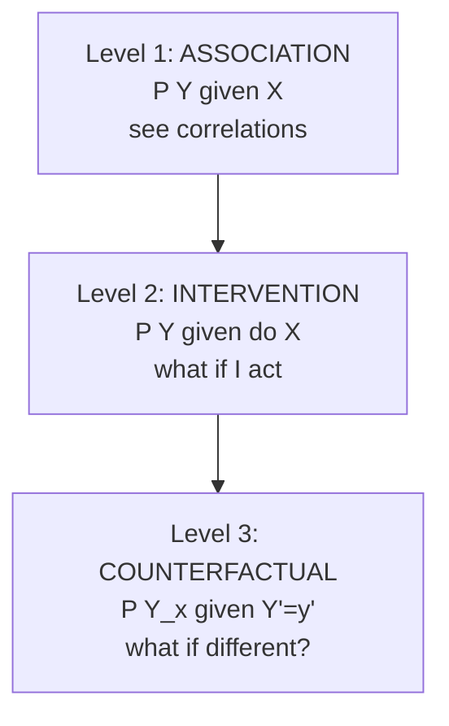
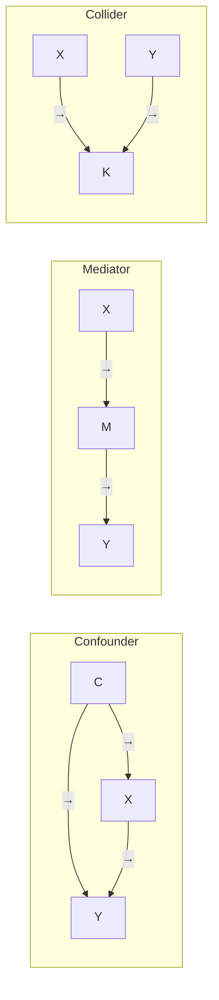

# Causality: Hume, Pearl, do-calculus

"Correlation does not imply causation" is taught everywhere. But what does "cause" mean? And how to establish causation from data? Philosophy circled the question for 2000 years. Since the 1990s, Judea Pearl has given a precise technical answer that's transformed statistics, epidemiology, AI.

## 1. Hume: causality as habit

David Hume (*Treatise*, 1739): we never observe "the cause". We observe:

1. **Spatial contiguity**.
2. **Temporal succession**.
3. **Constant conjunction**.

Causal "necessity" is just psychological habit of expecting $B$ after $A$. **Regularity theory**.

Critique: too many false positives. Day precedes night, but Earth's rotation causes both.

## 2. Mill's methods (1843)

Empirical discrimination:

- **Agreement**: shared factor across positive cases.
- **Difference**: factor that varies between positive and control.
- **Joint method**: combine.

Ancestor of **experimental design**: treatment and control groups.

## 3. Traditional statistical paradigm

For most of the 20th century, statistics refused formal causal talk. Pearson (1911) called the concept "obsolete".

Tools: correlation, regression, RCT (Fisher 1925). RCT is gold standard because randomization guarantees comparable groups → mean difference is causal.

Problem: often you can't randomize (epidemiology, economics, social science). Need other methods.

## 4. Pearl's revolution

Judea Pearl (*Causality*, 2000). Turing Award 2011.

### Tools

**Causal diagrams (DAG)**: nodes = variables, arrows = direct causal relations. Make assumptions **explicit**.

**$do(\cdot)$ operator**: $P(Y | do(X=x))$ = probability of $Y$ if you *intervene* setting $X=x$. Distinct from $P(Y | X=x)$ (observation).

**Structural Causal Model (SCM)**: equations $X_i = f_i(\text{Pa}(X_i), U_i)$. Compute interventions and counterfactuals.

### Ladder of causation



- **L1 — Association**: "Of smokers, how many get cancer?". Available from observational data.
- **L2 — Intervention**: "If I forced someone to smoke, what cancer risk?". Manipulation required.
- **L3 — Counterfactual**: "Marco smoked, got cancer. Would he have if he hadn't?". Counterfactual question.

Higher rungs aren't generally answerable from data alone of lower rungs. **You need a causal model to intervene or counterfactualize.**

## 5. Confounder, mediator, collider

Three causal structures involving a third variable $C$ that links $X$ and $Y$.



- **Confounder**: causes both $X$ and $Y$ — creates spurious correlation. Classic: smoking causes both coffee drinking and lung cancer (both correlated, but not causally direct).
- **Mediator**: sits between — $X \to M \to Y$. Exercise → less fat → less heart disease.
- **Collider**: both $X$ and $Y$ cause $K$. Conditioning on $K$ creates spurious correlation between $X$ and $Y$ (collider bias / Berkson's paradox).

### Collider example: Hollywood beauty and talent

Among Hollywood stars, beauty and acting talent appear uncorrelated (even slightly anti-correlated). Causal explanation: neither alone is necessary, but Hollywood requires enough of one *or* the other. Hollywood = collider. Conditioning on "being in Hollywood" induces spurious anti-correlation among selected.

## 6. Backdoor criterion

Question: given a DAG, how to compute $P(Y | do(X))$ from observational $P(Y, X, \ldots)$?

**Backdoor criterion** (Pearl 1995): a set $Z$ is admissible if:

1. $Z$ contains no descendants of $X$.
2. $Z$ blocks all "backdoor" paths between $X$ and $Y$.

Then:

$$P(Y | do(X)) = \sum_z P(Y | X, Z=z) P(Z=z)$$

Confounder example: $C \to X, C \to Y, X \to Y$. Conditioning on $C$ identifies the causal effect.

## 7. Frontdoor criterion

For when confounder is unobservable. If there's an observed mediator $M$ between $X$ and $Y$ unaffected by the confounder:

```
X → M → Y
↑       ↑
U ──────┘
```

The frontdoor formula still identifies $P(Y | do(X))$.

## 8. Do-calculus

Three rules of transformation. Every identifiable causal effect from a DAG can be rewritten as observable probabilities.

1. Insertion/deletion of observations.
2. Action/observation exchange.
3. Insertion/deletion of actions.

**Completeness** (Shpitser-Pearl, Huang-Valtorta): if an effect is identifiable, do-calculus finds it.

## 9. Counterfactuals

Highest rung. "Had Marco not smoked, would he have gotten cancer?". Requires SCM and "twin world" procedure:

1. **Abduction**: deduce exogenous values from observation.
2. **Action**: intervene $X \leftarrow x'$ in the model.
3. **Prediction**: compute $Y$ under the new model.

Applications: legal responsibility, individualized treatment.

## 10. Practical implications

- "Correlation ≠ causation" isn't enough. You need to know *which causal structure* generates the data.
- Observational data **underdetermines** causal structure. Need assumptions.
- RCTs are gold but not always feasible. Pearl shows when observational methods are valid.
- Modern causal inference tools: DoWhy, EconML, causalML implement this.

## Exercises

<details>
  <summary>Ice cream sales and drownings are correlated. DAG?</summary>

Confounder `summer month`. Summer → ice cream sales. Summer → drownings. Condition on month: correlation disappears.
</details>

<details>
  <summary>Study: patients receiving treatment X have higher mortality. Does X increase mortality?</summary>

Possible collider/selection bias: those receiving X are sicker patients. Severity (latent) causes both "receive X" and "mortality". To estimate effect, condition on severity (confounder), or RCT.
</details>

## Summary

- Hume: causation = constant conjunction + habit.
- Mill, Fisher: experimental methods → RCT as gold.
- Pearl: DAG + $do(\cdot)$ + ladder (association, intervention, counterfactual).
- Confounder vs mediator vs collider: opposite implications.
- Backdoor and frontdoor criteria identify causal effects from observation, under explicit assumptions.
- Do-calculus: complete formal machinery for causal identification.

## Further reading

- Pearl, *Causality* (2009, 2nd ed.).
- Pearl & Mackenzie, *The Book of Why* (2018).
- Hernán & Robins, *Causal Inference: What If* (2020, free online).
- Imbens & Rubin, *Causal Inference* (2015) — Rubin paradigm.
