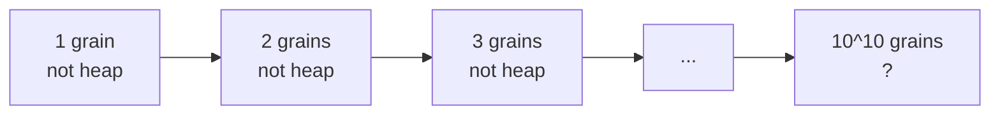
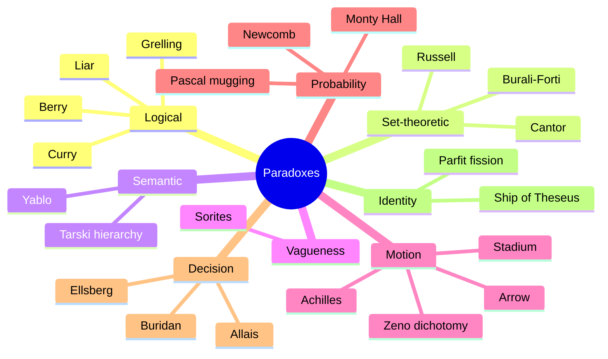

# Famous paradoxes: logic, sets, motion, decision

A paradox, in the technical sense given by W. V. Quine ("The Ways of Paradox", 1962), is an apparently sound argument that leads to an apparently absurd conclusion. Quine distinguishes three flavours: *veridical* paradoxes (the conclusion is in fact true, only counter-intuitive — the Monty Hall problem), *falsidical* paradoxes (the argument hides a fallacy — Zeno's dichotomy), and *antinomies* (genuine contradictions that force a revision of the underlying theory — Russell's paradox, the Liar). The history of logic is in large part the history of antinomies: each one has forced philosophers to redraw the line between syntax, semantics and metaphysics.

This section is a compact field guide to fifteen of the most influential paradoxes. For each we state the puzzle, diagnose *why* it is a paradox, and survey the major proposed solutions. The grouping follows the dominant problem each puzzle exposes: logical/semantic, set-theoretic, vagueness, motion, probability, decision, identity.

## 1. Logical and semantic paradoxes

### 1.1 The Liar (Eubulides, 4th c. BC)

> "This sentence is false."

If $L$ is true, then it says of itself that it is false — so it is false. If $L$ is false, then what it says is the case — so it is true. Either assignment of truth value contradicts itself. Eubulides of Miletus, a Megaric philosopher, gave at least seven paradoxes; Cicero (*Academica* II) reports the Stoic philosopher Philetas of Cos died from the strain of trying to solve it.

**Diagnosis.** The Liar shows that a sufficiently expressive language (one that contains its own truth predicate plus self-reference) cannot be both consistent and have a *naive* notion of truth. Alfred Tarski's solution (1933, *The Concept of Truth in Formalized Languages*) is the **hierarchy of metalanguages**: truth for sentences of language $L_n$ is defined only in $L_{n+1}$. Saul Kripke ("Outline of a Theory of Truth", 1973) proposes a fixed-point construction where pathological sentences receive neither true nor false but a third value, *undefined*. Graham Priest defends **dialetheism**: the Liar is genuinely both true and false, and we need a paraconsistent logic that tolerates this (see [Non-classical logic](18-non-classical-logic.html)).

### 1.2 Russell's paradox (Bertrand Russell, 1901)

Let $R = \{x : x \notin x\}$ be the set of all sets that are not members of themselves. Ask: is $R \in R$?

$$R \in R \;\Leftrightarrow\; R \notin R$$

A flat contradiction. Russell discovered it in June 1901 while reading Frege's *Grundgesetze der Arithmetik* and wrote to Frege on 16 June 1902. Frege replied: *"Arithmetic totters."* Volume II of the *Grundgesetze* had to add a desperate appendix.

**Diagnosis.** Naive set theory's **unrestricted comprehension** axiom — for any predicate $\varphi(x)$, the set $\{x : \varphi(x)\}$ exists — is inconsistent. The standard repair is **Zermelo-Fraenkel set theory** (1908, 1922), which replaces unrestricted comprehension with the *Axiom of Separation*: from an existing set $A$ you may form $\{x \in A : \varphi(x)\}$. Russell's own repair was the **theory of types** (Russell-Whitehead, *Principia Mathematica*, 1910–13): every variable carries a type level, and $x \in y$ is well-formed only if $y$ is one level higher than $x$, blocking the self-membership question. Quine's NF (1937) is a third option.

### 1.3 Berry's paradox (G. G. Berry, 1906)

Consider the description: *"the smallest positive integer not definable in fewer than twelve English words."* That description has eleven words, yet it allegedly defines a number that requires twelve.

**Diagnosis.** The paradox conflates **expressibility in English** (an informal, unstable notion) with mathematical definability. Within a formal system the predicate "definable in fewer than $n$ symbols" is not itself definable in the same system without paradox — a fact closely connected to Gödel's incompleteness ([Metalogic and Gödel](15-metalogic-godel.html)) and to Tarski's theorem on the undefinability of truth.

### 1.4 Grelling-Nelson paradox (1908)

An adjective is **autological** if it applies to itself ("short" is short, "polysyllabic" is polysyllabic), **heterological** otherwise ("long" is not long). Is "heterological" heterological?

$$\text{"heterological" is heterological} \;\Leftrightarrow\; \text{it is not heterological}$$

A semantic cousin of Russell's paradox. Same family of solutions (typing of semantic predicates; restriction of self-application).

### 1.5 Curry's paradox (Haskell Curry, 1942)

Take any sentence $X$ (say, *"Santa Claus exists"*) and form
$$C: \;\text{If this sentence is true, then } X.$$
Naive reasoning, using only modus ponens and conditional proof, derives $X$. Whatever $X$ is.

**Diagnosis.** Curry shows that the Liar's pathologies do not even require negation. The culprit is **contraction**, the structural rule $A \rightarrow (A \rightarrow B) \vdash A \rightarrow B$. **Substructural logics** (linear logic, relevance logic, light logics) drop contraction precisely to block Curry-style derivations.

## 2. Set-theoretic paradoxes

### 2.1 Cantor's paradox (1899)

Cantor's theorem ([Sets and relations](14-sets-relations-functions.html)) proves that for any set $A$, the power set $\mathcal{P}(A)$ has strictly greater cardinality: $|A| < |\mathcal{P}(A)|$. Now take $U$ to be the "set of all sets". Then $\mathcal{P}(U) \subseteq U$ (every member of $\mathcal{P}(U)$ is a set, hence a member of $U$), which would give $|\mathcal{P}(U)| \le |U|$, contradicting Cantor's theorem.

**Diagnosis.** There is no set of all sets in ZFC. The collection of all sets is a **proper class** (von Neumann-Bernays-Gödel set theory makes this explicit).

### 2.2 Burali-Forti paradox (Cesare Burali-Forti, 1897)

The ordinals are linearly ordered by membership. If the set $\Omega$ of all ordinals existed, $\Omega$ itself would be an ordinal greater than every ordinal — including itself. Contradiction.

**Diagnosis.** Same as Cantor: $\Omega$ is a proper class, not a set. Historically the first of the set-theoretic antinomies; Burali-Forti's 1897 paper anticipated Russell by four years, though Russell's formulation has more philosophical reach.

## 3. Semantic paradoxes without self-reference: Yablo (1993)

Stephen Yablo asked whether self-reference is essential to the Liar. Consider the infinite sequence of sentences:

- $S_1$: "All $S_k$ for $k > 1$ are false."
- $S_2$: "All $S_k$ for $k > 2$ are false."
- $S_3$: "All $S_k$ for $k > 3$ are false."
- ...

No sentence refers to itself. Yet a uniform assignment of truth values is impossible: if any $S_n$ is true, then $S_{n+1}$ is false (so some $S_k$ for $k > n+1$ is true), but $S_n$ said all later sentences are false — contradiction. If $S_n$ is false, some later $S_k$ is true, which by the same step generates a contradiction.

**Diagnosis.** Yablo's paradox shows that **circularity** rather than **self-reference** is the deep pathology. (Though Graham Priest argues Yablo's sequence still encodes a hidden fixed point, so the debate is open.) See Cook, *The Yablo Paradox* (Oxford, 2014).

## 4. Vagueness: the Sorites (heap)

Attributed to Eubulides again. One grain of sand is not a heap. If $n$ grains do not make a heap, then $n+1$ grains do not make a heap. By induction, $10^{10}$ grains are not a heap. Yet plainly they are.

**Diagnosis.** The Sorites attacks vague predicates whose **tolerance** principle ("adding one grain does not change heap-status") is incompatible with their **clear cases** at both ends. Major responses:

- **Epistemicism** (Timothy Williamson, *Vagueness*, 1994): there *is* a sharp cut-off, we just cannot know it.
- **Supervaluationism** (Kit Fine, 1975): a sentence is super-true iff true on every admissible precisification. "$n$ grains is a heap" is neither super-true nor super-false in the borderline.
- **Fuzzy logic** (Zadeh, 1965): truth comes in degrees in $[0,1]$, and "heap" has a graded extension. See [Non-classical logic](18-non-classical-logic.html).
- **Contextualism** (Stewart Shapiro): the threshold shifts with context.

## 5. Zeno's paradoxes of motion (5th c. BC)

Zeno of Elea defended Parmenides' monism by arguing that plurality and motion are illusions. Aristotle's *Physics* (VI) preserves four arguments.

### 5.1 Dichotomy
Before reaching destination $D$, the runner must reach $D/2$. Before that, $D/4$. Before that, $D/8$. Infinitely many sub-tasks must be completed in finite time. Motion is impossible.

### 5.2 Achilles and the tortoise
Achilles spots the tortoise $100$ m ahead. He reaches the tortoise's starting point; the tortoise has meanwhile moved $1$ m. Achilles covers that; the tortoise moves $1\,\text{cm}$. Ad infinitum: Achilles never catches up.

### 5.3 The arrow
At any single instant the arrow occupies a region equal to itself — it is at rest. Time is a succession of instants. Therefore the arrow is always at rest.

### 5.4 The stadium
Three rows of equal bodies move past each other; the same body passes two others in half the time it passes one. Hence "half the time equals the whole time".

**Diagnosis.** The dichotomy and Achilles paradoxes were dissolved by the modern theory of **convergent series**: $\sum_{n=1}^\infty 1/2^n = 1$. Achilles overtakes the tortoise at a finite time computable as a geometric sum. The arrow paradox is subtler: it concerns the relation between **instants** and **intervals**. Russell (*Principles of Mathematics*, 1903, §54) introduced the *at-at theory* of motion: motion is just being at different places at different times, no further "flowing" needed. Modern measure theory and the non-standard analysis of Abraham Robinson (1961) give further tools, but a full discussion engages metaphysics of time, supertasks, and the structure of the continuum (see Salmon, *Zeno's Paradoxes*, 1970).

## 6. Probability paradoxes

### 6.1 Newcomb's paradox (William Newcomb, 1960; Robert Nozick, 1969)

A reliable predictor offers two boxes. **Box A** is transparent and contains \$1,000. **Box B** is opaque and contains either \$1,000,000 or \$0. The predictor has already predicted your choice: if it predicted you would take only Box B, it put \$1,000,000 inside; if it predicted you would take both, Box B is empty. The predictor has been right in $99\%$ of previous cases. Do you take only B (one-boxing) or both (two-boxing)?

**Two-boxer:** the prediction is already made, the contents of B are fixed; whatever is in B, you get an extra \$1,000 by also taking A. **Dominance** reasoning recommends two-boxing.

**One-boxer:** in $99\%$ of cases, one-boxers walk away with \$1,000,000 and two-boxers with \$1,000. **Expected utility** reasoning recommends one-boxing.

| Strategy | Predictor sees one-box (0.99) | Predictor sees two-box (0.01) | $EU$ |
|---|---|---|---|
| One-box | \$1,000,000 | \$0 | \$990,000 |
| Two-box | \$1,001,000 | \$1,000 | \$11,000 |

**Diagnosis.** Newcomb's paradox is the headline conflict between **evidential** and **causal** decision theory. David Lewis ("Why Ain'cha Rich?", 1981) defends two-boxing on causal grounds; James Joyce, Andy Egan and others have refined the analysis. The puzzle deeply ties to free will, time, and the metaphysics of prediction.

### 6.2 Pascal's mugging (Eliezer Yudkowsky, 2007)

A stranger says: *"Give me five euros now, or I will use my magic powers to torture $3 \uparrow\uparrow\uparrow\uparrow 3$ people in a parallel universe."* You assign a tiny probability $\varepsilon$ to the threat being real. But the disutility is so enormous that $\varepsilon \cdot U$ still dominates any everyday option. Expected utility theory recommends paying.

**Diagnosis.** Either expected utility breaks down at extreme tails, or our willingness to assign even tiny credence to arbitrarily-large-utility scenarios must be capped. Bounded utility functions (Cox-Arrow tradition), leverage penalties (Yudkowsky), or rejecting arithmetic expected utility for unbounded scenarios are competing repairs. The paradox is a real concern in **AI alignment** discussions, where it gets called the *fanaticism problem*.

## 7. Decision: Buridan's ass

Attributed to Jean Buridan (14th c., though the example is older — Aristotle, *De Caelo* II.13, has a similar one with a hungry, thirsty man). An ass equidistant from two identical bales of hay has no reason to prefer one over the other. By the **principle of sufficient reason**, it cannot choose, and starves.

**Diagnosis.** Real agents break symmetries through noise, secondary preferences, or randomisation. Spinoza laughed at the example (*Ethics* II, scholium); Leibniz used a softer version to argue that perfect indifference is psychologically impossible. The deep modern descendant is the design of **tie-breaking rules** in voting theory and randomised algorithms — see Arrow's impossibility theorem and the use of $\varepsilon$-greedy strategies in reinforcement learning.

## 8. Identity: Ship of Theseus (Plutarch, *Vita Thesei* 23)

The Athenians preserved Theseus's ship by replacing planks as they decayed. Eventually every plank had been replaced. Is it still the same ship? Hobbes (*De Corpore*, 1655) sharpened the puzzle: suppose the discarded planks are reassembled into a second ship. Now there are two candidates — which is "the original"?

**Diagnosis.** The paradox confronts the **persistence conditions** for material objects. Major theories:

- **Endurantism / three-dimensionalism**: objects persist by being wholly present at each moment; identity over time requires a continuity criterion (causal, material, formal). Most endurantists pick the *continuously-repaired* ship.
- **Perdurantism / four-dimensionalism** (Quine, David Lewis): objects are space-time worms; the "original ship" is the worm whose temporal parts overlap with most planks at most times.
- **Eliminativism**: there are no ships at all, only plank-arrangements; the question is verbal.

The Ship of Theseus is the granddaddy of countless identity puzzles in biology (cell turnover), neuroscience (the self), law (corporate continuity) and software (Git rebases). It is also a direct ancestor of the **fission and teletransportation** thought experiments of Derek Parfit (*Reasons and Persons*, 1984).

## 9. A taxonomy

## 10. Legacy: what each paradox bought us

| Paradox | Field it forced into existence or reform |
|---|---|
| Russell | Type theory; ZF set theory |
| Liar / Curry | Tarskian truth hierarchy; substructural logics |
| Sorites | Vagueness theory; fuzzy & supervaluationist logics |
| Zeno | Modern analysis; theory of the continuum |
| Newcomb | Causal decision theory |
| Monty Hall | Pedagogical case for Bayesian reasoning (see [Probability paradoxes](34-probability-paradoxes.html)) |
| Ship of Theseus | Mereology; personal-identity theory |
| Berry | Algorithmic information theory (Chaitin) |

Paradoxes are not embarrassments to be hidden; they are the **stress tests** of our concepts. As Quine remarked, "Of all the ways of acquiring knowledge of the world, the paradoxes have been among the most fruitful."

## 11. Exercises

Exercise 1 — Diagnose the paradox

For each statement, identify which paradox it instantiates and whether it is veridical, falsidical, or an antinomy.

(a) "I always lie."
(b) "Take the smallest positive integer that cannot be described in fifteen English words."
(c) A computer program $P$ that, given any program, prints "halts" or "loops". Apply $P$ to itself, with the negation.

**Answer.** (a) Liar; antinomy. (b) Berry; antinomy (in naive English) — disappears in a formal language. (c) Halting-problem self-application, a paradox-of-self-reference cousin of the Liar; in formal computability theory it becomes a proof (Turing 1936) rather than an antinomy.

Exercise 2 — Compute Achilles' meeting point

Achilles runs at $10\,\text{m/s}$, the tortoise at $1\,\text{m/s}$, with a $100\,\text{m}$ head start. When does Achilles overtake the tortoise?

**Solution.** Position equations: Achilles $x_A(t) = 10t$; tortoise $x_T(t) = 100 + t$. Equate: $10t = 100 + t \Rightarrow 9t = 100 \Rightarrow t = 100/9 \approx 11.11\,\text{s}$. The sum of Zeno's infinitely many sub-tasks converges to this finite time; the geometric series $100 + 10 + 1 + 0.1 + \dots = 100 \cdot \frac{1}{1 - 1/10} = 111.11\,\text{m}$ is exactly the overtaking position.

Exercise 3 — Apply a Sorites response

A man is rich at $\$10^9$, not rich at $\$0$. The tolerance principle says: removing one cent never changes rich-status. Apply (i) supervaluationism, (ii) fuzzy logic, (iii) epistemicism.

**Solution.** (i) Supervaluation: a wealth $w$ is super-rich iff $w$ exceeds the threshold on *every* admissible precisification; super-poor iff below every; borderline otherwise. "Bob is rich at \$500,000" lacks classical truth value. (ii) Fuzzy: define $\mu_\text{rich}(w) = \sigma(\log_{10}(w/w_0))$, a sigmoid; "Bob is rich" has degree $0.6$. (iii) Epistemicism: there is a sharp threshold, perhaps \$731,452.07, which determines the truth — we just cannot know it.

Exercise 4 — One-box or two-box?

Suppose the Newcomb predictor is right $51\%$ of the time. Compute expected utilities for both strategies. Where is the threshold of accuracy at which the EU comparison flips?

**Solution.** Let $p$ be the predictor's accuracy. One-box EU $= p \cdot 10^6 + (1-p) \cdot 0 = 10^6 p$. Two-box EU $= p \cdot 1000 + (1-p) \cdot 1{,}001{,}000 = 1{,}001{,}000 - 10^6 p$. They cross when $10^6 p = 1{,}001{,}000 - 10^6 p \Rightarrow p = 0.5005$. With $p = 0.51$, one-boxing yields \$510,000 vs two-boxing's \$491,000 — one-box wins. The result is fragile: the threshold is right next to chance, which is precisely why Newcomb's paradox remains a stress test of decision theory.

## Summary

- A paradox is an argument with apparently true premises, apparently valid inference, and apparently false conclusion. Quine distinguishes veridical, falsidical, and antinomies.
- Logical/semantic paradoxes (Liar, Curry, Berry, Grelling) forced the development of Tarskian truth hierarchies, type theory, and substructural logics.
- Set-theoretic paradoxes (Russell, Cantor, Burali-Forti) forced the move from naive to axiomatic set theory.
- Yablo's paradox showed that *circularity*, not literal self-reference, is the deep pathology.
- The Sorites paradox spawned the modern theories of vagueness.
- Zeno's motion paradoxes dissolved with the modern theory of the continuum and convergent series.
- Newcomb's paradox separates causal from evidential decision theory; Pascal's mugging stresses expected utility at the tails.
- The Ship of Theseus opens the modern philosophy of personal identity.

## Further reading

- W. V. Quine, "The Ways of Paradox" (1962), reprinted in *The Ways of Paradox and Other Essays*, Harvard UP.
- R. M. Sainsbury, *Paradoxes*, 3rd ed., Cambridge UP, 2009.
- M. Clark, *Paradoxes from A to Z*, 3rd ed., Routledge, 2012.
- G. Priest, *In Contradiction*, Oxford UP, 2nd ed., 2006 — dialetheic treatment of the Liar.
- T. Williamson, *Vagueness*, Routledge, 1994.
- R. Nozick, "Newcomb's Problem and Two Principles of Choice", in *Essays in Honor of Carl G. Hempel*, 1969.
- D. Parfit, *Reasons and Persons*, Oxford UP, 1984 — for the modern Ship-of-Theseus literature.
- W. Salmon (ed.), *Zeno's Paradoxes*, Bobbs-Merrill, 1970.
