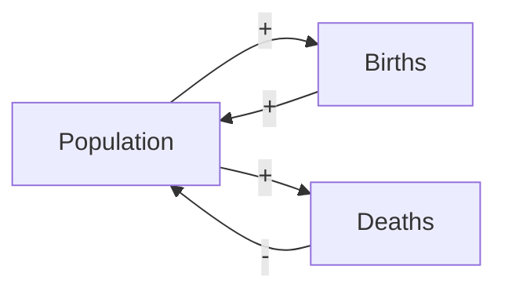

# Systems thinking and feedback models

Systems thinking treats interdependent collections of variables as a unit, focusing on feedback rather than linear cause-effect. Origins: Bertalanffy's general systems theory (1940s), Forrester's industrial dynamics (1960s), Donella Meadows.

## 1. Core concepts

- **System**: set of elements connected by relations to produce a behavior.
- **Stocks**: accumulations (water in a tank, population, money).
- **Flows**: rates of change (inflow, outflow).
- **Feedback loops**:
  - **Reinforcing (positive)**: stock grows or declines exponentially.
  - **Balancing (negative)**: stock approaches a target.
- **Delays**: time lag between cause and effect. Source of oscillations.

## 2. Causal loop diagrams (CLDs)

Arrows show influence: + (same direction), − (opposite). Loops marked R (reinforcing) or B (balancing).

Births reinforce population (R loop). Deaths balance (B loop). Combined dynamics: growth vs equilibrium.

## 3. Examples

- **Thermostat**: B loop. Temperature deviates → heating activates → temperature returns to setpoint.
- **Bubble**: R loop + delay. Prices rise → buyers attracted → prices rise more, eventually corrected when reality intrudes.
- **Tragedy of the commons** (Hardin 1968): individual rationality + shared resource = collective overuse.

## 4. Donella Meadows' 12 leverage points (1999)

From weakest to strongest:

1. Constants, parameters, numbers (e.g. tax rate).
2. Size of buffer stocks.
3. Structure of stock-flow systems.
4. Length of delays.
5. Strength of balancing loops.
6. Strength of reinforcing loops.
7. Information flow structure.
8. Rules of the system (incentives, constraints).
9. Power to self-organize.
10. Goals of the system.
11. Paradigm from which the system arose.
12. Power to transcend paradigms.

Most policies tweak parameters (#1) — weak leverage. Real change works on rules (#8) or goals (#10).

## 5. Systems archetypes

Reusable patterns:

- **Fixes that fail**: solution alleviates symptom but worsens underlying problem.
- **Shifting the burden**: short-term fix becomes dependent, sapping long-term solution.
- **Escalation**: each party responds to the other's escalation. Arms race.
- **Tragedy of the commons**: shared resource overused.
- **Growth and underinvestment**: success outpaces capacity, then declines.

## 6. Bounded rationality (Simon)

Agents have limited information and processing — they make *locally* sensible decisions that aggregate to *globally* dysfunctional outcomes. Foundation of behavioral economics and systems analysis.

## 7. Analytical vs systemic thinking

- **Analytical**: break into parts, study each. Strong for reducible problems.
- **Systemic**: study interactions, feedback, emergent behavior. For complex problems.

Both needed. Pure analytical misses emergent dynamics; pure systemic loses depth on individual mechanisms.

## 8. Applied example: traffic policy

"Add a lane to reduce congestion."

CLD:

- Lane added → travel time down → more people drive → travel time up.

The R loop (induced demand) negates the intended improvement. Result: same congestion, more cars.

Real solution requires #8-#10 leverage: change incentives (congestion pricing), goals (reduce car-trips, not speed up cars), or paradigm (mobility as service).

## 9. Tools

- **Vensim, Stella, Insight Maker**: simulation modeling.
- **Causal loop diagrams**: napkin-level visualization.
- **System Dynamics models**: equations + simulation over time.

## Exercises

  
Draw a CLD for "social media engagement → mental health".

User opens app → sees engaging content (R: more time spent → more engaging algorithm adapted to user). Also: more time → less sleep → mood worse → seeks distraction → opens app (R: addiction loop). Mood balancing (B): user notices, takes break.

Resulting dynamics: addiction can dominate if balancing is weak (e.g., easy access, addictive design).

## Summary

- Stocks, flows, feedback loops (R, B), delays.
- CLDs show structure of influence.
- Meadows' 12 leverage points: parameters (weak) → paradigms (strong).
- Systems archetypes: reusable failure patterns.
- Bounded rationality: individually sensible, collectively dysfunctional.

## Further reading

- Donella Meadows, *Thinking in Systems* (2008).
- Forrester, *Industrial Dynamics* (1961).
- Senge, *The Fifth Discipline* (1990).
- Sterman, *Business Dynamics* (2000).
