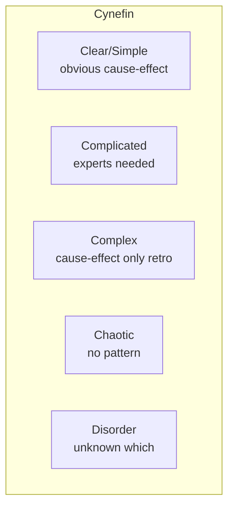

# Wicked problems, complexity, VUCA

Not all problems are equal. Some have standard solutions (compute √7). Others are **wicked** — they resist every classical method. Distinguishing problem types is the first strategic decision.

## 1. Rittel & Webber, 1973

Horst Rittel and Melvin Webber coin "wicked problem" in urban planning. They list 10 features:

1. No definitive formulation.
2. No stopping rule.
3. Solutions are good/bad, not true/false (value-laden).
4. No immediate definitive test.
5. One-shot: every attempt has consequences.
6. Non-enumerable solution set.
7. Each problem is unique.
8. Every wicked is a symptom of another.
9. Multiple admissible causal explanations.
10. The planner has no right to be wrong (irreversibility).

### Examples

- **Climate change**: how to define? Costs/benefits across generations? Irreversible interventions. Multiple causes. No end.
- **Urban poverty**: no single definition. Interlocking social, economic, planning causes.
- **Public health**: each intervention generates new challenges.
- **Political polarization**: part of the problem is value disagreement.

### Tame problems

Opposite: clear definition, success criteria, testable solutions. Building a bridge, writing a compiler, winning at chess.

## 2. VUCA

US military acronym (1990s):

- **Volatility**: rapid unpredictable change.
- **Uncertainty**: unknown probabilities (Knightian).
- **Complexity**: many interconnected elements.
- **Ambiguity**: causes-effects unclear, multiple interpretations.

Adopted in business to describe turbulent operating environments.

## 3. Cynefin framework (Snowden, 1999)

Classification of problem types with corresponding decision modes.

### Five domains

| Domain | Features | Approach |
|---|---|---|
| **Clear** | obvious cause-effect, repeatable | sense → categorize → respond (best practices) |
| **Complicated** | cause-effect requires expert analysis | sense → analyze → respond (good practices) |
| **Complex** | cause-effect only in retrospect | probe → sense → respond (emergent practices) |
| **Chaotic** | no stable cause-effect | act → sense → respond (novel practices) |
| **Disorder** | unsure which domain | first figure out which |

### Common error: treating Complex as Complicated

Organizations applying "best practices" recipe to problems that need experimentation. E.g., "agile methodology" copy-pasted to contexts where it should be reinvented.

## 4. Strategies for complex problems

### Probe-Sense-Respond

When you don't know what to do, make small reversible experiments (probes). Observe effects. Respond based on what emerges. Antifragile (see [sec. 37](37-knightian-black-swans.html)) by design.

### Scenario planning

Develop 3-5 radically different plausible futures. Plan for robustness in each, not optimum in one. Shell pioneer (Pierre Wack, 1970s). Avoids overfitting one scenario.

### Iterative adaptation

Not "definitive plan → execution" but plan-do-learn loop. OODA, agile, lean startup are variants.

### Stakeholder involvement

Wicked problems have many stakeholders with diverse values. The "solution" emerges only through dialogue process, not unilateral technical analysis.

## 5. Typical traps

**Silver bullet hunting**: seeking the perfect solution. Doesn't exist for wicked.

**Tame-ification**: reducing the wicked problem to tame by ignoring complexity. E.g. reducing "political polarization" to "social media algorithm problem".

**Solutionism**: throwing software at deep social problems. Morozov's critique.

**Analysis paralysis**: waiting to "understand" before acting. On wicked, acting changes the problem; without action, no understanding.

## 6. Applied example: managing a pandemic

- **Clear**: vaccinate at-risk populations (standard).
- **Complicated**: design the cold chain (logistics expertise).
- **Complex**: convince population to vaccinate (social, cultural, media factors interact — requires experimentation, differentiated messaging).
- **Chaotic**: first weeks of unknown pandemic — act before understanding.

COVID-19 error: treating "convincing to vaccinate" as Complicated (a single good message suffices) instead of Complex (requires differentiated community engagement).

## 7. Antifragility for complex problems

From Taleb: systems benefiting from shock. For wicked:

- Decentralize decisions.
- Keep options open (optionality).
- Cap downside.
- Build redundancy.
- Tolerate small failures to avoid large ones.

## Exercises

  
Classify via Cynefin: (a) optimize warehouse inventory, (b) integrate second-generation immigrants, (c) assemble IKEA furniture, (d) respond to terrorist attack in progress.

(a) Complicated — statistical/operational analysis.
(b) Complex — many factors, emergent outcomes, values in tension.
(c) Clear — standard procedure.
(d) Chaotic — act before understanding fully.

## Summary

- Wicked problems (Rittel-Webber): fluid definition, no stop, no definitive test.
- VUCA: turbulent environments.
- Cynefin: 5 domains, different approach each.
- Complex problems: probe-sense-respond, scenarios, iteration, stakeholders.
- Traps: silver bullet, tame-ification, solutionism, paralysis.

## Further reading

- Rittel & Webber, *Dilemmas in a General Theory of Planning*, Policy Sci (1973).
- Snowden & Boone, *A Leader's Framework for Decision Making*, HBR (2007).
- Bennett & Lemoine, *What VUCA Really Means for You*, HBR (2014).
- Conklin, *Dialogue Mapping* (2005).
