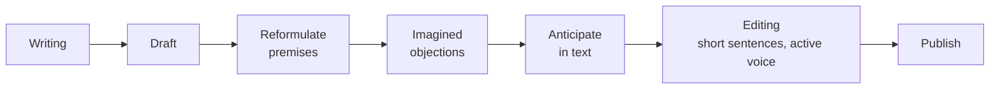

# Critical reading and argumentative writing

Reading and writing well aren't intuitive — they're techniques. The critic reads **to dismantle** an argument. The writer constructs **as if every reader were hunting for the weak spot**.

## 1. Critical reading: techniques

### SQ3R (Robinson 1946)

1. **Survey**: skim (titles, intro, conclusion, images). 2-3 min.
2. **Question**: turn titles into questions.
3. **Read**: read actively seeking answers.
4. **Recite**: repeat aloud the key ideas without looking.
5. **Review**: re-read notes, place in framework.

Works for technical and popular texts. Argumentative texts need an extra layer.

### Close reading

Line-by-line with margin annotations. Look for:

- Key non-obvious words (what does the author mean by "justice"? "natural"?).
- Hidden assumptions.
- Explicit logical connectives ("therefore", "because", "although").
- Tone or voice shifts.

### Argument mapping

For argumentative texts, reduce to:

- **Main thesis**: what the text wants you to believe.
- **Premises**: support offered.
- **Sub-arguments**: each premise has a sub-argument.
- **Objections and responses**: does the text consider them?
- **Conclusion**: same as thesis or developed?

Use Toulmin or bullet-tree mapping.

## 2. Example: an op-ed analysis

> "Taxes should be cut because they stimulate economic growth, as Reagan's policies demonstrate, leading to the 1980s expansion."

Map:

- Thesis: cut taxes.
- Premise: cutting taxes stimulates growth.
- Evidence: Reagan cut, 1980s expanded.
- Warrant (hidden): correlation = causation; 1980s growth mainly due to tax policy.
- Backing: not provided.
- Rebuttal: none considered.

Weak points:

1. Correlation/causation conflation (see [Pearl](45-causality-pearl.html)).
2. Ignores other factors (deregulation, demographics, end of Cold War, Volcker monetary policy).
3. Cherry-picked single favorable case.
4. Ignores contrary evidence (Romer & Romer 2010 finding modest effects).

Critical reading produces these objections in 5 minutes. Passive reading produces "interesting".

## 3. Reading traps

### Confirmation bias

See only what supports. Mitigation: actively seek what you *don't* want to read.

### Source credibility

Overvalue content from authoritative source. Mitigation: read content first, then look at source.

### Bullshit asymmetry (Brandolini 2013)

Refuting nonsense takes 10× the effort of producing it. Choose strategically what to refute.

## 4. Argumentative writing

Mirror of reading: write thinking of the hostile critical reader.

### Thesis statement

One sentence summarizing your thesis. **Specific, contestable, demonstrable.**

Bad: "Pollution is a problem."
Good: "Italy should ban gasoline cars by 2035 because aggregate health benefits exceed transition costs."

### Toulmin-style essay structure

1. **Intro**: context + thesis + roadmap.
2. **Body**: one premise per paragraph: claim, evidence, warrant.
3. **Objections and responses**: steelman the opposition.
4. **Conclusion**: restate thesis in light of argument; no new ideas.

### Common errors

| Error | Fix |
|---|---|
| Assertion without evidence | Add data, sources, examples |
| Padding | Cut |
| Hedge abuse ("perhaps maybe in some cases") | Clear position |
| False precision (73.42%) | Round or cite |
| Cherry picking | Acknowledge counter-cases |
| Implicit strawman | Steelman |
| Non sequitur conclusion | Verify premise → conclusion link |

### Style

- **Short sentences** where possible.
- **Active voice** over passive ("The government approved" > "Was approved by…").
- **Concreteness**: proper nouns, specific examples, numbers.
- **Terminological consistency**: if you use "rationality", use it the same way throughout.

## 5. Steelmanning + writing

Before publishing, imagine the smartest hostile critic. Anticipate them in the text.

Concretely: draft. Under each paragraph imagine a critical comment. Revise.

## 6. Critical writing for academic papers

Differences from essay:

- Thesis as "hypothesis → method → result → conclusion".
- Explicit literature review.
- Stated limitations.
- Technical but reviewer-comprehensible.
- Rigorous citations.

## 7. Process diagram

## Exercises

  
Map: "We should abolish helmet requirements because everyone has the right to risk for themselves."

- Thesis: abolish helmet law.
- Premise: individual liberty over personal risk.
- Implicit warrant: "the risk is only the motorcyclist's".

Weak point: the warrant is false. Healthcare costs of an unsafe crash fall on the public system (externality). So "only for himself" doesn't hold. A serious case must either (a) modify the principle, (b) privatize health costs, or (c) accept the trade-off.

Critical writing addresses this objection.

## Summary

- Critical reading: SQ3R + close reading + argument mapping (Toulmin).
- Hunt for thesis, premises, warrants, evidence, missing objections.
- Critical writing: specific thesis, Toulmin structure, preemptive steelmanning, short sentences, active voice.
- Common errors: assertion without evidence, hedge abuse, false precision, cherry picking.
- Steelmanning makes writing both stronger and more honest.

## Further reading

- Robinson, *Effective Study* (1946).
- Adler & Van Doren, *How to Read a Book* (1972).
- Booth, Colomb, Williams, *The Craft of Research* (2016).
- Williams, *Style: Lessons in Clarity and Grace* (2014).
