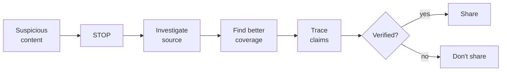

# Propaganda, manipulation, news literacy, fact-checking

Propaganda isn't modern nor exclusive to totalitarian regimes. It's the systematization of mass persuasion techniques toward an agenda. Recognizing it is now an information-survival skill.

## 1. Classical techniques (IPA 1937)

The **Institute for Propaganda Analysis** (USA, 1937) cataloged seven techniques still relevant today.

| Technique | Effect | Example |
|---|---|---|
| Name-calling | negative label on person/idea | "elitist", "fascist", "communist" |
| Glittering generalities | vague but resonant positive words | "freedom", "democracy", "family", "the people" |
| Transfer | associate positive symbol (flag, cross) with idea | leader photographed at war memorial |
| Testimonial | celebrity endorsement | famous actor supports party |
| Plain folks | "I'm one of you" | politician playing cards in pub |
| Card stacking | only favorable facts | charts with rigged scales, cherry-picked period |
| Bandwagon | "everyone thinks so" | "70% support X" |

Note: these are not fallacies per se (a politician *might* genuinely be one of the people). Become problematic when they **substitute for argument** instead of accompanying it.

## 2. Edward Bernays and modern PR

Bernays (1891–1995), nephew of Freud. *Propaganda* (1928), *Crystallizing Public Opinion* (1923). Believed modern democracy required "rational management" of public opinion by experts.

Examples:
- Convinced American women to smoke ("torches of freedom", 1929) framing cigarettes as emancipation.
- Made "eggs and bacon" the "traditional" American breakfast (campaign for bacon producers).
- Helped overthrow democratically elected Guatemalan government for United Fruit (1954).

His work is an insider manual for manipulating opinion via psychoanalysis and mass psychology.

## 3. Chomsky-Herman: *Manufacturing Consent* (1988)

Five filters through which info passes in mainstream media:

1. **Concentrated ownership**: media owned by few conglomerates with own interests.
2. **Advertising as business model**: newspapers serve advertisers, not readers.
3. **Reliance on official sources**: government, institutional experts — convenient, uncontroversial.
4. **Flak**: organized pressure (letters, lawsuits) against deviating media.
5. **Anti-X ideology**: common enemy (anti-communism 1988; anti-terrorism post-2001).

Result isn't censorship — it's self-selection of who enters media and what they say. Controversial but widely discussed.

## 4. Modern types (UNESCO 2018)

- **Misinformation**: false info, shared without intent to harm. WhatsApp hoaxes.
- **Disinformation**: false **and** intentional. Russian election interference 2016.
- **Malinformation**: true, strategically released to harm. Doxxing, selective leaks.

All part of **infodemic** during COVID-19.

## 5. Deepfakes and AI-generated content

Since 2018, generative models (GANs, diffusion, LLMs) produce:

- **Deepfake video**: face swaps, false lip-sync, synthetic voice.
- **Generated images**: no original photo.
- **Plausible text**: articles, comments, reviews.

Implication: **mass cheap production** of credible content. Consequences:

- "Liar's dividend" (Chesney-Citron 2019): anyone can claim "it's a deepfake" of true content.
- Generalized institutional trust erosion.
- Need for provenance infrastructure (C2PA, content credentials).

## 6. News literacy: SIFT (Mike Caulfield)

Four quick moves:

1. **STOP**: before reacting/sharing, pause 10 seconds.
2. **Investigate the source**: who publishes? Wikipedia in 1 minute often suffices.
3. **Find better coverage**: search the same fact in multiple reliable sources. If no one else reports it, suspicious.
4. **Trace claims, quotes, media**: back to original. Cites Y? Find Y. Photo X? Reverse-image search.

## 7. Practical fact-checking

Free tools:

- **Google Reverse Image / TinEye**: where a photo appeared, when.
- **Wayback Machine (archive.org)**: historical snapshots of web pages.
- **InVID** (browser extension): forensic video analysis.
- **Bellingcat OSINT toolkit**: open-source intelligence.
- **AllSides, MediaBiasFactCheck**: source bias/reliability ratings.

### Example: a viral photo claim

"Photo of Putin with Syrian child, 2024."

Move 1: reverse image search. Result: photo from 2008, Putin in Chechnya visit. Wrong attribution.

Move 2: search "Putin Syria 2024" in reliable outlets. No confirmation.

Time spent: 60 seconds. Don't share.

## 8. Confirmation bias and filter bubbles

Eli Pariser, *The Filter Bubble* (2011): social media algorithms personalize so you see mainly content confirming your views.

Effects:
- Overestimate consensus on your views.
- Reduced exposure to opposing views.
- Polarization.

Mitigation: deliberately follow sources you disagree with (critically). Disable personalization where possible. Seek facts before opinion.

## 9. Info detox

- Limit social media to set times.
- Replace algorithmic feeds with RSS/newsletters (you control content).
- Avoid news in first/last hour of day.
- "Slow news": weekly long-form reading, no continuous breaking-news stream.

## Exercises

  
Apply SIFT to: "Study shows red wine extends life by 10 years"

**STOP**: wait.

**Investigate**: lifestyle magazine living on clicks. Is study cited? Search author.

**Find better coverage**: PubMed, serious journals. Likely real study (if it exists) is correlational sub-sample analysis with small effect size: "modest association between moderate consumption and mortality", nowhere near "+10 years".

**Trace**: find original paper. Often claim is a 5× distortion of paper text.

Decision: don't share.

## Summary

- IPA 1937: name-calling, glittering generalities, transfer, testimonial, plain folks, card stacking, bandwagon.
- Bernays: PR invented by applying mass psychology.
- *Manufacturing Consent* (Chomsky-Herman): 5 structural filters of mainstream media.
- UNESCO: mis-/dis-/mal-information.
- Deepfakes & AI lower disinformation cost; produce "liar's dividend".
- SIFT (Stop, Investigate, Find, Trace) for rapid evaluation.
- Tools: reverse image, archive.org, InVID, Bellingcat.

## Further reading

- Bernays, *Propaganda* (1928).
- Chomsky & Herman, *Manufacturing Consent* (1988).
- Caulfield, *Web Literacy for Student Fact-Checkers* (2017, free online).
- Higgins, *We Are Bellingcat* (2021).
- Pariser, *The Filter Bubble* (2011).
