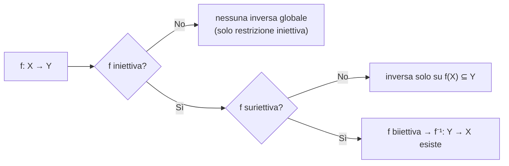

# Insiemi, relazioni, funzioni

## Perché parlarne

L'analisi *non* parla soprattutto di numeri — parla di **funzioni fra insiemi di numeri**. Frasi come "$f$ è iniettiva, quindi $f^{-1}$ esiste sull'immagine" sono suono senza senso finché non sai cosa vogliano dire "iniettiva", "$f^{-1}$" e "immagine". Qui mettiamo il lessico in ordine, una parola alla volta.

## Cos'è un insieme (vista naïf)

Un **insieme** è una collezione di oggetti. Punto. Non daremo gli assiomi pesanti (Zermelo–Fraenkel). Ci basta la versione "naïf": un insieme si descrive in due modi:

- **Elencazione**: $A = \{1, 2, 3\}$ — "$A$ è l'insieme che contiene 1, 2, 3".
- **Comprensione**: $A = \{x \in X : P(x)\}$ — "$A$ è l'insieme degli $x$ in $X$ tali che $P(x)$".

Esempi:
- $\{x \in \mathbb{N} : x \text{ è pari}\}$ = i naturali pari = $\{0, 2, 4, 6, \dots\}$.
- $\{x \in \mathbb{R} : x^2 < 4\}$ = i reali col quadrato minore di 4 = l'intervallo $(-2, 2)$.

> **Glossario veloce.** $\in$ = "appartiene a"; $\notin$ = "non appartiene a"; $\subseteq$ = "è sottoinsieme di" (tutti i suoi elementi sono anche dell'altro); $\emptyset$ = "insieme vuoto" (nessun elemento).

**Avvertenza storica.** Cantor permetteva $\{x : P(x)\}$ *senza* dire dentro a quale universo $X$. Russell ha scoperto che porta a paradossi: chiama $R = \{x : x \notin x\}$ ("$R$ è l'insieme degli insiemi che non contengono se stessi"); chiediti se $R \in R$. Se sì → no. Se no → sì. Paradosso. Si risolve dicendo: **parti sempre da un universo $X$ dato**, e prendi sottoinsiemi di lì. Noi lo faremo sempre.

## Operazioni con gli insiemi

Dati due sottoinsiemi $A, B \subseteq X$:

- **Unione** $A \cup B = \{x \in X : x \in A \lor x \in B\}$ — gli elementi che stanno in *almeno uno* dei due.
- **Intersezione** $A \cap B = \{x \in X : x \in A \land x \in B\}$ — gli elementi che stanno in *entrambi*.
- **Differenza** $A \setminus B = \{x \in X : x \in A \land x \notin B\}$ — quelli di $A$ ma non di $B$.
- **Complementare** $A^c = X \setminus A$ — tutto ciò che, dentro l'universo $X$, *non* sta in $A$.
- **Differenza simmetrica** $A \triangle B = (A \setminus B) \cup (B \setminus A)$ — quelli che stanno in uno solo dei due.

**Inclusione**: $A \subseteq B$ vuol dire $\forall x,\ (x \in A \Rightarrow x \in B)$. A parole: ogni elemento di $A$ è anche elemento di $B$.

### Diagrammi di Venn

<svg viewBox="0 0 600 300" xmlns="http://www.w3.org/2000/svg">
  <rect x="20" y="20" width="560" height="260" fill="#111a30" stroke="#f3eed9" stroke-width="1"/>
  <circle cx="240" cy="150" r="100" fill="#d4af37" fill-opacity="0.35" stroke="#d4af37" stroke-width="2"/>
  <circle cx="360" cy="150" r="100" fill="#6fb38a" fill-opacity="0.35" stroke="#6fb38a" stroke-width="2"/>
  <text x="170" y="155" fill="#f3eed9" font-family="serif" font-size="20">A</text>
  <text x="420" y="155" fill="#f3eed9" font-family="serif" font-size="20">B</text>
  <text x="295" y="155" fill="#f3eed9" font-family="serif" font-size="16" font-weight="bold" text-anchor="middle">A∩B</text>
  <text x="40" y="40" fill="#f3eed9" font-family="serif" font-size="16">X</text>
</svg>

La regione gialla è $A$, la verde è $B$. La fascia centrale dove si sovrappongono è $A \cap B$. Tutto il rettangolo è l'universo $X$.

### Leggi di De Morgan: come "entra" il complementare

Prima di scrivere qualunque formula, facciamolo con i numeri.

**Esempio super concreto.** Universo $X = \{1, 2, 3, 4, 5, 6, 7, 8, 9, 10\}$ (i numeri da 1 a 10).

Definiamo:
- $A = \{2, 4, 6, 8, 10\}$ — i pari.
- $B = \{3, 6, 9\}$ — i multipli di 3.

Calcoliamo l'unione e poi il complementare dell'unione:
- $A \cup B = \{2, 3, 4, 6, 8, 9, 10\}$ — pari **oppure** multipli di 3.
- $(A \cup B)^c$ = "quelli che non sono né pari né multipli di 3" = $\{1, 5, 7\}$.

Adesso facciamo l'altra strada: prima i complementari, poi l'intersezione:
- $A^c = \{1, 3, 5, 7, 9\}$ — i dispari.
- $B^c = \{1, 2, 4, 5, 7, 8, 10\}$ — i non-multipli di 3.
- $A^c \cap B^c$ = "quelli che stanno in entrambi" = $\{1, 5, 7\}$. **Stesso risultato.**

Coincidenza? No, è una **regola generale** che si chiama **legge di De Morgan**. Tradotta a parole:

> "Non stare nell'unione" è la **stessa cosa** di "non stare in nessuno dei pezzi".

E viceversa:

> "Non stare in tutti" è la stessa cosa di "stare fuori da almeno uno".

In formule:

$$\left(\bigcup_{i \in I} A_i\right)^{\!c} = \bigcap_{i \in I} A_i^c, \qquad \left(\bigcap_{i \in I} A_i\right)^{\!c} = \bigcup_{i \in I} A_i^c.$$

> **Glossarietto della formula** — leggiamola simbolo per simbolo:
>
> - $A_i$ = un insieme, indicato dal "pedice" $i$ (un'etichetta numerica o simbolica). Pensa a $A_1, A_2, A_3, \dots$ come a una *lista di insiemi*.
> - $I$ = l'**insieme degli indici**, cioè la lista delle etichette possibili. Se $I = \{1, 2, 3\}$ hai tre insiemi; se $I = \mathbb{N}$ ne hai infiniti.
> - $i \in I$ = "$i$ è una delle etichette in $I$" (si legge "$i$ appartiene a $I$").
> - $\bigcup_{i \in I} A_i$ = **unione su tutta la famiglia**: $A_{i_1} \cup A_{i_2} \cup A_{i_3} \cup \dots$ per tutti gli $i$ presi da $I$. È una scrittura compatta — quel simbolo grande $\bigcup$ è solo un $\cup$ "che si applica a tanti".
> - $\bigcap_{i \in I} A_i$ = stesso discorso ma con l'intersezione.
> - $A^c$ = **complementare** di $A$: tutto ciò che sta nell'universo $X$ ma fuori da $A$. Cioè $A^c = X \setminus A$. La "c" sopra il simbolo *è solo un'etichetta* — sta per "complementare", non è un'operazione né un esponente.
> - $A_i^c$ = il complementare del singolo insieme $A_i$.
> - $\left(\bigcup_i A_i\right)^c$ = il complementare di tutta l'unione, presa come un solo grosso insieme.
> - $=$ = "i due insiemi a sinistra e a destra contengono esattamente gli stessi elementi".
>
> Tradotta in italiano corrente, la **prima formula** dice: "il complementare dell'unione (sinistra) è uguale all'intersezione dei complementari (destra)". La seconda: "il complementare dell'intersezione è l'unione dei complementari". Come avevamo visto nell'esempio con i pari e i multipli di 3.

#### Dimostrazione della prima — passo per passo

Vogliamo mostrare: $\left(\bigcup A_i\right)^c = \bigcap A_i^c$.

Per dimostrarlo, prendiamo un elemento $x$ qualsiasi e verifichiamo che "$x$ sta a sinistra" se e solo se "$x$ sta a destra". Cioè vogliamo dimostrare la catena di equivalenze:

$$x \in \left(\bigcup A_i\right)^c \iff x \in \bigcap A_i^c.$$

Lo facciamo in 4 passi, ognuno è una riformulazione equivalente di quello prima.

**Passo 1.** $x \in \left(\bigcup A_i\right)^c$ significa, *per definizione di complementare*, che $x$ **non** sta dentro all'unione:

$$x \in \left(\bigcup A_i\right)^c \quad\iff\quad x \notin \bigcup A_i.$$

**Passo 2.** "$x$ non sta nell'unione" significa che $x$ **non è in nessuno** dei pezzi: non sta in $A_1$, non sta in $A_2$, e così via per tutti gli indici:

$$x \notin \bigcup A_i \quad\iff\quad \forall i,\ x \notin A_i.$$

(È la *definizione* di unione: stare nell'unione = stare in almeno uno. Negare: non stare in nessuno.)

**Passo 3.** "Non stare in $A_i$" è la definizione di "stare nel complementare di $A_i$":

$$\forall i,\ x \notin A_i \quad\iff\quad \forall i,\ x \in A_i^c.$$

**Passo 4.** "$x$ è in $A_i^c$ per ogni $i$" significa, *per definizione di intersezione*, che $x$ è nell'intersezione dei complementari:

$$\forall i,\ x \in A_i^c \quad\iff\quad x \in \bigcap A_i^c.$$

**Conclusione.** Mettendo insieme i quattro passi, abbiamo $x \in \left(\bigcup A_i\right)^c \iff x \in \bigcap A_i^c$ per ogni $x$. Quindi i due insiemi hanno gli stessi elementi, cioè sono uguali. $\blacksquare$

> **Nota di lettura.** Quando vedi una catena di "$\iff$" come $A \iff B \iff C \iff D$, vuol dire che $A$ e $D$ sono equivalenti, passando per due ponti intermedi. Ogni passaggio va letto come una *traduzione* dello stesso fatto in parole leggermente diverse. Se uno dei passi non ti torna, fermati lì — è quello il punto da chiarire.

## Coppie ordinate e prodotto cartesiano

$$A \times B = \{(a, b) : a \in A,\ b \in B\}.$$

> **Glossarietto della formula:**
>
> - $A \times B$ = il **prodotto cartesiano** di $A$ per $B$ (nome storico — dal piano cartesiano).
> - $(a, b)$ = una **coppia ordinata**: due elementi messi in fila, dove il primo viene da $A$ e il secondo da $B$. Le parentesi tonde dicono "coppia".
> - $\{...\}$ = "l'insieme di tutti gli oggetti che soddisfano la condizione che segue i due punti".
> - I due punti `:` si leggono "tali che".
> - $a \in A$ = "$a$ appartiene all'insieme $A$".

A parole: $A \times B$ è l'**insieme di tutte le coppie ordinate** $(a, b)$ in cui il primo elemento è preso da $A$ e il secondo da $B$.

**Importante.** Le coppie sono *ordinate*: $(a, b) \ne (b, a)$ in generale (a meno che $a = b$). Cioè la coppia "Roma, Milano" non è la stessa cosa della coppia "Milano, Roma".

Esempio. $A = \{1, 2\}$, $B = \{x, y\}$. Allora:
$$A \times B = \{(1, x), (1, y), (2, x), (2, y)\}.$$

**Cardinalità.** Se $|A| = m$ e $|B| = n$ (cardinalità = numero di elementi), allora $|A \times B| = mn$. Verifica sull'esempio: $2 \cdot 2 = 4$. ✓

Si estende a più fattori: $A_1 \times \dots \times A_n$ è l'insieme delle $n$-uple ordinate.

## Relazioni binarie

Una **relazione binaria** su $X$ è un sottoinsieme $R \subseteq X \times X$. Quando $(x, y) \in R$, scriviamo $x \sim y$ ("$x$ è in relazione con $y$").

**Esempio.** Su $\mathbb{Z}$ definiamo $x \sim y \iff x - y$ è pari. Quindi $3 \sim 5$ ($3 - 5 = -2$ pari), ma $3 \not\sim 4$ ($3 - 4 = -1$ dispari).

### Le quattro proprietà che contano

| nome | definizione (in simboli) | in parole |
|------|--------------------------|-----------|
| riflessiva | $\forall x,\ x \sim x$ | ogni elemento è in relazione con se stesso |
| simmetrica | $x \sim y \Rightarrow y \sim x$ | se vale in un verso vale anche nell'altro |
| antisimmetrica | $x \sim y \land y \sim x \Rightarrow x = y$ | possono valere in entrambi i versi solo se $x$ e $y$ sono uguali |
| transitiva | $x \sim y \land y \sim z \Rightarrow x \sim z$ | si concatena |

### Relazioni di equivalenza

Una relazione è **di equivalenza** se è riflessiva *e* simmetrica *e* transitiva. Pensa a "$\sim$" come "$=$ modulo qualcosa": dice quando due elementi sono "indistinguibili dal nostro punto di vista".

**Classe di equivalenza** di $x$: l'insieme di tutti i suoi "amici" — gli elementi in relazione con lui. Notazione $[x] = \{y : y \sim x\}$.

**Insieme quoziente** $X / {\sim}$: l'insieme delle classi.

**Teorema (partizione).** Le classi di equivalenza formano una **partizione** di $X$: ogni elemento di $X$ sta in una classe, e due classi diverse non si toccano.

*Dim.* (a) Riflessività dà $x \in [x]$, quindi ogni $x$ ha la sua classe, l'unione delle classi è tutto $X$.
(b) Supponiamo $[x] \cap [y] \neq \emptyset$. Sia $z$ un elemento comune: $z \sim x$ e $z \sim y$. Per simmetria $x \sim z$, per transitività $x \sim y$. Quindi ogni $w \sim x$ è anche $\sim y$ (transitività): $[x] \subseteq [y]$, e per simmetria viceversa. Quindi $[x] = [y]$. ∎

**Esempio cardine — gli orologi.** Su $\mathbb{Z}$ definiamo $a \sim b \iff n \mid (a - b)$ ("$n$ divide $a - b$"), per $n \ge 1$ fissato. Le classi sono i resti modulo $n$:
- $[0] = \{0, n, -n, 2n, -2n, \dots\}$
- $[1] = \{1, n+1, 1-n, 2n+1, \dots\}$
- … fino a $[n-1]$

Il quoziente $\mathbb{Z}/n\mathbb{Z}$ ha esattamente $n$ elementi. Pensa all'orologio: se $n = 12$, dopo 25 ore sei alla stessa ora che dopo 1 ora, perché $25 \equiv 1 \pmod {12}$.

### Relazioni d'ordine

Una relazione è **d'ordine** se è riflessiva + antisimmetrica + transitiva. Si scrive $\le$ invece di $\sim$.

- **Ordine totale**: in più, $\forall x, y$ si ha $x \le y$ oppure $y \le x$. Ogni coppia è confrontabile.
- **Ordine parziale**: non si richiede confrontabilità.

Esempi:
- $\le$ su $\mathbb{R}$ è un ordine **totale** (dati due reali, uno è $\le$ all'altro).
- $\subseteq$ sull'insieme delle parti $\mathcal{P}(X)$ (cioè la collezione di *tutti* i sottoinsiemi di $X$) è solo **parziale**: $\{1\}$ e $\{2\}$ non sono confrontabili nessuno è incluso nell'altro.

## Funzioni: il concetto centrale dell'analisi

Una **funzione** $f : X \to Y$ è una regola che a ogni $x \in X$ associa **un unico** $y \in Y$. Si scrive $y = f(x)$.

Formalmente: una funzione è un sottoinsieme $f \subseteq X \times Y$ tale che per ogni $x \in X$ esiste un unico $y \in Y$ con $(x, y) \in f$.

Vocabolario:
- **Dominio**: $X$ — l'insieme dove $f$ è definita ("da dove partono gli $x$").
- **Codominio**: $Y$ — l'insieme dove $f$ "vive" ("dove arrivano gli $y$").
- **Immagine** di un sottoinsieme $A \subseteq X$: $f(A) = \{f(x) : x \in A\}$. Sono "dove vanno" gli elementi di $A$.
- **Antiimmagine** (o **controimmagine**) di un sottoinsieme $B \subseteq Y$: $f^{-1}(B) = \{x \in X : f(x) \in B\}$. Sono "chi parte verso" $B$.

> **Attenzione, falso amico.** $f^{-1}(B)$ (scrittura con un *insieme* dentro) è l'antiimmagine: ha senso **sempre**, anche se $f$ non è invertibile. La funzione inversa $f^{-1} : Y \to X$ (che mangia un *elemento* alla volta) esiste **solo** se $f$ è biiettiva (vedi sotto). I due simboli sono uguali ma il contesto cambia tutto: guarda cosa c'è fra parentesi.

### Iniettiva, suriettiva, biiettiva

**Iniettiva** (in inglese "one-to-one"): elementi diversi vanno in elementi diversi.

$$f(x_1) = f(x_2) \Rightarrow x_1 = x_2 \quad\text{(equivalente: } x_1 \ne x_2 \Rightarrow f(x_1) \ne f(x_2)\text{)}.$$

> **Glossarietto:**
>
> - $x_1, x_2$ = due elementi del dominio (i pedici 1 e 2 sono solo etichette per distinguerli).
> - $f(x_1) = f(x_2)$ = "i due output sono uguali".
> - $\Rightarrow$ = "implica".
> - $x_1 = x_2$ = "in realtà erano lo stesso input".
>
> **Tradotto in italiano:** "se due input danno lo stesso output, allora erano lo stesso input". Cioè $f$ "non incolla" mai due punti diversi. A scuola si diceva: "il grafico di $f$ taglia ogni retta orizzontale in al massimo un punto".

**Suriettiva** (in inglese "onto"): ogni elemento del codominio è raggiunto.

$$\forall y \in Y,\ \exists x \in X : f(x) = y, \quad\text{cioè } f(X) = Y.$$

> **Glossarietto:**
>
> - $\forall y \in Y$ = "per ogni $y$ nel codominio $Y$".
> - $\exists x \in X$ = "esiste un $x$ nel dominio $X$".
> - $: f(x) = y$ = "tale che $f$ di $x$ vale $y$".
> - $f(X)$ = l'immagine di tutto il dominio = $\{f(x) : x \in X\}$ = i valori raggiunti da $f$.
>
> **Tradotto:** "ogni $y$ del codominio è raggiunto da almeno un $x$ del dominio". Cioè nessun elemento di $Y$ è "saltato". A scuola: "il grafico tocca ogni retta orizzontale in almeno un punto".

**Biiettiva**: iniettiva *e* suriettiva. Ogni $y$ del codominio ha **esattamente un** $x$ che gli corrisponde (almeno uno per suriettività, al più uno per iniettività).

Solo se $f$ è biiettiva esiste la **funzione inversa** $f^{-1} : Y \to X$, definita da: $f^{-1}(y) = $ "l'unico $x$ tale che $f(x) = y$".

### Esempi visualizzati

- $f : \mathbb{R} \to \mathbb{R}$, $f(x) = x^2$. *Non iniettiva* ($f(1) = f(-1) = 1$), *non suriettiva* (ogni quadrato è $\ge 0$, i numeri negativi non vengono raggiunti).
  - **Restringendo** dominio e codominio: $f : [0, +\infty) \to [0, +\infty)$, $f(x) = x^2$. Adesso è biiettiva. La sua inversa è la radice quadrata $\sqrt{\cdot}$.
- $f : \mathbb{R} \to \mathbb{R}$, $f(x) = x^3$. Iniettiva (strettamente crescente, due input distinti danno cubi distinti). Suriettiva (ogni reale ha una radice cubica reale). Biiettiva — inversa è $\sqrt[3]{\cdot}$.
- $f : \mathbb{Z} \to \mathbb{Z}/n\mathbb{Z}$, $f(k) = [k]_n$ (la classe di $k$ modulo $n$). Suriettiva (ogni classe è raggiunta). Non iniettiva ($f(0) = f(n)$). Si chiama **proiezione canonica** sul quoziente.

### Composizione di funzioni

Se $f : X \to Y$ e $g : Y \to Z$, la **composizione** $g \circ f : X \to Z$ è definita da $(g \circ f)(x) = g(f(x))$.

A parole: "applica prima $f$, poi $g$ al risultato".

**Esempio.** $f(x) = x + 1$, $g(y) = y^2$. Allora $(g \circ f)(x) = g(f(x)) = g(x+1) = (x+1)^2$. Diverso da $(f \circ g)(x) = f(g(x)) = f(x^2) = x^2 + 1$.

**Proprietà.**

- **Associativa**: $h \circ (g \circ f) = (h \circ g) \circ f$. (Possiamo togliere le parentesi.)
- **Iniettività si conserva**: se $f$ e $g$ sono iniettive, $g \circ f$ è iniettiva.
- **Suriettività si conserva**: se $f$ e $g$ sono suriettive, $g \circ f$ è suriettiva.
- **Attenzione**: $g \circ f$ iniettiva *non* implica $g$ iniettiva (vedi esercizio 3). Implica solo $f$ iniettiva.

## Come si comportano immagini e antiimmagini

Le **antiimmagini** sono "obbedienti": commutano con tutte le operazioni insiemistiche.

$$f^{-1}(B_1 \cup B_2) = f^{-1}(B_1) \cup f^{-1}(B_2), \qquad f^{-1}(B_1 \cap B_2) = f^{-1}(B_1) \cap f^{-1}(B_2).$$

> **Glossarietto** (riprendo le definizioni di prima):
>
> - $B_1, B_2$ = due sottoinsiemi del codominio $Y$.
> - $f^{-1}(B)$ = **antiimmagine** di $B$ = "tutti gli $x$ del dominio che vanno a finire dentro $B$" = $\{x \in X : f(x) \in B\}$. (Ricorda: questa scrittura ha senso *sempre*, anche se $f$ non è invertibile.)
> - $B_1 \cup B_2$ = unione (elementi in *almeno uno* dei due).
> - $B_1 \cap B_2$ = intersezione (elementi in *entrambi*).
>
> **Tradotto:** "gli $x$ che finiscono in $B_1$ oppure in $B_2$" è uguale a "gli $x$ che finiscono in $B_1$, uniti agli $x$ che finiscono in $B_2$". Idem per l'intersezione. Sembra ovvio, ma il vantaggio è che vale *sempre*, senza ipotesi su $f$.

Le **immagini** invece sono *meno* obbedienti:

$$f(A_1 \cup A_2) = f(A_1) \cup f(A_2) \quad\text{(uguale, ok)},$$
$$f(A_1 \cap A_2) \subseteq f(A_1) \cap f(A_2) \quad\text{(solo inclusione!)}.$$

> **Glossarietto:**
>
> - $A_1, A_2$ = due sottoinsiemi del **dominio** $X$.
> - $f(A) = \{f(x) : x \in A\}$ = **immagine** di $A$ = "i valori che $f$ produce quando il suo input varia in $A$".
> - $\subseteq$ = "sottoinsieme di" (può essere uguale, oppure strettamente più piccolo).
>
> **Tradotto:** per le immagini, l'**unione** funziona uguale (entrambe le formulazioni includono lo stesso insieme di valori). Per l'**intersezione** invece c'è solo una freccia, non l'uguaglianza: ci sono valori che stanno in $f(A_1) \cap f(A_2)$ ma non in $f(A_1 \cap A_2)$ — vedi controesempio sotto.

L'inclusione può essere stretta. **Esempio.** $f : \{0, 1\} \to \{0\}$ costante, $A_1 = \{0\}$, $A_2 = \{1\}$. Allora $A_1 \cap A_2 = \emptyset$ quindi $f(A_1 \cap A_2) = \emptyset$. Ma $f(A_1) \cap f(A_2) = \{0\} \cap \{0\} = \{0\} \ne \emptyset$.

## Diagramma di flusso: quando esiste l'inversa

## Esercizi

Esercizio 1 — De Morgan con una famiglia infinita

Sia $A_n = (-1/n, 1/n) \subseteq \mathbb{R}$ per ogni $n = 1, 2, 3, \dots$. Calcola $\bigcap_n A_n$ e $\big(\bigcap_n A_n\big)^c$.

**Soluzione.** Un $x \neq 0$ cade fuori da $A_n$ non appena $1/n < |x|$. Solo $x = 0$ sta in tutti gli $A_n$. Quindi $\bigcap_n A_n = \{0\}$. Il complementare è $\mathbb{R} \setminus \{0\}$.

Verifica con De Morgan: $\mathbb{R} \setminus \{0\} = \bigcup_n A_n^c = \bigcup_n ((-\infty, -1/n] \cup [1/n, +\infty))$. All'aumentare di $n$, l'unione "copre" tutti i reali non nulli. ✓

Esercizio 2 — Una relazione di equivalenza geometrica

Su $\mathbb{R}^2 \setminus \{(0,0)\}$ definisci $(x,y) \sim (x', y')$ se esiste $\lambda > 0$ con $(x', y') = \lambda(x, y)$. Mostra che è di equivalenza e descrivi le classi.

**Soluzione.** Riflessiva: $\lambda = 1$. Simmetrica: se $(x',y') = \lambda(x,y)$ allora $(x,y) = (1/\lambda)(x',y')$ e $1/\lambda > 0$. Transitiva: composizione $\lambda \mu > 0$.

Le classi sono le **semirette uscenti dall'origine** (escluso l'origine): un punto $(x,y)$ e tutti i suoi multipli positivi $\lambda(x,y)$.

Il quoziente è in biiezione con il cerchio unitario $S^1$: ogni semiretta lo interseca in un unico punto.

Esercizio 3 — Composizione e iniettività

Mostra: se $g \circ f$ è iniettiva, allora $f$ è iniettiva. Trova poi un controesempio in cui $g \circ f$ è iniettiva ma $g$ non lo è.

**Soluzione.** Supponi $f(x_1) = f(x_2)$. Allora $g(f(x_1)) = g(f(x_2))$, cioè $(g \circ f)(x_1) = (g \circ f)(x_2)$. Per iniettività di $g \circ f$, segue $x_1 = x_2$. Quindi $f$ è iniettiva. ∎

**Controesempio.** Sia $f : \{0\} \to \{0, 1\}$ con $f(0) = 0$. Sia $g : \{0, 1\} \to \{0\}$ con $g(0) = g(1) = 0$ (costante). Allora $g \circ f : \{0\} \to \{0\}$ è iniettiva banalmente (dominio con un solo punto). Ma $g$ identifica $0$ e $1$, non è iniettiva.

Esercizio 4 — Immagine non commuta con l'intersezione

Trova $f : X \to Y$ e $A_1, A_2 \subseteq X$ con $f(A_1 \cap A_2) \subsetneq f(A_1) \cap f(A_2)$ (inclusione stretta).

**Soluzione.** $f : \{a, b\} \to \{0\}$ costante, $A_1 = \{a\}$, $A_2 = \{b\}$. Allora $A_1 \cap A_2 = \emptyset$, $f(\emptyset) = \emptyset$. Ma $f(A_1) = f(A_2) = \{0\}$, quindi $f(A_1) \cap f(A_2) = \{0\}$. $\emptyset \subsetneq \{0\}$.

Esercizio 5 — Aritmetica modulo 5

Su $\mathbb{Z}$ scriviamo $a \equiv b \pmod 5$ se $5 \mid (a - b)$ ("5 divide $a - b$"). Quante classi ha $\mathbb{Z}/5\mathbb{Z}$? Calcola $[3] + [4]$ e $[2] \cdot [3]$.

**Soluzione.** Cinque classi: $[0], [1], [2], [3], [4]$ (i possibili resti nella divisione per 5).

$[3] + [4] = [3 + 4] = [7] = [2]$ (perché $7 = 5 + 2$, resto 2).

$[2] \cdot [3] = [6] = [1]$ (perché $6 = 5 + 1$).

(Detto per inciso: questa struttura $\mathbb{Z}/5\mathbb{Z}$ è un *campo* — ogni elemento non nullo ha inverso moltiplicativo. Si chiama $\mathbb{F}_5$.)

## Trappole comuni

- **$f^{-1}(B)$ vs. $f^{-1}$**. La prima scrittura prende un *insieme* e dà l'antiimmagine (esiste sempre). La seconda è *una funzione*, esiste solo se $f$ è biiettiva. Stesso simbolo, due cose diverse.
- **Codominio ≠ immagine**. $f(x) = x^2$ con $f : \mathbb{R} \to \mathbb{R}$ ha codominio $\mathbb{R}$ ma immagine solo $[0, +\infty)$. Per essere suriettiva devi cambiare codominio a $[0, +\infty)$.
- **Relazione d'ordine ≠ ordine totale**. $\subseteq$ è d'ordine ma non è totale. $\le$ su $\mathbb{R}$ è totale: lo useremo sempre dando per scontata la confrontabilità.
- **Immagine non commuta con $\cap$**. È un errore tipico. Ridimostralo a mente quando lo invochi.

> **Pillola operativa — "buona definizione".** Quando definisci una funzione "passando al quoziente" — tipo $\bar f : X / {\sim} \to Y$ con $\bar f([x]) = f(x)$ — devi **sempre** verificare la **buona definizione**: se $x \sim x'$, allora $f(x) = f(x')$. Altrimenti hai scritto un simbolo, non una funzione, perché il valore dipenderebbe dal rappresentante della classe.

## Riassunto in una riga

Un insieme è una collezione, una funzione è "ogni input → un unico output", e tutta l'analisi vivrà nello spazio delle funzioni $\mathbb{R} \to \mathbb{R}$ — con composizioni, inverse, immagini e antiimmagini come operazioni quotidiane.
