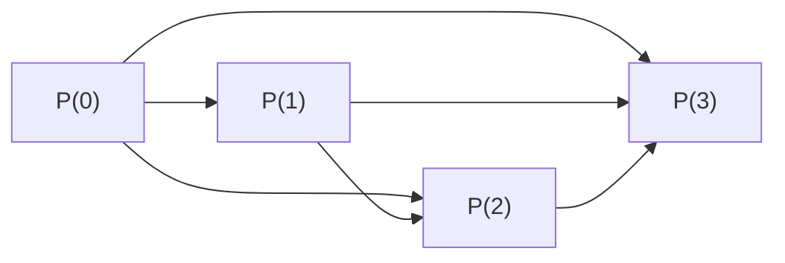

# Numeri naturali e principio di induzione

## Perché parlarne

L'**induzione** è il trucco con cui la matematica dimostra **infiniti casi** con un argomento **finito**. Senza, in analisi non parti: ogni "vale per ogni $n$" si appoggia all'induzione.

L'intuizione è il **domino infinito**: hai una fila lunghissima di tessere; se mostri che (a) la prima cade, e (b) ogni tessera che cade fa cadere la successiva, allora **cadono tutte**. L'induzione formale è esattamente questo, scritto in matematica.

## Cosa sono i numeri naturali

I **numeri naturali** sono i numeri che usiamo per contare: $\mathbb{N} = \{0, 1, 2, 3, 4, \dots\}$. (Convenzione: noi includiamo $0$; alcuni testi italiani partono da 1 — non cambia nulla di sostanziale.)

> **Glossarietto:**
>
> - $\mathbb{N}$ = simbolo per "i naturali" (la N "doppia" è una convenzione tipografica per i grandi insiemi numerici). Si legge "enne".
> - $\{0, 1, 2, \dots\}$ = elencazione, i tre puntini significano "e così via per sempre".

### Gli assiomi di Peano (la definizione formale di $\mathbb{N}$)

Giuseppe Peano nel 1889 ha proposto questa descrizione: $\mathbb{N}$ è caratterizzato dai cinque assiomi seguenti. Li scriviamo, poi li traduciamo.

1. $0 \in \mathbb{N}$.
2. Esiste una funzione **successore** $S : \mathbb{N} \to \mathbb{N}$.
3. $0$ non è il successore di nessuno: $S(n) \ne 0$ per ogni $n \in \mathbb{N}$.
4. $S$ è iniettiva: $S(m) = S(n) \Rightarrow m = n$.
5. **Principio di induzione.** Se $A \subseteq \mathbb{N}$ con $0 \in A$ e $\forall n,\ (n \in A \Rightarrow S(n) \in A)$, allora $A = \mathbb{N}$.

> **Glossarietto:**
>
> - $S$ = "successore", la funzione che dato $n$ restituisce $n+1$. Esempio: $S(3) = 4$, $S(0) = 1$.
> - "$S$ iniettiva" significa che due numeri diversi hanno successori diversi (cioè non c'è "ricongiungimento" della linea numerica).
> - $A \subseteq \mathbb{N}$ = "$A$ è un sottoinsieme di $\mathbb{N}$".

**Cosa vogliono dire, tutti insieme.** Assioma 1: c'è uno **start** ($0$). Assioma 2: c'è un **prossimo** ben definito ($S$). Assioma 3: lo start non è il prossimo di nessuno (la fila va in avanti, non torna su 0). Assioma 4: la fila non si ramifica né si ricongiunge (due numeri diversi non hanno lo stesso successivo). Assioma 5: ogni numero si raggiunge partendo da 0 e applicando $S$ un numero finito di volte — non ci sono "isole" scollegate.

Il quinto assioma è il principio di induzione. Lo riformuliamo in modo più pratico.

## Principio di induzione (forma usabile)

Sia $P(n)$ una proprietà che dipende dal numero naturale $n$ — chiamala "predicato". Per esempio: $P(n) = $ "$n^2 \ge n$".

**Principio di induzione.** Se:

- **(Base)** $P(0)$ è vero, e
- **(Passo)** $\forall n \in \mathbb{N},\ P(n) \Rightarrow P(n+1)$,

allora $P(n)$ è vero **per ogni** $n \in \mathbb{N}$.

> **Glossarietto della formula:**
>
> - $P(n)$ = un'affermazione che varia con $n$ (vera o falsa a seconda del valore di $n$).
> - **Base** = il primo caso, $n = 0$ (o $n = 1$, o un altro $n_0$ scelto come punto di partenza).
> - **Passo** = la "dimostrazione del dominio dopo dominio": *assumendo* che $P(n)$ sia vera (questa assunzione si chiama **ipotesi induttiva**), dimostri che anche $P(n+1)$ è vera.
> - $\Rightarrow$ = "implica" (vedi sez. 01).
> - $\forall n \in \mathbb{N}$ = "per ogni naturale".
>
> **Tradotto in italiano corrente:** "se il primo domino cade e ogni domino fa cadere il successivo, allora cadono tutti i domino".

**Variante con base diversa.** A volte la proprietà inizia a valere da $n = 1$ o $n = n_0$. Si dimostra $P(n_0)$ come base, e il passo $P(n) \Rightarrow P(n+1)$ per $n \ge n_0$. Conclusione: $P(n)$ vale per ogni $n \ge n_0$.

## Primo esempio guidato: la somma di Gauss

**Teorema.** Per ogni $n \in \mathbb{N}$,
$$0 + 1 + 2 + \dots + n = \frac{n(n+1)}{2}.$$
In notazione compatta: $\displaystyle \sum_{k=0}^{n} k = \frac{n(n+1)}{2}$.

> **Glossarietto:**
>
> - $\sum_{k=0}^{n} k$ = "sommatoria" da $k=0$ a $k=n$ del termine $k$ = $0 + 1 + 2 + \dots + n$. Il simbolo $\Sigma$ (sigma maiuscola greca) sta per "somma".
> - $k$ è la **variabile muta** (l'indice che scorre); sta scritta sotto e sopra il $\Sigma$ il suo valore iniziale e finale.

**Storia.** Si racconta che il piccolo Gauss alle elementari, a cui il maestro aveva chiesto di sommare da 1 a 100 per tenerlo zitto, restituì $5050$ in pochi secondi. Aveva notato: accoppia $1+100$, $2+99$, $3+98$, …, $50+51$: 50 coppie tutte uguali a $101$, quindi $50 \times 101 = 5050$. La formula generale è la versione algebrica di quel trucco.

*Dimostrazione per induzione.*

**(Base, $n = 0$).** A sinistra: $\sum_{k=0}^{0} k = 0$. A destra: $\frac{0 \cdot 1}{2} = 0$. Coincidono. ✓

**(Passo).** *Ipotesi induttiva*: assumiamo che la formula valga per un certo $n$, cioè
$$\sum_{k=0}^{n} k = \frac{n(n+1)}{2}. \quad (\text{IH})$$

*Tesi*: vogliamo dimostrare che vale anche per $n+1$, cioè
$$\sum_{k=0}^{n+1} k = \frac{(n+1)(n+2)}{2}.$$

*Conto.* La sommatoria fino a $n+1$ è la sommatoria fino a $n$ più l'ultimo termine $n+1$:
$$\sum_{k=0}^{n+1} k = \underbrace{\sum_{k=0}^{n} k}_{\text{uso (IH)}} + (n+1) = \frac{n(n+1)}{2} + (n+1).$$

Adesso mettiamo $n+1$ a fattore comune:
$$\frac{n(n+1)}{2} + (n+1) = (n+1)\left(\frac{n}{2} + 1\right) = (n+1) \cdot \frac{n+2}{2} = \frac{(n+1)(n+2)}{2}.$$

Esattamente quello che volevamo. ∎

## Forma forte (o "induzione completa")

A volte per dimostrare $P(n+1)$ ti serve non solo $P(n)$, ma anche $P(n-1)$, $P(n-2)$, …, $P(0)$ — cioè "tutti i precedenti".

**Principio forte.** Se:

$$\forall n \in \mathbb{N},\ \big(\forall k < n,\ P(k)\big) \Rightarrow P(n)$$

allora $P(n)$ è vero per ogni $n$.

> **Glossarietto:**
>
> - $\forall k < n,\ P(k)$ = "per ogni $k$ minore di $n$, vale $P(k)$" — cioè tutti i casi precedenti.
> - Nota: per $n = 0$ l'antecedente "$\forall k < 0$" è **vuoto** (non ci sono $k < 0$ in $\mathbb{N}$), quindi vacuamente vero (vedi sez. 01 sulla vacuità). Quindi nel principio forte la base è incorporata nel caso $n = 0$.

**Tradotto:** "se ogni proprietà segue dalle precedenti, e questo include il caso base (vacuamente), allora vale per tutti".

### Esempio: fattorizzazione in primi

**Teorema.** Ogni intero $n \ge 2$ si scrive come prodotto di numeri primi.

> **Glossarietto:** un numero **primo** è un intero $p \ge 2$ divisibile solo per $1$ e per se stesso. Esempi: 2, 3, 5, 7, 11, …

*Dim. per induzione forte su $n$.*

Sia $P(n)$ = "$n$ si scrive come prodotto di primi" (per $n \ge 2$).

*Caso $n = 2$:* $2$ è primo, e $2 = 2$ è una "scrittura come prodotto di un solo primo". $P(2)$ vera.

*Passo induttivo.* Sia $n \ge 2$, e supponiamo $P(k)$ vera per ogni $2 \le k < n$. Mostriamo $P(n)$.

- Caso A: $n$ è primo. Allora $n = n$ è la scrittura cercata. Fatto.
- Caso B: $n$ è composto, cioè $n = a \cdot b$ con $1 < a, b < n$. Per ipotesi forte, *sia* $a$ *sia* $b$ si fattorizzano in primi: $a = p_1 \cdots p_r$ e $b = q_1 \cdots q_s$. Quindi $n = p_1 \cdots p_r \cdot q_1 \cdots q_s$, scrittura come prodotto di primi.

In entrambi i casi $P(n)$ è vera. ∎

(Per chi è curioso: l'**unicità** della fattorizzazione — il "teorema fondamentale dell'aritmetica" — richiede un po' più di lavoro.)

## Diagrammi del passo induttivo

Visualizziamo la differenza tra induzione classica e forte:

*Induzione classica*: ogni anello dipende **solo dal precedente** ($P(n) \Rightarrow P(n+1)$).

*Induzione forte*: $P(n)$ può usare **tutti** i $P(k)$ con $k < n$ — frecce da ognuno verso il successivo.

## Disuguaglianze classiche dimostrabili per induzione

### Esempio: $2^n > n$ per ogni $n \ge 1$

> **Glossarietto:** $2^n$ = "2 elevato alla $n$" = $\underbrace{2 \cdot 2 \cdots 2}_{n \text{ volte}}$. Es: $2^3 = 2 \cdot 2 \cdot 2 = 8$.

*(Base, $n = 1$).* $2^1 = 2$ e $2 > 1$. ✓

*(Passo).* Ipotesi induttiva: $2^n > n$. Vogliamo $2^{n+1} > n + 1$.

$$2^{n+1} = 2 \cdot 2^n \overset{\text{(IH)}}{>} 2 \cdot n = n + n.$$

Poiché $n \ge 1$, abbiamo $n + n \ge n + 1$. Mettendo insieme: $2^{n+1} > n + 1$. ∎

### Disuguaglianza di Bernoulli

**Teorema.** Per ogni $x \ge -1$ e ogni $n \in \mathbb{N}$,
$$(1 + x)^n \ge 1 + nx.$$

> **Glossarietto della formula:**
>
> - $x$ = un numero reale $\ge -1$ (cioè $1 + x \ge 0$, indispensabile perché le potenze siano controllabili).
> - $(1+x)^n$ = la base $(1+x)$ elevata alla $n$.
> - $1 + nx$ = approssimazione lineare di $(1+x)^n$ (esattamente: i primi due termini dello sviluppo di Newton del binomio).
>
> **Tradotto:** la quantità $(1+x)^n$ è sempre *almeno* $1 + nx$. È una stima molto utile in tutti i calcoli di crescita.

*Dim.*

*(Base, $n = 0$).* $(1+x)^0 = 1$ e $1 + 0 \cdot x = 1$. Vero (con $\ge$). ✓

*(Passo).* Ipotesi induttiva: $(1+x)^n \ge 1 + nx$. Vogliamo $(1+x)^{n+1} \ge 1 + (n+1) x$.

Poiché $1 + x \ge 0$, moltiplicare entrambi i lati dell'ipotesi induttiva per $(1+x)$ **conserva la disuguaglianza** (regola fondamentale: si può moltiplicare per un numero $\ge 0$ senza cambiare verso). Quindi:

$$(1+x)^{n+1} = (1+x) \cdot (1+x)^n \overset{\text{(IH)}}{\ge} (1+x) \cdot (1 + nx).$$

Svolgiamo il prodotto a destra:
$$(1+x)(1+nx) = 1 + nx + x + nx^2 = 1 + (n+1)x + nx^2.$$

Adesso il termine $n x^2$ è $\ge 0$ (è $n \ge 0$ per il quadrato $\ge 0$), quindi possiamo "buttarlo via" mantenendo la disuguaglianza:

$$1 + (n+1) x + n x^2 \ge 1 + (n+1) x.$$

Concatenando: $(1+x)^{n+1} \ge 1 + (n+1) x$. ∎

**Uso tipico.** La useremo per stimare la velocità di crescita di $a^n$ (capitoli sulle successioni e sull'esponenziale).

### AM–GM a due termini (in margine)

Per ogni $a, b \ge 0$:
$$\frac{a + b}{2} \ge \sqrt{ab}.$$

> **Glossarietto.** AM = "Arithmetic Mean" = media aritmetica $(a+b)/2$. GM = "Geometric Mean" = media geometrica $\sqrt{ab}$. La disuguaglianza dice: la media aritmetica è sempre $\ge$ della media geometrica.

*Dim.* $(a - b)^2 \ge 0$ (un quadrato non è mai negativo). Sviluppando:
$$a^2 - 2ab + b^2 \ge 0 \Longrightarrow a^2 + b^2 \ge 2ab.$$
Sostituiamo $a \to \sqrt a, b \to \sqrt b$ (cosa lecita perché $a, b \ge 0$ rende le radici reali):
$$a + b \ge 2 \sqrt{a b} \quad\Longrightarrow\quad \frac{a + b}{2} \ge \sqrt{a b}. \quad \blacksquare$$

L'estensione a $n$ termini si fa per induzione (esercizio 4).

## Definizioni ricorsive

Una **definizione ricorsiva** definisce $f(n+1)$ in termini di $f(n)$ (o di valori precedenti). È legittima grazie all'induzione.

**Esempio 1 — fattoriale.**
$$0! = 1, \qquad (n+1)! = (n+1) \cdot n!.$$

> **Glossarietto:** $n!$ si legge "n fattoriale". $n!$ = prodotto di tutti i naturali da 1 a $n$. Esempi: $3! = 1 \cdot 2 \cdot 3 = 6$, $5! = 120$. Convenzione: $0! = 1$ (utile per avere formule pulite).

**Esempio 2 — Fibonacci.**
$$F_0 = 0, \quad F_1 = 1, \quad F_{n+2} = F_{n+1} + F_n.$$

I primi termini: $0, 1, 1, 2, 3, 5, 8, 13, 21, 34, 55, \dots$ — ogni numero è la somma dei due precedenti.

Queste definizioni sono giustificate dal **Teorema di ricorsione** (Dedekind): dato un punto di partenza $a$ e una regola di passaggio $h$, esiste *un'unica* funzione $f : \mathbb{N} \to X$ con $f(0) = a$ e $f(n+1) = h(n, f(n))$. (Vale anche per ricorsioni "a passo due" come Fibonacci, con piccole modifiche.)

### Identità di Fibonacci (esempio di induzione)

**Teorema.** $\displaystyle \sum_{k=0}^{n} F_k = F_{n+2} - 1$.

*Dim. per induzione.*

*(Base, $n = 0$).* Lato sinistro: $F_0 = 0$. Lato destro: $F_2 - 1 = 1 - 1 = 0$. ✓

*(Passo).* Ipotesi induttiva: $\sum_{k=0}^{n} F_k = F_{n+2} - 1$. Vogliamo $\sum_{k=0}^{n+1} F_k = F_{n+3} - 1$.

$$\sum_{k=0}^{n+1} F_k = \underbrace{\sum_{k=0}^{n} F_k}_{= F_{n+2} - 1 \text{ per (IH)}} + F_{n+1} = (F_{n+2} - 1) + F_{n+1} = (F_{n+1} + F_{n+2}) - 1 = F_{n+3} - 1.$$

(Nell'ultimo passaggio usiamo la regola di ricorrenza $F_{n+1} + F_{n+2} = F_{n+3}$.) ∎

### Crescita esponenziale di Fibonacci

I numeri di Fibonacci crescono esponenzialmente con base $\varphi$ (la **sezione aurea**, $\approx 1.618$).

> **Glossarietto:** $\varphi = (1 + \sqrt 5)/2 \approx 1.618$ è la "sezione aurea" o "rapporto aureo", che soddisfa $\varphi^2 = \varphi + 1$. La sua versione "minore" è $\psi = (1 - \sqrt 5)/2 \approx -0.618$.

**Formula di Binet** (per chi è curioso): $F_n = \frac{\varphi^n - \psi^n}{\sqrt 5}$. Dato che $|\psi| < 1$, il termine $\psi^n$ è esponenzialmente piccolo, quindi $F_n \approx \varphi^n / \sqrt 5$.

<svg viewBox="0 0 600 300" xmlns="http://www.w3.org/2000/svg">
  <rect x="0" y="0" width="600" height="300" fill="#111a30"/>
  <line x1="40" y1="270" x2="580" y2="270" stroke="#f3eed9" stroke-width="1"/>
  <line x1="40" y1="20" x2="40" y2="270" stroke="#f3eed9" stroke-width="1"/>
  <text x="290" y="295" fill="#f3eed9" font-family="serif" font-size="12" font-style="italic">n</text>
  <text x="10" y="30" fill="#f3eed9" font-family="serif" font-size="12" font-style="italic">Fₙ</text>
  <polyline points="60,270 100,268 140,266 180,262 220,256 260,246 300,228 340,202 380,164 420,114 460,52" fill="none" stroke="#d4af37" stroke-width="2"/>
  <polyline points="60,270 100,265 140,256 180,242 220,219 260,180 300,130 340,70" fill="none" stroke="#6fb38a" stroke-width="2" stroke-dasharray="4 4"/>
  <text x="450" y="40" fill="#d4af37" font-family="serif" font-size="13" font-style="italic">Fₙ (Fibonacci)</text>
  <text x="350" y="60" fill="#6fb38a" font-family="serif" font-size="13" font-style="italic">φⁿ/√5 (sezione aurea)</text>
</svg>

$F_n$ cresce come $\varphi^n / \sqrt{5}$ con $\varphi = (1+\sqrt 5)/2$. La differenza è esponenzialmente piccola.

## Induzione "transfinita" (solo cenno)

Il principio di induzione si estende a insiemi più grandi di $\mathbb{N}$ — gli **ordinali**. Brevissimo:

- Un insieme è **ben ordinato** se ogni suo sottoinsieme non vuoto ha un minimo. $\mathbb{N}$ lo è; $\mathbb{Z}$ no (l'insieme $\{n \in \mathbb{Z} : n \le 0\}$ non ha minimo).
- Sugli ordinali si fa induzione con due tipi di passo: **successore** (come in $\mathbb{N}$) e **limite** (per ordinali "tipo $\omega$" che sono il limite di tutti i precedenti).

Lo userai (eventualmente) in teoria degli insiemi e nel lemma di Zorn. Per Analisi I basta sapere che esiste.

## Errori tipici: i "cavalli alla Pólya"

George Pólya raccontava questa "dimostrazione" fasulla per illustrare un errore tipico.

**"Tutti i cavalli del mondo hanno lo stesso colore."**

*"Dim." per induzione sul numero $n$ di cavalli.*

*Base.* $n = 1$: ovvio, un cavallo ha lo stesso colore di se stesso. ✓

*"Passo".* Assumi che ogni gruppo di $n$ cavalli sia monocromatico. Prendi $n+1$ cavalli, chiamali $c_1, \dots, c_{n+1}$.

- Considera i primi $n$: $\{c_1, \dots, c_n\}$. Per ipotesi, stesso colore.
- Considera gli ultimi $n$: $\{c_2, \dots, c_{n+1}\}$. Per ipotesi, stesso colore.
- I due gruppi si sovrappongono in $\{c_2, \dots, c_n\}$ (cavalli in comune), quindi il colore è lo stesso per tutti. ∎(?)

### L'errore

Il passo va da $n$ a $n+1$. Verifichiamolo per il **primo caso utile**: $n = 1$, quindi $n + 1 = 2$. I due gruppi sono:

- Primi $n = 1$: $\{c_1\}$.
- Ultimi $n = 1$: $\{c_2\}$.

Si sovrappongono in $\{c_2, \dots, c_n\} = \{c_2, \dots, c_1\}$ — che è **vuoto** (non c'è nessun cavallo dall'indice 2 all'indice 1). Quindi i due gruppi sono **disgiunti**, e l'argomento del "colore in comune" salta.

**Morale.** Quando dimostri un passo $P(n) \Rightarrow P(n+1)$, verifica che la logica funzioni anche per il *primo* $n$ rilevante, non solo "in generale". Spesso il primo caso è quello dove il passo nasconde un buco.

## Esercizi

Esercizio 1 — Somma dei quadrati

Dimostra per induzione che $\displaystyle \sum_{k=1}^{n} k^2 = \frac{n(n+1)(2n+1)}{6}$.

**Soluzione.**

*(Base, $n = 1$).* Lato sinistro: $1^2 = 1$. Lato destro: $\frac{1 \cdot 2 \cdot 3}{6} = 1$. ✓

*(Passo).* Ipotesi induttiva: $\sum_{k=1}^{n} k^2 = \frac{n(n+1)(2n+1)}{6}$.

$$\sum_{k=1}^{n+1} k^2 = \frac{n(n+1)(2n+1)}{6} + (n+1)^2 = \frac{(n+1)[n(2n+1) + 6(n+1)]}{6} = \frac{(n+1)(2n^2 + 7n + 6)}{6}.$$

Fattorizza il polinomio: $2n^2 + 7n + 6 = (n+2)(2n+3)$ (verifica: $(n+2)(2n+3) = 2n^2 + 3n + 4n + 6 = 2n^2 + 7n + 6$ ✓).

Quindi la somma è $\frac{(n+1)(n+2)(2(n+1)+1)}{6}$, esattamente la formula con $n \to n+1$. ∎

Esercizio 2 — $n! > 2^n$ per $n$ grande

Trova il più piccolo $n_0$ tale che $n! > 2^n$ per ogni $n \ge n_0$, e dimostralo.

**Soluzione.** Calcoliamo i primi casi:

| $n$ | $n!$ | $2^n$ |
|---|---|---|
| 1 | 1 | 2 |
| 2 | 2 | 4 |
| 3 | 6 | 8 |
| 4 | 24 | 16 |

Da $n = 4$ in poi $n! > 2^n$. Quindi $n_0 = 4$.

*(Base, $n = 4$).* $24 > 16$. ✓

*(Passo).* Ipotesi induttiva: $n! > 2^n$ con $n \ge 4$. Allora
$$(n+1)! = (n+1) \cdot n! \overset{\text{(IH)}}{>} (n+1) \cdot 2^n \ge 2 \cdot 2^n = 2^{n+1},$$
perché $n + 1 \ge 5 \ge 2$. ∎

Esercizio 3 — Divisibilità

Dimostra che $6 \mid (n^3 - n)$ per ogni $n \in \mathbb{N}$.

**Soluzione (via algebra).** $n^3 - n = n(n^2 - 1) = n(n-1)(n+1)$. È il prodotto di tre interi consecutivi. Tra tre consecutivi: uno è multiplo di 3, almeno uno è pari, quindi il prodotto è multiplo di $2 \cdot 3 = 6$.

**Soluzione (per induzione).**

*(Base, $n = 0$).* $0^3 - 0 = 0 = 6 \cdot 0$. ✓

*(Passo).* Ipotesi: $6 \mid (n^3 - n)$. Allora
$$(n+1)^3 - (n+1) = (n^3 + 3n^2 + 3n + 1) - (n + 1) = (n^3 - n) + 3n^2 + 3n = (n^3 - n) + 3n(n+1).$$

Il primo addendo è multiplo di 6 per ipotesi induttiva. Il secondo è $3n(n+1)$ — ma $n(n+1)$ è il prodotto di due interi consecutivi, quindi è pari. Cioè $3n(n+1) = 3 \cdot 2 \cdot k = 6k$ per qualche $k$. Multiplo di 6.

Somma di due multipli di 6 è multiplo di 6. ∎

Esercizio 4 — AM–GM per $n$ termini

Dimostra che per $a_1, \dots, a_n \ge 0$,
$$\frac{a_1 + \dots + a_n}{n} \ge \sqrt[n]{a_1 \cdots a_n}.$$

**Schema (induzione "alla Cauchy", in due fasi).**

*Fase 1 — induzione su potenze di 2.* Per $n = 2^k$, induzione su $k$:

- $k = 0$ ($n = 1$): banale, $a_1 \ge a_1$.
- $k = 1$ ($n = 2$): è AM–GM a due termini, già dimostrato.
- Passo: con $2^{k+1}$ termini, dividi in due metà da $2^k$. Per ipotesi, ogni metà soddisfa AM–GM. Poi applichi AM–GM a due termini sulle due medie.

*Fase 2 — "completamento" per $n$ qualunque.* Sia $n$ qualsiasi e $\bar a = (a_1 + \dots + a_n)/n$. Aggiungi copie di $\bar a$ fino a raggiungere una potenza di 2: $a_1, \dots, a_n, \bar a, \bar a, \dots, \bar a$. La media resta $\bar a$ (perché aggiungere copie della media non la cambia).

Applicando la Fase 1: $\bar a \ge \sqrt[2^k]{a_1 \cdots a_n \cdot \bar a^{2^k - n}}$. Riarrangiando si ottiene AM–GM per $n$ termini. ∎

Esercizio 5 — Trova l'errore

"Dimostrazione": $\forall n \in \mathbb{N},\ n = n + 1$.

*Base*: omessa.

*Passo*: assumi $n = n+1$. Sommando 1 ai due lati: $n + 1 = n + 2$. ✓

Conclusione: $n = n + 1$ per ogni $n$. ∎

Cosa c'è di sbagliato?

**Soluzione.** **Manca la base**, e infatti non esiste: $0 \ne 1$. Il principio di induzione richiede **entrambi** base e passo. Una dimostrazione del passo da sola dice solo: "se uno cade, tutti cadono". Ma se *nessuno cade* (cioè se la base fallisce), tutta la struttura collassa. Senza la prima tessera che cade, l'effetto domino non parte.

## Trappole comuni

- **Saltare la base.** Senza $P(0)$ (o $P(n_0)$), il passo è gratis e non dimostra nulla — vedi esercizio 5.
- **Base sbagliata.** Verificare la base solo per $n = 1$ quando il passo richiede $n \ge 2$. I cavalli di Pólya: la dimostrazione funziona per $n \ge 2$ ma la base è $n = 1$. Risultato: argomentazione bucata.
- **Confondere "per qualche $n$" con "per ogni $n$".** $P(n)$ vera per *uno specifico* $n$ non dice nulla sugli altri. L'induzione serve appunto a passare da "vero in cascata" a "vero per ogni".
- **Usare l'induzione su $\mathbb{R}$.** Non funziona: i reali non sono ben ordinati dall'usuale $\le$ (es. $(0, 1]$ non ha minimo). Per i reali servono altri argomenti (estremo superiore, completezza — sezioni 06-07).

> **Pillola operativa.** Scrivi sempre **esplicitamente** il predicato $P(n)$ all'inizio della dimostrazione. Non scrivere "per induzione" senza dichiarare cosa varia con $n$: metà degli errori vengono dal fatto che a metà passo lo studente, senza accorgersene, ha cambiato cosa stava dimostrando.

## Riassunto in una riga

L'induzione è il "domino infinito": base ($P(0)$ vera) + passo ($P(n) \Rightarrow P(n+1)$) ⇒ $P$ vera per ogni naturale — il modo standard di dimostrare proposizioni che coinvolgono tutti i numeri.
