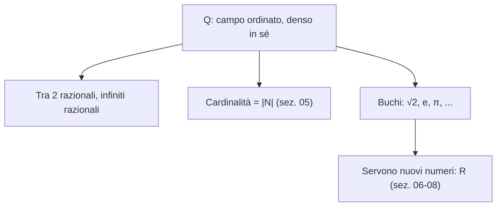

# Numeri interi e razionali

## Perché parlarne

Tutti sappiamo cosa siano $-3$ o $7/4$ — li usiamo dalle elementari. Ma in matematica esiste una **costruzione rigorosa**: partire da $\mathbb{N}$ (i naturali) e *fabbricare* $\mathbb{Z}$ e $\mathbb{Q}$ con le **operazioni di quoziente** (vedi sez. 02 sulle relazioni di equivalenza).

A cosa serve, in pratica? A due cose:
1. **Legittimare gli oggetti**: scrivere $-3$ e $\frac 7 4$ deve avere un significato preciso, non un'intuizione informale.
2. **Imparare la tecnica del "quoziente"**: la useremo identica per costruire $\mathbb{R}$ (sez. 08).

## Da $\mathbb{N}$ a $\mathbb{Z}$: aggiungere gli "opposti"

In $\mathbb{N} = \{0, 1, 2, 3, \dots\}$ non puoi sempre risolvere l'equazione $a + x = b$. Esempio: $3 + x = 1$ — non c'è nessun naturale $x$ che la risolva (perché ogni naturale è $\ge 0$).

Vogliamo "estendere" $\mathbb{N}$ aggiungendo gli **opposti**: numeri come $-3$ tali che $3 + (-3) = 0$.

### L'idea: un intero è una "differenza"

Pensiamo a un intero come $a - b$, dove $a, b$ sono naturali. Per esempio:
- $5 = 5 - 0 = 6 - 1 = 7 - 2 = \dots$
- $-3 = 0 - 3 = 1 - 4 = 2 - 5 = \dots$

Notiamo che **tante coppie diverse** $(a, b)$ rappresentano lo stesso intero. La coppia $(5, 0)$ e la coppia $(6, 1)$ rappresentano entrambe $5$. Quando due coppie rappresentano lo stesso intero?

> Risposta: $(a, b)$ e $(c, d)$ rappresentano lo stesso intero quando $a - b = c - d$, cioè (riscritto senza il "$-$" che ancora non abbiamo) quando $a + d = b + c$.

### La costruzione formale

**Definizione.** Su $\mathbb{N} \times \mathbb{N}$ (coppie ordinate di naturali) definiamo la relazione:
$$(a, b) \sim (c, d) \iff a + d = b + c.$$

> **Glossarietto:**
>
> - $\mathbb{N} \times \mathbb{N}$ = prodotto cartesiano (sez. 02) = insieme di tutte le coppie ordinate $(a, b)$ con $a, b$ naturali.
> - $\sim$ = "è in relazione con" — nel nostro caso, "rappresenta lo stesso intero".

**Verifica che $\sim$ è di equivalenza** (riflessiva + simmetrica + transitiva — vedi sez. 02):

- **Riflessiva**: $(a, b) \sim (a, b)$ vuol dire $a + b = b + a$. Vero (commutatività).
- **Simmetrica**: se $(a,b) \sim (c,d)$ allora $a + d = b + c$, che è uguale a $c + b = d + a$, cioè $(c, d) \sim (a, b)$. ✓
- **Transitiva**: se $(a,b) \sim (c,d)$ e $(c,d) \sim (e,f)$, allora $a + d = b + c$ e $c + f = d + e$. Sommando le due: $a + d + c + f = b + c + d + e$, e semplificando $c + d$ da entrambi i lati (legge di cancellazione in $\mathbb{N}$): $a + f = b + e$, cioè $(a, b) \sim (e, f)$. ✓

**Definizione.** $\mathbb{Z} := (\mathbb{N} \times \mathbb{N}) / \sim$. Cioè gli **interi** sono le classi di equivalenza di coppie di naturali. La classe $[(a, b)]$ "rappresenta" l'intero $a - b$.

> **Glossarietto:**
>
> - $/$ in $X/\sim$ è il simbolo di **insieme quoziente** (sez. 02): "raggruppiamo gli elementi di $X$ secondo la relazione $\sim$, ogni classe è un nuovo elemento".
> - $[(a, b)]$ = "la classe di equivalenza che contiene $(a, b)$".

### Operazioni su $\mathbb{Z}$

Definiamo somma, prodotto e opposto usando i rappresentanti:

- **Somma**: $[(a, b)] + [(c, d)] := [(a + c,\ b + d)]$.
  *Perché?* Se pensiamo $[(a,b)] = a - b$ e $[(c,d)] = c - d$, la somma è $(a - b) + (c - d) = (a + c) - (b + d) = [(a+c, b+d)]$.
- **Prodotto**: $[(a, b)] \cdot [(c, d)] := [(ac + bd,\ ad + bc)]$.
  *Perché?* $(a - b)(c - d) = ac - ad - bc + bd = (ac + bd) - (ad + bc) = [(ac+bd, ad+bc)]$.
- **Opposto**: $-[(a, b)] := [(b, a)]$.
  *Perché?* $-(a - b) = b - a = [(b, a)]$.

**Buona definizione.** Ogni operazione su classi di equivalenza va verificata: il risultato non deve dipendere dal rappresentante scelto. Per la somma: se $(a, b) \sim (a', b')$ e $(c, d) \sim (c', d')$, allora $a + b' = a' + b$ e $c + d' = c' + d$. Sommando: $(a + c) + (b' + d') = (a' + c') + (b + d)$, cioè $(a + c, b + d) \sim (a' + c', b' + d')$. ✓

### Immersione di $\mathbb{N}$ in $\mathbb{Z}$

I naturali "vivono dentro" gli interi tramite $n \mapsto [(n, 0)]$:
$$\mathbb{N} \hookrightarrow \mathbb{Z}, \qquad n \mapsto [(n, 0)].$$

> **Glossarietto.** Il simbolo $\hookrightarrow$ è una freccia "uncinata" che indica un'**immersione iniettiva**: ogni naturale finisce in un intero diverso, e così "ritroviamo" $\mathbb{N}$ dentro $\mathbb{Z}$.

Verifica iniettività: $[(n, 0)] = [(m, 0)] \iff n + 0 = 0 + m \iff n = m$. ✓

Da questo momento in poi, **identifichiamo** $n \in \mathbb{N}$ con $[(n, 0)] \in \mathbb{Z}$, e scriviamo semplicemente:
- $n$ al posto di $[(n, 0)]$ (interi positivi e zero).
- $-n$ al posto di $[(0, n)]$ (interi negativi).

Così otteniamo la notazione abituale $\mathbb{Z} = \{\dots, -3, -2, -1, 0, 1, 2, 3, \dots\}$.

### Diagramma del quoziente

<svg viewBox="0 0 600 300" xmlns="http://www.w3.org/2000/svg">
  <rect x="0" y="0" width="600" height="300" fill="#111a30"/>
  <line x1="40" y1="270" x2="580" y2="270" stroke="#f3eed9"/>
  <line x1="40" y1="20" x2="40" y2="270" stroke="#f3eed9"/>
  <text x="295" y="293" fill="#f3eed9" font-family="serif" font-size="12" font-style="italic">a (primo)</text>
  <text x="10" y="150" fill="#f3eed9" font-family="serif" font-size="12" font-style="italic">b (secondo)</text>

  <!-- classi di equivalenza = rette di pendenza 1 -->
  <line x1="40" y1="250" x2="280" y2="10" stroke="#6fb38a" stroke-width="1" stroke-dasharray="3 3"/>
  <line x1="80" y1="270" x2="320" y2="30" stroke="#d4af37" stroke-width="1" stroke-dasharray="3 3"/>
  <line x1="160" y1="270" x2="400" y2="30" stroke="#e8a04a" stroke-width="1" stroke-dasharray="3 3"/>
  <line x1="240" y1="270" x2="480" y2="30" stroke="#6aa9d8" stroke-width="1" stroke-dasharray="3 3"/>
  <line x1="320" y1="270" x2="560" y2="30" stroke="#e07a8d" stroke-width="1" stroke-dasharray="3 3"/>

  <!-- punti rappresentanti -->
  <circle cx="120" cy="190" r="3" fill="#d4af37"/>
  <circle cx="160" cy="150" r="3" fill="#d4af37"/>
  <circle cx="200" cy="110" r="3" fill="#d4af37"/>
  <text x="125" y="180" fill="#d4af37" font-family="serif" font-size="11">(2,2)</text>
  <text x="165" y="140" fill="#d4af37" font-family="serif" font-size="11">(3,3)</text>

  <text x="290" y="20" fill="#6fb38a" font-family="serif" font-size="12">b−a = +2 (intero −2)</text>
  <text x="500" y="20" fill="#e07a8d" font-family="serif" font-size="12">a−b = +2 (intero +2)</text>
</svg>

Le coppie $(a, b) \in \mathbb{N}^2$ sono punti del piano. Ogni retta a 45° è una classe: tutti i punti hanno la stessa "differenza" $a - b$, e quindi rappresentano lo stesso intero. La classe della "diagonale principale" (passante per (2,2), (3,3) etc.) corrisponde all'intero 0.

### Ordine in $\mathbb{Z}$

$[(a, b)] \le [(c, d)] \iff a + d \le b + c$.

> **Tradotto:** la condizione "$a - b \le c - d$" diventa, riscrivendola senza sottrazione, "$a + d \le b + c$". È un ordine totale (ogni due interi sono confrontabili), e somma/prodotto (per fattori positivi) lo conservano.

## Da $\mathbb{Z}$ a $\mathbb{Q}$: aggiungere gli inversi moltiplicativi

In $\mathbb{Z}$ non puoi sempre risolvere l'equazione $b \cdot x = a$. Esempio: $2 x = 1$ — non c'è nessun intero $x$ che la risolva.

Vogliamo "estendere" $\mathbb{Z}$ aggiungendo gli **inversi**: numeri come $\frac 1 2$ tali che $2 \cdot \frac 1 2 = 1$.

### L'idea: un razionale è una "frazione"

Stessa tecnica del passaggio $\mathbb{N} \to \mathbb{Z}$. Codifichiamo un razionale come coppia $(a, b)$ con $b \ne 0$, che pensiamo come $\frac a b$. E identifichiamo coppie che rappresentano la stessa frazione:
$$\frac{1}{2} = \frac{2}{4} = \frac{3}{6} = \dots$$
Cioè $(a, b)$ e $(c, d)$ rappresentano lo stesso razionale quando $\frac a b = \frac c d$, che riscritto senza divisione diventa $ad = bc$.

### La costruzione formale

**Definizione.** Su $\mathbb{Z} \times (\mathbb{Z} \setminus \{0\})$ (coppie con secondo elemento non nullo) definiamo:
$$(a, b) \sim (c, d) \iff a d = b c.$$

> **Glossarietto:**
>
> - $\mathbb{Z} \setminus \{0\}$ = "$\mathbb{Z}$ meno lo zero" = gli interi diversi da zero. Escludiamo zero come denominatore per evitare la divisione per zero.

**Verifica che $\sim$ è di equivalenza.**

- Riflessiva: $ab = ba$ (commutatività). ✓
- Simmetrica: ovvia.
- Transitiva: $(a, b) \sim (c, d)$ e $(c, d) \sim (e, f)$ danno $ad = bc$ e $cf = de$. Moltiplicando la prima per $f$: $adf = bcf$. Sostituendo $cf = de$: $adf = bde$. Cancellando $d$ (lecita perché $d \ne 0$): $af = be$, cioè $(a, b) \sim (e, f)$. ✓

**Definizione.** $\mathbb{Q} := (\mathbb{Z} \times (\mathbb{Z} \setminus \{0\})) / \sim$. Scriviamo $\frac{a}{b}$ (o $a/b$) per la classe $[(a, b)]$.

### Operazioni su $\mathbb{Q}$

Le regole familiari delle frazioni:

- **Somma**: $\dfrac{a}{b} + \dfrac{c}{d} := \dfrac{a d + b c}{b d}$.
  *Perché?* Comune denominatore $bd$: $\frac{a}{b} = \frac{ad}{bd}$, $\frac{c}{d} = \frac{bc}{bd}$, somma $\frac{ad + bc}{bd}$.
- **Prodotto**: $\dfrac{a}{b} \cdot \dfrac{c}{d} := \dfrac{a c}{b d}$.
- **Opposto**: $-\dfrac{a}{b} := \dfrac{-a}{b}$.
- **Inverso** (per $a \ne 0$): $\left(\dfrac{a}{b}\right)^{-1} := \dfrac{b}{a}$.

Tutte vanno verificate "ben definite", cioè indipendenti dal rappresentante scelto (vedi esercizio 2).

### $\mathbb{Q}$ è un campo ordinato

**Definizione.** Un **campo** è un insieme $K$ con due operazioni $+$ e $\cdot$ che soddisfano le proprietà familiari:

- **Per la somma**: associativa $((a+b)+c = a+(b+c))$, commutativa $(a+b = b+a)$, esiste lo zero $(a + 0 = a)$, ogni elemento ha l'opposto $(a + (-a) = 0)$.
- **Per il prodotto** (sui non-nulli): associativa, commutativa, esiste l'uno $(a \cdot 1 = a)$, ogni elemento non nullo ha l'inverso $(a \cdot a^{-1} = 1)$.
- **Distributiva**: $a(b + c) = ab + ac$.

In più $\mathbb{Q}$ è **ordinato** in modo compatibile: c'è un ordine totale $\le$ tale che:
- $a \le b \Rightarrow a + c \le b + c$ (la somma "non disordina").
- $0 \le a$ e $0 \le b$ implica $0 \le ab$ (prodotto di non-negativi è non-negativo).

> **Tradotto.** $\mathbb{Q}$ è "una struttura algebrica completa per le 4 operazioni" (più, meno, per, diviso — escluso la divisione per zero), e in più i numeri sono ordinati in modo che le operazioni rispettino l'ordine. Tutto ciò che vorresti fare con i numeri "ordinari" lo puoi fare in $\mathbb{Q}$. Quasi tutto.

## $\mathbb{Q}$ è "denso in sé"

**Teorema (densità interna).** Tra due razionali distinti, c'è sempre un altro razionale.

*Dim.* Siano $p, q \in \mathbb{Q}$ con $p < q$. Considera la media $m = \frac{p + q}{2}$. È razionale (somma di razionali diviso 2 è razionale). E:
$$p < m < q$$
perché $p = \frac{p + p}{2} < \frac{p + q}{2} < \frac{q + q}{2} = q$ (la prima e l'ultima disuguaglianza valgono perché $p < q$). ∎

**Corollario.** Tra due razionali distinti ci sono **infiniti** razionali (iterando: prendi la media, poi la media tra $p$ e $m$, ecc.).

> **Tradotto.** I razionali sono "fittissimi": non c'è nessuna "minima distanza" tra due razionali consecutivi — non esiste nemmeno il concetto di "razionale consecutivo". Eppure, come vedremo, in mezzo ai razionali ci sono dei **buchi enormi**.

## Il primo buco: $\sqrt 2 \notin \mathbb{Q}$

Già visto nel cap. 01 — rivediamolo in modo riassuntivo.

**Teorema (Pitagora, Euclide).** Non esiste $r \in \mathbb{Q}$ con $r^2 = 2$.

*Dim. (per assurdo).* Supponi $r = p/q$ con $p, q$ interi, $q \ne 0$, $\gcd(p, q) = 1$. Allora $p^2 = 2 q^2$, quindi $p^2$ pari, quindi $p$ pari (sez. 01), $p = 2m$. Sostituendo: $4m^2 = 2 q^2$, cioè $q^2 = 2 m^2$, quindi $q$ pari. Ma allora $\gcd(p, q)$ contiene il fattore 2, contro l'ipotesi $\gcd(p, q) = 1$. Assurdo. ∎

**Lezione.** L'equazione $x^2 = 2$ non si risolve in $\mathbb{Q}$. *Eppure* la successione $1, 1.4, 1.41, 1.414, 1.4142, \dots$ (tutta di razionali) sembra "convergere a qualcosa". Quel "qualcosa" è $\sqrt 2 \approx 1.4142\dots$, e *non sta in $\mathbb{Q}$*.

## $\mathbb{Q}$ non è completo

Ecco il punto centrale di tutto il capitolo, quello per cui ci serviranno i reali.

### Cos'è la "completezza"

**Definizione provvisoria.** Un insieme totalmente ordinato $(K, \le)$ si dice **completo** se ogni suo sottoinsieme non vuoto e *superiormente limitato* ammette un **estremo superiore** in $K$.

> **Glossarietto** (lo formalizzeremo nei cap. 06-07, qui solo a parole):
>
> - **Superiormente limitato**: c'è una "cappa" $M$ che non viene mai superata — $\forall x \in A,\ x \le M$. $M$ si chiama **maggiorante**.
> - **Estremo superiore** ($\sup$): il più piccolo dei maggioranti. Cioè: la "cappa più stretta possibile" sopra l'insieme.

Esempio: $A = \{x \in \mathbb{Q} : x < 1\}$. È superiormente limitato (es. da 2). Tra tutti i maggioranti, il più piccolo è $1$. Quindi $\sup A = 1$.

### $\mathbb{Q}$ ha un buco "visibile"

**Teorema.** $\mathbb{Q}$ **non** è completo.

*Idea.* Consideriamo l'insieme dei "razionali positivi col quadrato $< 2$": dovrebbe avere come estremo superiore $\sqrt 2$, ma $\sqrt 2 \notin \mathbb{Q}$. Quindi il sup non esiste in $\mathbb{Q}$.

*Dim.* Sia
$$A = \{q \in \mathbb{Q} : q > 0,\ q^2 < 2\}.$$

$A$ è:
- **Non vuoto**: $1 \in A$ (perché $1 > 0$ e $1^2 = 1 < 2$). ✓
- **Superiormente limitato**: $2$ è un maggiorante (se $q > 2$ allora $q^2 > 4 > 2$, quindi $q \notin A$). ✓

Mostriamo che $A$ **non ha estremo superiore in $\mathbb{Q}$**. Per assurdo, supponiamo che $s = \sup A$ esista in $\mathbb{Q}$. Allora $s$ è un razionale, e $s^2$ è razionale. Tre casi.

**Caso 1: $s^2 < 2$.** Allora $s \in A$. Mostriamo che troviamo $q \in A$ con $q > s$, contraddicendo "$s$ è maggiorante" (figuriamoci il più piccolo).

Cerchiamo $q = s + \varepsilon$ con $\varepsilon > 0$ razionale piccolo, tale che $q \in A$, cioè $q^2 < 2$:
$$q^2 = (s + \varepsilon)^2 = s^2 + 2 s \varepsilon + \varepsilon^2.$$
Vogliamo $q^2 < 2$, cioè $2 s \varepsilon + \varepsilon^2 < 2 - s^2$. Se $\varepsilon \in (0, 1)$ allora $\varepsilon^2 < \varepsilon$, quindi:
$$2 s \varepsilon + \varepsilon^2 < (2s + 1) \varepsilon.$$
Basta scegliere $\varepsilon$ con $0 < \varepsilon < \min\left(1,\ \frac{2 - s^2}{2s + 1}\right)$ — esiste sempre un razionale così, e otteniamo $q \in A$ con $q > s$. Contraddizione.

**Caso 2: $s^2 > 2$.** Mostriamo che esiste un maggiorante più piccolo di $s$, contraddicendo "$s$ è il più piccolo dei maggioranti".

Cerchiamo $r = s - \varepsilon$ con $\varepsilon > 0$ razionale piccolo, tale che $r$ sia ancora maggiorante di $A$, cioè $\forall q \in A,\ q < r$. Equivalentemente (visto che $q > 0$ e vorremmo $r > 0$): $q^2 < r^2$.

Per ogni $q \in A$ vale $q^2 < 2$. Se riusciamo ad avere $r^2 > 2$, allora $q^2 < 2 < r^2$. Quindi cerchiamo $\varepsilon$ tale che $r^2 = (s - \varepsilon)^2 > 2$:
$$(s - \varepsilon)^2 = s^2 - 2 s \varepsilon + \varepsilon^2 > s^2 - 2 s \varepsilon.$$
Basta $s^2 - 2 s \varepsilon > 2$, cioè $\varepsilon < \frac{s^2 - 2}{2 s}$. Esiste un razionale così.

Inoltre serve $r > 0$, cioè $\varepsilon < s$. Entrambe le condizioni sono soddisfacibili. Quindi $r$ è un maggiorante più piccolo. Contraddizione.

**Caso 3: $s^2 = 2$.** Ma $s \in \mathbb{Q}$, e abbiamo appena dimostrato che nessun razionale ha quadrato 2. Assurdo.

Tutti e tre i casi portano a contraddizione. Quindi non esiste $\sup A$ in $\mathbb{Q}$. ∎

> **Tradotto.** L'insieme $A$ avrebbe "naturalmente" come estremo superiore $\sqrt 2$ — ma $\sqrt 2$ non esiste in $\mathbb{Q}$. Quindi $\mathbb{Q}$ "non chiude" questo sup. C'è un **buco**. E non è l'unico: anche $\sqrt 3$, $\sqrt 5$, $\pi$, $e$, … sono tutti buchi.

## Implicazioni filosofiche

Per fare analisi (limiti, derivate, integrali) servono **insiemi completi**: ogni successione che "sembra convergere" deve avere un limite *davvero esistente*. $\mathbb{Q}$ non lo è — è pieno di buchi.

La costruzione di $\mathbb{R}$ (sez. 08) sarà esattamente l'arte di **tappare quei buchi**, aggiungendo "abbastanza" numeri da garantire che ogni sup esista.

## Esempi guidati

**1.** Somma di due frazioni: $\dfrac{7}{12} + \dfrac{1}{8} = ?$

*Soluzione.* Comune denominatore di 12 e 8: minimo comune multiplo $\text{mcm}(12, 8) = 24$.
$\dfrac{7}{12} = \dfrac{7 \cdot 2}{24} = \dfrac{14}{24}$. $\dfrac{1}{8} = \dfrac{1 \cdot 3}{24} = \dfrac{3}{24}$.
Somma: $\dfrac{14 + 3}{24} = \dfrac{17}{24}$.

**2.** $\sqrt 3 \notin \mathbb{Q}$. Dimostrazione analoga a $\sqrt 2$ (vedi cap. 01, esercizio 3).

**3.** $\log_{10} 2 \notin \mathbb{Q}$. *Soluzione.* Se $\log_{10} 2 = p/q$ con $p, q$ interi positivi, allora $10^{p/q} = 2$, cioè $10^p = 2^q$, cioè $2^p \cdot 5^p = 2^q$. Per l'**unicità della fattorizzazione in primi** (cap. 03), gli esponenti di $2$ e $5$ devono coincidere a destra e sinistra. A destra non c'è il fattore $5$, quindi $p = 0$. Ma allora $\log_{10} 2 = 0$, cioè $10^0 = 2$, falso. ∎

## Esercizi

Esercizio 1 — $\sqrt 5$ irrazionale

Dimostra che $\sqrt 5 \notin \mathbb{Q}$.

**Soluzione.** Per assurdo, $\sqrt 5 = p/q$ con $\gcd(p, q) = 1$. Allora $p^2 = 5 q^2$, quindi $5 \mid p^2$. Poiché 5 è primo, $5 \mid p$, scriviamo $p = 5m$. Sostituendo: $25 m^2 = 5 q^2 \Rightarrow q^2 = 5 m^2$, quindi $5 \mid q$. Ma allora $5 \mid \gcd(p, q) = 1$. Assurdo. ∎

Esercizio 2 — Buona definizione del prodotto

Verifica che il prodotto su $\mathbb{Q}$ è ben definito: se $(a, b) \sim (a', b')$ e $(c, d) \sim (c', d')$, allora $(a c, b d) \sim (a' c', b' d')$.

**Soluzione.** Le ipotesi sono $a b' = a' b$ e $c d' = c' d$. Vogliamo $(a c)(b' d') = (a' c')(b d)$. Conto:
$$(ac)(b' d') = (a b')(c d') = (a' b)(c' d) = (a' c')(b d). \quad\blacksquare$$

Esercizio 3 — Nessun razionale ha quadrato 3

Sia $B = \{q \in \mathbb{Q}^+ : q^2 < 3\}$. Mostra che non ha estremo superiore in $\mathbb{Q}$.

**Soluzione.** Stesso schema della dimostrazione che $\mathbb{Q}$ non è completo. I tre casi $s^2 < 3, s^2 > 3, s^2 = 3$ portano ad assurdo. Per il primo, definisci $q = s + \varepsilon$ con $0 < \varepsilon < \min(1, (3 - s^2)/(2s + 1))$. Per il secondo, $r = s - \varepsilon$ con $\varepsilon < (s^2 - 3)/(2 s)$. Per il terzo, $\sqrt 3 \notin \mathbb{Q}$.

Esercizio 4 — Frazioni diadiche dense

Mostra che per ogni $p, q \in \mathbb{Q}$ con $p < q$ esiste un razionale della forma $k / 2^n$ ("**frazione diadica**") strettamente compreso tra $p$ e $q$.

**Soluzione.** Scegli $n \in \mathbb{N}$ con $2^n > \frac{1}{q - p}$ (esiste, perché i naturali sono illimitati). Allora $\frac{1}{2^n} < q - p$.

Sia $k = \lfloor 2^n p \rfloor + 1$ (la parte intera di $2^n p$, più 1). Allora:
- $k > 2^n p$, quindi $k / 2^n > p$.
- $k \le 2^n p + 1$, quindi $k / 2^n \le p + 1/2^n < p + (q - p) = q$.

Mettendo insieme: $p < k/2^n < q$. ∎

Esercizio 5 — Quadrati perfetti vs radici razionali

Sia $n \ge 2$ intero. Mostra che $\sqrt n \in \mathbb{Q}$ **se e solo se** $n$ è un quadrato perfetto (cioè $n = m^2$ per qualche $m \in \mathbb{N}$).

**Soluzione.**

*"Se"*: $n = m^2 \Rightarrow \sqrt n = m \in \mathbb{Z} \subset \mathbb{Q}$.

*"Solo se"*: per assurdo, $\sqrt n = p/q$ con $\gcd(p, q) = 1$. Allora $p^2 = n q^2$.

Prendiamo un primo $r$ qualunque e supponiamo che $r^a \| n$ (cioè $r^a$ divide $n$ ma $r^{a+1}$ no — è l'esponente esatto di $r$ in $n$).

Da $p^2 = n q^2$ e $\gcd(p, q) = 1$: tutti i fattori primi di $p^2$ vengono da $n$ (perché $q$ e $p$ non hanno fattori in comune). L'esponente di $r$ in $p^2$ è pari (è $2 \times \text{esponente in } p$). Quindi anche l'esponente di $r$ in $n q^2$ è pari — e nel passaggio da $n q^2$ a $n$ si toglie $r^{2 \cdot (\text{esponente in } q)}$, lasciando comunque un esponente pari.

Quindi l'esponente di $r$ in $n$ è pari. Vale per *ogni* primo che divide $n$, quindi tutti gli esponenti nella fattorizzazione di $n$ sono pari, e $n$ è quadrato perfetto. ∎

## Trappole comuni

- **Confondere "frazione" con "coppia"**. La frazione $a/b$ è la *classe di equivalenza* — $1/2$ e $2/4$ sono **la stessa frazione**, anche se sono coppie diverse.
- **Dimenticare $b \ne 0$**. La costruzione di $\mathbb{Q}$ esclude lo zero al denominatore. $1/0$ non è "infinito": semplicemente non esiste in $\mathbb{Q}$.
- **Pensare che $\mathbb{Q}$ basti per l'analisi**. Non basta: l'analisi richiede completezza, e $\mathbb{Q}$ è pieno di buchi. Tutti i teoremi di esistenza dell'analisi (Bolzano, Weierstrass, valor medio) usano la completezza di $\mathbb{R}$.
- **Pensare "irrazionale = strano"**. In realtà sono la **regola**, non l'eccezione: i numeri irrazionali sono "molto più numerosi" dei razionali (cap. 05 — Cantor). Quasi ogni numero reale che incontrerai è irrazionale.

> **Pillola operativa.** Quando vedi una costruzione "per classi di equivalenza", ricorda due cose: (a) la classe è un *insieme di rappresentanti*, mai un singolo rappresentante; (b) ogni operazione definita "sui rappresentanti" deve essere verificata **ben definita** sulle classi (non deve dipendere dalla scelta del rappresentante). È l'esercizio mentale che fa la differenza fra capire e ripetere.

## Riassunto in una riga

$\mathbb{Z}$ si costruisce da $\mathbb{N}$ identificando coppie con la stessa differenza, $\mathbb{Q}$ si costruisce da $\mathbb{Z}$ identificando coppie con la stessa frazione — e $\mathbb{Q}$, pur essendo denso, è pieno di buchi (come $\sqrt 2$) che ci costringeranno a costruire $\mathbb{R}$.
