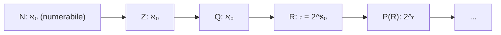

# Cardinalità e infinito (Cantor)

## Perché parlarne

Tra il 1873 e il 1891 Georg Cantor ha scoperto una cosa che ha cambiato la matematica: **gli infiniti non sono tutti uguali**. $\mathbb{N}$ (i naturali) e $\mathbb{R}$ (i reali) hanno entrambi infiniti elementi, ma $\mathbb{R}$ ne ha **strettamente di più**.

Sembra paradossale: come si "contano" due cose infinite? Cantor ha trovato la risposta giusta, ed è elegante. Capirla cambia il modo in cui pensi a:
- **Successioni e serie** (cosa significa "elencare" qualcosa).
- **Misura e probabilità** (perché "casualmente uno legge un razionale" ha probabilità zero).
- **Calcolabilità** (cosa una macchina può, o non può, enumerare).

## L'idea: contare senza contare

Per due insiemi *finiti* sappiamo cosa vuol dire "stesso numero di elementi": contiamo, e se contiamo lo stesso numero, abbiamo lo stesso. Ma per due insiemi *infiniti*, contare non funziona.

**L'idea di Cantor**: due insiemi hanno lo stesso "numero" di elementi (la stessa **cardinalità**) se possiamo metterli in **corrispondenza uno a uno** — cioè se esiste una funzione biiettiva fra loro.

> **Esempio quotidiano.** Hai 30 sedie e tante persone. Per sapere se ci sono "tante persone quante sedie" non devi contarle: basta dire "sedetevi" e vedere se ognuno ha la sua sedia e ogni sedia ha qualcuno. Se sì, stessa cardinalità. *Anche* se sono 30, anche se sono infiniti. È il principio della biiezione.

### Definizione formale

**Definizione.** Due insiemi $A$ e $B$ sono **equipotenti** (in simboli $A \sim B$ oppure $|A| = |B|$) se esiste una funzione **biiettiva** $f : A \to B$.

> **Glossarietto:**
>
> - $|A|$ = "cardinalità di $A$" = "il numero (eventualmente infinito) di elementi di $A$".
> - $A \sim B$ = "$A$ ed $B$ sono equipotenti".
> - **Biiezione**: funzione iniettiva (input diversi → output diversi) **e** suriettiva (ogni output viene raggiunto). Vedi sez. 02.

L'equipotenza è una relazione di equivalenza (sez. 02) sulla classe degli insiemi: riflessiva (funzione identità), simmetrica (la biiezione inversa esiste sempre), transitiva (composizione di biiezioni è biiezione).

**Definizione di "$\le$".** $|A| \le |B|$ se esiste una funzione **iniettiva** $A \to B$ (ogni elemento di $A$ "trova posto" in $B$, anche se in $B$ avanzano elementi).

**Definizione di "$<$".** $|A| < |B|$ se $|A| \le |B|$ ma $A \not\sim B$ (cioè c'è un'iniezione ma nessuna biiezione).

## Esempi sorprendenti

L'intuizione "$A \subset B \Rightarrow |A| < |B|$" funziona per gli insiemi finiti, ma **non** per quelli infiniti.

### 1. $\mathbb{N} \sim \mathbb{N}_{\text{pari}}$ (i naturali pari sono "tanti quanti" tutti i naturali)

Biiezione: $f(n) = 2n$. Cioè la corrispondenza $0 \leftrightarrow 0, 1 \leftrightarrow 2, 2 \leftrightarrow 4, 3 \leftrightarrow 6, \dots$ Ogni naturale ha esattamente un partner pari, ogni pari ha esattamente un partner naturale.

> **Tradotto.** "Eliminando metà dei naturali (i dispari), me ne restano altrettanti." Sembra magia, ma è la firma dell'infinito.

**Definizione di Dedekind di "infinito".** Un insieme è **infinito** se è equipotente a un suo sottoinsieme proprio. (Per gli insiemi finiti, $|A| < |B|$ se $A \subsetneq B$. Per gli infiniti, no.)

### 2. $\mathbb{N} \sim \mathbb{Z}$

Idea: enumera gli interi alternando positivi e negativi: $0, 1, -1, 2, -2, 3, -3, \dots$

Formalmente $f : \mathbb{N} \to \mathbb{Z}$,
$$f(n) = \begin{cases} n/2 & \text{se } n \text{ pari} \\ -(n+1)/2 & \text{se } n \text{ dispari} \end{cases}$$

Verifica: $f(0) = 0$, $f(1) = -1$, $f(2) = 1$, $f(3) = -2$, $f(4) = 2$, …

### 3. $(0, 1) \sim \mathbb{R}$ (un intervallino "contiene tutto $\mathbb{R}$")

Biiezione esplicita: $f(x) = \tan(\pi (x - 1/2))$.

> **Glossarietto.** $\tan$ è la funzione tangente (vedi sez. 19). Su $(-\pi/2, \pi/2)$ la tangente è una biiezione con $\mathbb{R}$. Trasformiamo $(0, 1)$ in $(-\pi/2, \pi/2)$ con la mappa lineare $x \mapsto \pi(x - 1/2)$, e poi applichiamo la tangente.

Per ora non importa avere familiarità con la tangente: il punto è che un intervallo aperto piccolissimo ha *gli stessi punti* dell'intera retta reale.

## Numerabilità: il "primo" infinito

**Definizione.** Un insieme $A$ è **numerabile** se $A \sim \mathbb{N}$ (cioè se esiste una biiezione $\mathbb{N} \to A$).

Avere una biiezione con $\mathbb{N}$ vuol dire poter **enumerare** gli elementi: $A = \{a_0, a_1, a_2, a_3, \dots\}$, una lista infinita ma "indicizzata" dai naturali.

> **Convenzione.** Alcuni autori chiamano "numerabile" anche un insieme finito. Noi diciamo **al più numerabile** per "finito o numerabile", e **numerabile** solo per la versione infinita.

### Teoremi base

**Teorema 1.** Ogni sottoinsieme **infinito** di $\mathbb{N}$ è numerabile.

*Dim.* Sia $A \subseteq \mathbb{N}$ infinito. Definiamo per ricorrenza:
$$a_0 := \min A, \qquad a_{n+1} := \min(A \setminus \{a_0, \dots, a_n\}).$$

> **Glossarietto:**
>
> - $\min A$ = il più piccolo elemento di $A$. Esiste perché $\mathbb{N}$ è **ben ordinato**: ogni sottoinsieme non vuoto ha un minimo (proprietà fondamentale dei naturali, cap. 03).
> - $A \setminus \{a_0, \dots, a_n\}$ = $A$ tolti gli elementi già scelti.

Ad ogni passo togliamo un elemento; siccome $A$ è infinito, non si esaurisce mai. La funzione $n \mapsto a_n$ è iniettiva (per costruzione, tutti i $a_n$ sono distinti). È anche suriettiva: se $b \in A$ non fosse mai $a_n$, allora ad ogni passo $a_n \le b$ (perché $a_n$ è il minimo di un insieme che contiene $b$), ma ci sono solo finitamente tanti naturali $\le b$, quindi finiremmo gli $a_n$, contraddizione. ∎

**Teorema 2.** Unione **numerabile** di insiemi **numerabili** è numerabile.

In simboli: se $A_k$ è numerabile per ogni $k \in \mathbb{N}$, allora $\bigcup_{k \in \mathbb{N}} A_k$ è numerabile.

*Dim. (idea — la "tabella infinita").* Scriviamo gli $A_k$ come liste:
$$A_k = \{a_{k, 0},\ a_{k, 1},\ a_{k, 2},\ \dots\}.$$

Disponiamo in una **tabella infinita**:

$$\begin{array}{c|cccc}
& 0 & 1 & 2 & \cdots \\\hline
A_0 & a_{0,0} & a_{0,1} & a_{0,2} & \cdots \\
A_1 & a_{1,0} & a_{1,1} & a_{1,2} & \cdots \\
A_2 & a_{2,0} & a_{2,1} & a_{2,2} & \cdots \\
\vdots & & & & \ddots
\end{array}$$

Adesso enumeriamo questa tabella **per diagonali**:
$$a_{0,0},\ \underbrace{a_{1,0},\ a_{0,1}}_{\text{somma indici} = 1},\ \underbrace{a_{2,0},\ a_{1,1},\ a_{0,2}}_{\text{somma indici} = 2},\ \dots$$

Ogni diagonale ha un numero finito di elementi (somma $k + j = n$ fisso: $n+1$ elementi). Le diagonali sono in numero numerabile (una per $n \in \mathbb{N}$). Quindi enumeriamo l'intera tabella con i naturali. Eliminando eventuali duplicati, otteniamo una biiezione $\mathbb{N} \to \bigcup A_k$. ∎

Questa tecnica si chiama **diagonale di Cantor (versione costruttiva)** ed è il modo standard per dimostrare numerabilità.

<svg viewBox="0 0 600 300" xmlns="http://www.w3.org/2000/svg">
  <rect x="0" y="0" width="600" height="300" fill="#111a30"/>
  <g stroke="#f3eed9" stroke-opacity="0.3" stroke-width="0.5">
    <line x1="60" y1="40" x2="540" y2="40"/>
    <line x1="60" y1="80" x2="540" y2="80"/>
    <line x1="60" y1="120" x2="540" y2="120"/>
    <line x1="60" y1="160" x2="540" y2="160"/>
    <line x1="60" y1="200" x2="540" y2="200"/>
    <line x1="60" y1="240" x2="540" y2="240"/>
    <line x1="60" y1="40" x2="60" y2="260"/>
    <line x1="120" y1="40" x2="120" y2="260"/>
    <line x1="180" y1="40" x2="180" y2="260"/>
    <line x1="240" y1="40" x2="240" y2="260"/>
    <line x1="300" y1="40" x2="300" y2="260"/>
    <line x1="360" y1="40" x2="360" y2="260"/>
    <line x1="420" y1="40" x2="420" y2="260"/>
    <line x1="480" y1="40" x2="480" y2="260"/>
  </g>
  <g fill="#f3eed9" font-family="serif" font-size="13" text-anchor="middle">
    <text x="90" y="65">1/1</text><text x="150" y="65">1/2</text><text x="210" y="65">1/3</text><text x="270" y="65">1/4</text><text x="330" y="65">1/5</text>
    <text x="90" y="105">2/1</text><text x="150" y="105">2/2</text><text x="210" y="105">2/3</text><text x="270" y="105">2/4</text><text x="330" y="105">2/5</text>
    <text x="90" y="145">3/1</text><text x="150" y="145">3/2</text><text x="210" y="145">3/3</text><text x="270" y="145">3/4</text>
    <text x="90" y="185">4/1</text><text x="150" y="185">4/2</text><text x="210" y="185">4/3</text>
    <text x="90" y="225">5/1</text><text x="150" y="225">5/2</text>
  </g>
  <polyline points="90,65 90,105 150,65 210,65 150,105 90,145 90,185 150,145 210,105 270,65" fill="none" stroke="#d4af37" stroke-width="2.5"/>
  <text x="380" y="280" fill="#d4af37" font-family="serif" font-size="12">enumerazione diagonale → Q+ numerabile</text>
</svg>

Le frazioni $a/b$ con $a, b \ge 1$ formano una tabella infinita. Le percorri per diagonali (somma $a + b$ crescente) saltando i duplicati: ottieni una lista numerata di tutti i razionali positivi.

### Conseguenze: $\mathbb{Z}$ e $\mathbb{Q}$ sono numerabili

**Teorema 3.** $\mathbb{Z}$ è numerabile. (Già dimostrato sopra con la lista $0, 1, -1, 2, -2, \dots$.)

**Teorema 4.** $\mathbb{Q}$ è numerabile.

*Dim.* Una frazione positiva $p/q$ (ridotta) è una coppia $(p, q) \in \mathbb{N}^2$. La diagonale di Cantor enumera $\mathbb{N}^2$. Quindi $\mathbb{Q}^+$ è numerabile (al più). D'altra parte $\mathbb{N} \subseteq \mathbb{Q}^+$, quindi $\mathbb{Q}^+$ non è finito. Conclusione: $\mathbb{Q}^+$ è numerabile.

Aggiungendo lo zero e i negativi (entrambi numerabili o finiti), tutto $\mathbb{Q}$ resta numerabile. ∎

> **Significato.** Sembra strano: $\mathbb{Q}$ è **denso** (cap. 04 — tra due razionali ci sono infiniti razionali), eppure si può "enumerare" in lista. La densità è una proprietà topologica, la numerabilità è una proprietà di "cardinalità". Sono concetti distinti.

## La grande sorpresa: $\mathbb{R}$ non è numerabile

**Teorema (Cantor 1891).** $\mathbb{R}$ **non** è numerabile. Equivalentemente: $|\mathbb{R}| > |\mathbb{N}|$.

*Dim. (diagonale di Cantor, seconda versione — quella più famosa).*

Basta dimostrare che $(0, 1)$ non è numerabile, perché $(0, 1) \sim \mathbb{R}$.

**Per assurdo**, supponiamo che esista una biiezione $f : \mathbb{N} \to (0, 1)$. Cioè possiamo "elencare" tutti i numeri di $(0, 1)$ come una lista:
$$f(0), f(1), f(2), f(3), \dots$$

Scriviamo ciascuno in **forma decimale**:
$$\begin{aligned}
f(0) &= 0.\,d_{0,0}\,d_{0,1}\,d_{0,2}\,d_{0,3}\,\dots \\
f(1) &= 0.\,d_{1,0}\,d_{1,1}\,d_{1,2}\,d_{1,3}\,\dots \\
f(2) &= 0.\,d_{2,0}\,d_{2,1}\,d_{2,2}\,d_{2,3}\,\dots \\
&\,\vdots
\end{aligned}$$

> **Glossarietto:**
>
> - $d_{n, k}$ = la $k$-esima cifra decimale del numero $f(n)$.
> - Convenzione: evitiamo le code di soli 9 (es. $0.4999\dots = 0.5000\dots$ — ogni numero ha quindi rappresentazione **unica**).

**Costruiamo un numero $x$ che differisce da TUTTI i numeri della lista.** Definiamo $x = 0.e_0\,e_1\,e_2\,e_3\,\dots$ scegliendo le cifre $e_n$ così:

$$e_n := \begin{cases} 5 & \text{se } d_{n,n} \ne 5 \\ 6 & \text{se } d_{n,n} = 5 \end{cases}$$

> **Tradotto.** Guardiamo la **diagonale** della lista (le cifre $d_{0,0}, d_{1,1}, d_{2,2}, \dots$) e per ogni cifra ne mettiamo una **diversa** in $e_n$. Scegliendo solo tra 5 e 6 evitiamo problemi (zero iniziale, code di 9, ecc.).

Allora:
- $x \in (0, 1)$ (perché è una decimale con cifre tra 5 e 6).
- $x \ne f(n)$ per ogni $n$, perché differiscono almeno nella **cifra $n$-esima**: $x$ ha $e_n$, mentre $f(n)$ ha $d_{n,n} \ne e_n$.

Ma allora $f$ non è suriettiva: $x$ non è nessuno dei $f(n)$. **Contraddizione**, perché $f$ era biiettiva.

Conclusione: nessuna $f : \mathbb{N} \to (0, 1)$ può essere biiettiva. Quindi $(0, 1)$ (e $\mathbb{R}$) non è numerabile. ∎

<svg viewBox="0 0 600 300" xmlns="http://www.w3.org/2000/svg">
  <rect x="0" y="0" width="600" height="300" fill="#111a30"/>
  <text x="30" y="50" fill="#f3eed9" font-family="monospace" font-size="14">f(0) = 0.</text>
  <text x="30" y="80" fill="#f3eed9" font-family="monospace" font-size="14">f(1) = 0.</text>
  <text x="30" y="110" fill="#f3eed9" font-family="monospace" font-size="14">f(2) = 0.</text>
  <text x="30" y="140" fill="#f3eed9" font-family="monospace" font-size="14">f(3) = 0.</text>
  <text x="30" y="170" fill="#f3eed9" font-family="monospace" font-size="14">f(4) = 0.</text>

  <rect x="125" y="36" width="20" height="20" fill="#d4af37" fill-opacity="0.3"/>
  <rect x="151" y="66" width="20" height="20" fill="#d4af37" fill-opacity="0.3"/>
  <rect x="177" y="96" width="20" height="20" fill="#d4af37" fill-opacity="0.3"/>
  <rect x="203" y="126" width="20" height="20" fill="#d4af37" fill-opacity="0.3"/>
  <rect x="229" y="156" width="20" height="20" fill="#d4af37" fill-opacity="0.3"/>

  <text x="125" y="52" fill="#f3eed9" font-family="monospace" font-size="14">3 1 4 1 5 9 ...</text>
  <text x="125" y="82" fill="#f3eed9" font-family="monospace" font-size="14">2 7 1 8 2 8 ...</text>
  <text x="125" y="112" fill="#f3eed9" font-family="monospace" font-size="14">5 0 0 0 0 0 ...</text>
  <text x="125" y="142" fill="#f3eed9" font-family="monospace" font-size="14">7 7 7 4 7 7 ...</text>
  <text x="125" y="172" fill="#f3eed9" font-family="monospace" font-size="14">1 2 3 4 5 6 ...</text>

  <text x="30" y="220" fill="#e07a8d" font-family="monospace" font-size="14">x   = 0.6 5 5 5 6 ...</text>
  <text x="30" y="250" fill="#e07a8d" font-family="serif" font-size="13">x differisce da f(n) nella cifra n → non in lista</text>
</svg>

Costruzione del numero "fuori lista": cambia la cifra $n$-esima di $f(n)$ in modo da differire sempre. Il nuovo $x$ non può essere nessuno dei $f(n)$.

## Cantor-Bernstein-Schroeder (CBS)

Tornando alle disuguaglianze tra cardinalità: c'è un risultato comodissimo.

**Teorema (Cantor-Bernstein-Schroeder).** Se $|A| \le |B|$ e $|B| \le |A|$, allora $|A| = |B|$.

**Tradotto.** Se esiste un'iniezione $A \to B$ e un'iniezione $B \to A$, allora esiste una biiezione $A \to B$.

> **Uso pratico.** Per dimostrare $|A| = |B|$ non devi necessariamente costruire una biiezione esplicita: ti basta trovare due iniezioni, una in ciascuna direzione.

*Idea della dimostrazione.* Date $f : A \to B$ e $g : B \to A$ iniettive, consideri le "catene" di un elemento $a \in A$:
$$a \mapsto f(a) \in B \mapsto g(f(a)) \in A \mapsto \dots$$
e indietro:
$$a, \quad g^{-1}(a) \in B\ (\text{se esiste}), \quad f^{-1}(g^{-1}(a)) \in A\ (\text{se esiste}), \dots$$

Ogni elemento appartiene a una catena. In base al tipo di catena (termina in $A$, termina in $B$, è infinita), si decide se mandarlo via $f$ o via $g^{-1}$. Si ottiene così una biiezione $h : A \to B$. (Dim. completa: 1-2 pagine. Vedi Halmos *Naive Set Theory*.)

## La "cardinalità del continuo"

**Notazione storica:**
- $\aleph_0$ ("aleph zero", da $\aleph$, prima lettera dell'alfabeto ebraico) $= |\mathbb{N}|$.
- $\mathfrak{c}$ ("c gotica") $= |\mathbb{R}|$, **cardinalità del continuo**.

Abbiamo dimostrato: $\aleph_0 < \mathfrak{c}$.

**Risultato.** $\mathfrak{c} = 2^{\aleph_0}$, cioè $|\mathbb{R}| = |\mathcal{P}(\mathbb{N})|$ (cardinalità dell'insieme delle parti di $\mathbb{N}$).

> **Glossarietto:**
>
> - $\mathcal{P}(X)$ = **insieme delle parti** di $X$ = l'insieme di tutti i sottoinsiemi di $X$. Es: $\mathcal{P}(\{1, 2\}) = \{\emptyset, \{1\}, \{2\}, \{1, 2\}\}$.
> - Se $|X| = n$ finito, allora $|\mathcal{P}(X)| = 2^n$ (per ogni elemento di $X$, scegli "dentro" o "fuori"). Lo stesso simbolo $2^{\aleph_0}$ generalizza la cardinalità delle "scelte tra dentro/fuori" su una infinità numerabile di elementi.

*Idea della dim. $\mathfrak{c} = 2^{\aleph_0}$.* Ogni reale di $(0, 1)$ si rappresenta in binario come successione di 0 e 1. Una successione $(a_0, a_1, a_2, \dots) \in \{0,1\}^{\mathbb{N}}$ corrisponde all'insieme degli indici dove vale 1, cioè a un elemento di $\mathcal{P}(\mathbb{N})$. Modulo la doppia rappresentazione (code di 1) — che riguarda un insieme numerabile — si sistema con CBS.

### Il teorema "padre": l'insieme delle parti è più grande

**Teorema (Cantor).** Per ogni insieme $X$, $|X| < |\mathcal{P}(X)|$.

*Dim.* L'iniezione $X \to \mathcal{P}(X)$ esiste ovvia: $x \mapsto \{x\}$. Quindi $|X| \le |\mathcal{P}(X)|$. Mostriamo la disuguaglianza stretta.

Per assurdo, supponiamo esista $f : X \to \mathcal{P}(X)$ **suriettiva**. Definiamo
$$D := \{x \in X : x \notin f(x)\}.$$

> **Tradotto.** $D$ è l'insieme degli $x \in X$ che **non appartengono** alla loro immagine $f(x)$ (ricorda che $f(x)$ è un sottoinsieme di $X$, quindi ha senso chiedere se $x \in f(x)$).

$D \in \mathcal{P}(X)$, quindi per suriettività esiste $x_0 \in X$ con $f(x_0) = D$. Adesso poniamoci la domanda: **$x_0 \in D$ o no?**

- Se $x_0 \in D$: per definizione di $D$, $x_0 \notin f(x_0) = D$. Contraddizione.
- Se $x_0 \notin D$: per definizione di $D$, $x_0 \in f(x_0) = D$. Contraddizione.

In entrambi i casi, contraddizione. Quindi nessuna $f$ può essere suriettiva. ∎

**Conseguenza.** Esiste una **gerarchia infinita di infiniti**:
$$|\mathbb{N}| < |\mathcal{P}(\mathbb{N})| < |\mathcal{P}(\mathcal{P}(\mathbb{N}))| < \mathcal{P}(\mathcal{P}(\mathcal{P}(\mathbb{N}))) < \dots$$

Non c'è un "infinito più grande". L'infinito stesso si arrampica su una scala senza fine.

## Ipotesi del continuo (solo cenno)

**Domanda di Cantor.** Esiste un insieme $X$ con $\aleph_0 < |X| < \mathfrak{c}$?

L'**Ipotesi del Continuo** (CH) dice: *no*, non esiste cardinalità intermedia tra $\mathbb{N}$ e $\mathbb{R}$.

Cantor sospettò la CH e cercò di dimostrarla, senza riuscirci. Risultati moderni:
- **Gödel (1940)**: la CH è coerente con gli assiomi ZFC (non si può confutare).
- **Cohen (1963)**: la CH è anche **indipendente** da ZFC (non si può dimostrare).

Cioè: la CH è una **proposizione indecidibile** nella matematica standard. Né vera né falsa, dipende da quali assiomi aggiungi. Sconvolgente.

## Gerarchia visiva

## Conseguenze inaspettate

**1.** $\mathbb{Q}[\sqrt 2] = \{a + b \sqrt 2 : a, b \in \mathbb{Q}\}$ è numerabile (iniezione in $\mathbb{Q} \times \mathbb{Q}$).

**2. I numeri algebrici sono numerabili.** Un numero è **algebrico** se è radice di un polinomio a coefficienti interi. *Dim.* I polinomi a coefficienti interi sono $\bigcup_n \mathbb{Z}^{n+1}$, unione numerabile di numerabili → numerabile. Ogni polinomio ha un numero finito di radici. Unione numerabile di insiemi finiti → numerabile. ∎

**Corollario potentissimo.** Esistono **numeri trascendenti** (= non algebrici): perché $\mathbb{R} \setminus \mathbb{A}$ (con $\mathbb{A}$ algebrici) è non vuoto, anzi ha cardinalità $\mathfrak{c}$. Quindi *quasi tutti* i reali sono trascendenti.

> **Curiosità storica.** Cantor ha dimostrato (1874) che i trascendenti esistono **contandoli**, prima ancora che si conoscesse un esempio concreto. È una delle prime dimostrazioni **non costruttive** della matematica. $e$ è stato dimostrato trascendente da Hermite (1873), $\pi$ da Lindemann (1882) — ma Cantor sapeva già che ce n'erano "molti di più" senza esibirne nessuno.

**3.** Le successioni finite di interi $\bigcup_n \mathbb{Z}^n$: numerabili.

**4.** Le successioni infinite $\{0, 1\}^{\mathbb{N}}$: cardinalità $\mathfrak{c}$.

## Esercizi

Esercizio 1 — Biiezione esplicita $\mathbb{N} \times \mathbb{N} \to \mathbb{N}$

Trova una biiezione esplicita $\pi : \mathbb{N}^2 \to \mathbb{N}$.

**Soluzione.** **Funzione di accoppiamento di Cantor**:
$$\pi(m, n) = \frac{(m + n)(m + n + 1)}{2} + m.$$

Verifica i primi valori: $\pi(0,0) = 0$, $\pi(1,0) = 1$, $\pi(0,1) = 2$, $\pi(2,0) = 3$, $\pi(1,1) = 4$, $\pi(0,2) = 5$, $\pi(3,0) = 6$, …

L'idea: numera le coppie per **antidiagonali** (a somma $m + n$ costante). La $k$-esima antidiagonale ha $k + 1$ punti, e prima di lei ci sono $1 + 2 + \dots + k = k(k+1)/2$ punti. Sull'antidiagonale $k = m + n$, il punto $(m, n)$ è al posto $m$. Quindi $\pi(m, n) = k(k+1)/2 + m$.

Esercizio 2 — $|\{0, 1\}^{\mathbb{N}}| = \mathfrak{c}$

Mostra che le successioni binarie infinite hanno cardinalità $\mathfrak{c}$.

**Soluzione.** Iniezione $\{0, 1\}^{\mathbb{N}} \to (0, 1)$: a una successione $a = (a_0, a_1, a_2, \dots)$ associamo $\sum_{n=0}^\infty a_n / 2^{n+1}$ (espansione binaria del numero).

Iniezione $(0, 1) \to \{0, 1\}^{\mathbb{N}}$: espansione binaria standard (eliminando code di 1).

Per CBS, $|\{0, 1\}^{\mathbb{N}}| = |(0, 1)| = |\mathbb{R}| = \mathfrak{c}$. ∎

Esercizio 3 — Cardinalità di un insieme "magro"

Sia $A$ l'insieme dei reali in $[0, 1]$ la cui espansione decimale contiene **solo** cifre $0$ e $1$. Trova $|A|$.

**Soluzione.** $A$ è in biiezione con $\{0, 1\}^{\mathbb{N}}$ (a meno della doppia rappresentazione, che è un insieme numerabile, gestibile con CBS). Quindi $|A| = \mathfrak{c}$.

**Notevole.** $A$ ha "misura zero" (è un insieme di tipo Cantor in base 10), eppure ha la stessa cardinalità di tutto $\mathbb{R}$. **Cardinalità e misura sono concetti diversi.**

Esercizio 4 — $\mathbb{R}^2 \sim \mathbb{R}$

Mostra che il piano $\mathbb{R}^2$ ha la stessa cardinalità della retta $\mathbb{R}$.

**Soluzione (idea).**

Iniezione $\mathbb{R} \to \mathbb{R}^2$: ovvia, $x \mapsto (x, 0)$.

Iniezione $\mathbb{R}^2 \to \mathbb{R}$: lavoriamo su $(0, 1)^2 \to (0, 1)$. Dato $(0.a_1 a_2 a_3 \dots,\ 0.b_1 b_2 b_3 \dots)$ associamo $0.a_1 b_1 a_2 b_2 a_3 b_3 \dots$ — **intercalando le cifre**. Quasi biiettiva (problemi con le code di 9 si gestiscono con CBS).

Per CBS, $|\mathbb{R}^2| = |\mathbb{R}|$.

**Curiosità.** Cantor stesso scrisse a Dedekind nel 1877: "*lo vedo, ma non lo credo*". L'idea che una linea e un quadrato abbiano lo stesso numero di punti contraddiceva l'intuizione di tutti i matematici dell'epoca.

(Nota tecnica: *non* esiste una biiezione **continua** tra $\mathbb{R}$ e $\mathbb{R}^2$. Le curve di Peano si avvicinano, ma non sono biiettive.)

Esercizio 5 — Esistenza dei trascendenti

Dimostra che esistono numeri trascendenti, **senza esibirne uno specifico**.

**Soluzione.** I numeri algebrici sono numerabili (esempio 2 sopra). Se i trascendenti **non** esistessero, $\mathbb{R}$ sarebbe uguale agli algebrici, quindi numerabile. Ma $\mathbb{R}$ non è numerabile (Cantor). Contraddizione.

Quindi i trascendenti esistono, e anzi sono $\mathfrak{c}$. ∎

Esempio classico di **dimostrazione non costruttiva**.

## Trappole comuni

- **"Tutti gli infiniti sono uguali."** **Falso.** $|\mathbb{N}| < |\mathbb{R}|$.
- **"Tra due interi consecutivi non c'è niente, quindi $\mathbb{Z}$ è più piccolo di $\mathbb{Q}$."** **Falso.** $|\mathbb{Z}| = |\mathbb{Q}| = \aleph_0$. La **densità** è una proprietà topologica, la **cardinalità** è insiemistica.
- **"$\mathbb{Q}$ è denso in $\mathbb{R}$, quindi deve avere stessa cardinalità."** **Falso.** $\mathbb{Q}$ è denso E numerabile; $\mathbb{R}$ è non numerabile.
- **"Esiste una lista di tutti i reali."** **Falso.** Esattamente la conclusione della diagonale di Cantor: non esiste.
- **"Misura zero ⇒ pochi punti."** **Falso.** L'insieme di Cantor (cap. 56) ha misura zero ma cardinalità $\mathfrak{c}$.

> **Pillola.** Quando senti "**infinito**", chiedi sempre "*quale* infinito?". $\aleph_0$, $\mathfrak{c}$, $2^{\mathfrak{c}}$, $\dots$ — Cantor ha aperto la porta a un'intera gerarchia di grandezze infinite.

## Riassunto in una riga

Gli infiniti non sono tutti uguali: $|\mathbb{N}| = |\mathbb{Z}| = |\mathbb{Q}| = \aleph_0$ ("numerabile") < $|\mathbb{R}| = \mathfrak{c}$ ("continuo"), e la dimostrazione è la **diagonale di Cantor** in tre righe.
