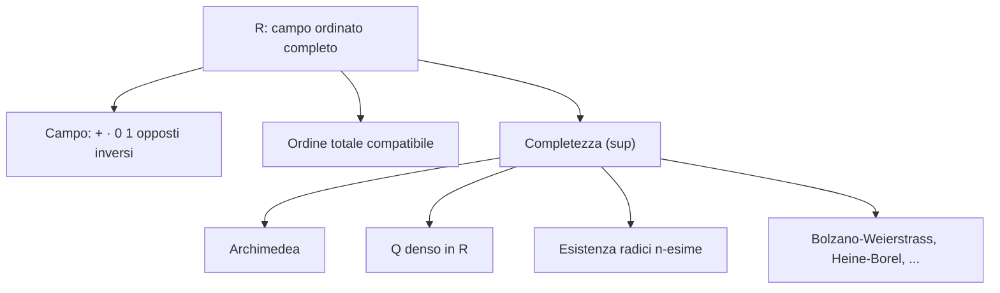

# Numeri reali: gli assiomi

## Perché parlarne

Ci sono due modi di lavorare con $\mathbb{R}$:

1. **Costruirlo** a partire da $\mathbb{Q}$ — c'è il metodo di Dedekind (sezioni) e quello di Cauchy (successioni di Cauchy). Le faremo nella sezione 08. È rigoroso ma laborioso.
2. **Postularne le proprietà** — diciamo "esiste un campo ordinato completo, chiamiamolo $\mathbb{R}$" e da lì deduciamo tutto. Più rapido e operativo. È quello che facciamo qui.

Per il 99% dell'analisi, l'approccio postulato è tutto ciò che serve.

## L'idea: $\mathbb{R}$ è caratterizzato da **tre famiglie di regole**

$\mathbb{R}$ è un insieme con:
- due operazioni: addizione $+$ e moltiplicazione $\cdot$;
- una relazione d'ordine $\le$.

e queste devono soddisfare **14 assiomi**, raggruppati in tre famiglie:
- **A. Assiomi di campo** (le solite proprietà di $+$ e $\cdot$).
- **B. Assiomi di ordine** (l'ordine $\le$ è "compatibile" con le operazioni).
- **C. Assioma di completezza** — *la* proprietà che $\mathbb{Q}$ non aveva.

### A. Assiomi di campo

$(\mathbb{R}, +, \cdot)$ è un **campo**:

1. **Associatività della somma**: $\forall a, b, c \in \mathbb{R},\ (a + b) + c = a + (b + c)$.
2. **Commutatività della somma**: $\forall a, b,\ a + b = b + a$.
3. **Esistenza dello zero**: $\exists 0 \in \mathbb{R}$ tale che $\forall a,\ a + 0 = a$.
4. **Esistenza dell'opposto**: $\forall a,\ \exists (-a)$ con $a + (-a) = 0$.
5. **Associatività e commutatività del prodotto**: $(ab)c = a(bc)$, $ab = ba$.
6. **Esistenza dell'uno**: $\exists 1 \ne 0$ tale che $\forall a,\ a \cdot 1 = a$.
7. **Esistenza dell'inverso** (per non-zero): $\forall a \ne 0,\ \exists a^{-1}$ con $a \cdot a^{-1} = 1$.
8. **Distributività**: $a(b + c) = ab + ac$.

> **Glossarietto:**
>
> - $\forall$ = "per ogni" (vedi sez. 01).
> - $\exists$ = "esiste almeno un".
> - **Campo** = struttura algebrica che ammette le 4 operazioni (più, meno, per, diviso, con divisione per zero esclusa).

### B. Assiomi di ordine

$\le$ è un **ordine totale compatibile** con le operazioni:

9. **Riflessiva**: $a \le a$.
10. **Antisimmetrica**: $a \le b$ e $b \le a$ implicano $a = b$.
11. **Transitiva**: $a \le b$ e $b \le c$ implicano $a \le c$.
12. **Totalità**: $\forall a, b$ vale $a \le b$ oppure $b \le a$ (ogni coppia è confrontabile).
13. **Compatibilità con $+$**: $a \le b \Rightarrow a + c \le b + c$.
14. **Compatibilità con $\cdot$**: $0 \le a$ e $0 \le b$ implicano $0 \le ab$.

> **Tradotto.** Gli ordinamenti 9-12 sono le solite regole del minore-uguale (riflessiva, transitiva, ecc.). 13 e 14 dicono che le operazioni "rispettano" l'ordine: sommare a destra e a sinistra una stessa cosa non scambia l'ordine; prodotti di non-negativi sono non-negativi.

A questo punto $\mathbb{R}$ è un **campo ordinato**. Anche $\mathbb{Q}$ lo è. Per distinguerli serve l'ultimo assioma.

### C. Assioma di completezza (il "vero" assioma di $\mathbb{R}$)

15. **Ogni sottoinsieme $A \subseteq \mathbb{R}$ non vuoto e superiormente limitato ammette estremo superiore in $\mathbb{R}$.**

> **Glossarietto** (lo formalizziamo a fondo nella sez. 07, qui usiamolo intuitivamente):
>
> - **Superiormente limitato** = "esiste una cappa": $\exists M \in \mathbb{R}$ tale che $\forall x \in A,\ x \le M$. $M$ si dice **maggiorante**.
> - **Estremo superiore** ($\sup A$) = "il più piccolo dei maggioranti" — la cappa più bassa possibile sopra $A$.

In simboli: se $A$ non è vuoto e ha almeno un maggiorante, allora *il minimo* tra i maggioranti esiste in $\mathbb{R}$.

> **Confronto.** $\mathbb{Q}$ NON soddisfa questo assioma: l'insieme $\{q \in \mathbb{Q} : q^2 < 2\}$ non ha sup in $\mathbb{Q}$ (perché "vorrebbe" essere $\sqrt 2 \notin \mathbb{Q}$). Vedi sez. 04. La completezza dice: in $\mathbb{R}$ il sup esiste *sempre*.

### Unicità di $\mathbb{R}$

**Teorema.** Esiste **un unico** (a meno di isomorfismo) campo ordinato completo. Lo chiamiamo $\mathbb{R}$.

> **Glossarietto.** "A meno di isomorfismo" = "se ne esistono due, c'è una funzione biiettiva tra di loro che preserva $+$, $\cdot$, $\le$" — cioè sono indistinguibili come strutture matematiche.

Quindi da qui in poi parliamo de **i** numeri reali, non *un* campo ordinato completo.

## Conseguenze immediate degli assiomi di campo

Tutte familiari (le usi alle medie), ma le elenchiamo per certificare che il sistema funziona.

**1. $-(-a) = a$.** ("L'opposto dell'opposto è il numero originale.")
*Dim.* $a + (-a) = 0$. Ma anche $-(-a) + (-a) = 0$ (per definizione di opposto). Per unicità dell'opposto di $-a$, $-(-a) = a$. ∎

**2. $a \cdot 0 = 0$ per ogni $a$.**
*Dim.* $a \cdot 0 = a \cdot (0 + 0) = a \cdot 0 + a \cdot 0$ (distributiva). Sottraendo $a \cdot 0$ a entrambi i lati: $0 = a \cdot 0$. ∎

**3. $(-1) \cdot a = -a$.**
*Dim.* $a + (-1) \cdot a = 1 \cdot a + (-1) \cdot a = (1 + (-1)) \cdot a = 0 \cdot a = 0$. Quindi $(-1) \cdot a$ è l'opposto di $a$. ∎

**4. Legge di annullamento del prodotto:** $ab = 0 \Rightarrow a = 0$ oppure $b = 0$.
*Dim.* Supponiamo $a \ne 0$. Allora esiste $a^{-1}$. Moltiplicando $ab = 0$ a sinistra per $a^{-1}$: $b = a^{-1}(ab) = a^{-1} \cdot 0 = 0$. ∎

## Conseguenze degli assiomi di ordine

**5. $a \le b \iff b - a \ge 0$.**

**6. $a \le 0 \Rightarrow -a \ge 0$.**

**7. $a > 0, b > 0 \Rightarrow ab > 0$.** (Stretta.)

**8. Regola dei segni**: $a < 0, b < 0 \Rightarrow ab > 0$.
*Dim.* $-a > 0$ e $-b > 0$, quindi $(-a)(-b) > 0$. Ma $(-a)(-b) = ab$ (verifica: $-a \cdot -b = (-1)a \cdot (-1)b = (-1)^2 ab = ab$). ∎

**9. Per ogni $a \ne 0$, $a^2 > 0$.** In particolare $1 = 1^2 > 0$.
*Dim.* Se $a > 0$: $a^2 = a \cdot a > 0$ (regola 7). Se $a < 0$: $a^2 = (-a)(-a) > 0$ (regola 8). ∎

> **Conseguenza notevole.** $\mathbb{C}$ (complessi) NON può essere reso un campo ordinato: in $\mathbb{C}$ esisterebbe l'unità immaginaria $i$ con $i^2 = -1 < 0$, contraddicendo "ogni quadrato è $> 0$".

## Conseguenze forti della completezza

Sono i risultati che $\mathbb{Q}$ NON ha, e che fanno funzionare l'analisi.

### Archimedeicità: "nessun numero è infinitamente grande"

**Teorema (proprietà archimedea).** Per ogni $a, b \in \mathbb{R}$ con $a > 0$, esiste $n \in \mathbb{N}$ con $n a > b$.

> **Tradotto.** Sommando $a$ a se stesso abbastanza volte, supero qualunque numero $b$, per quanto grande. Non esistono numeri "infinitamente grandi" o "infinitamente piccoli" in $\mathbb{R}$.

*Dim.* Per assurdo, supponiamo che esista una coppia $a > 0$, $b$ tale che $na \le b$ per ogni $n \in \mathbb{N}$. Allora l'insieme $A = \{na : n \in \mathbb{N}\}$ è non vuoto e superiormente limitato da $b$. Per completezza, esiste $s = \sup A$.

Allora $s - a < s$, quindi $s - a$ non è maggiorante. Quindi esiste $n_0 \in \mathbb{N}$ con $n_0 a > s - a$, cioè $(n_0 + 1) a > s$. Ma $(n_0 + 1) a \in A$, e $s$ era maggiorante di $A$. Contraddizione. ∎

**Corollario.** Per ogni $\varepsilon > 0$ esiste $n \in \mathbb{N}$ con $1/n < \varepsilon$.

*Dim.* Applica archimedeicità con $a = \varepsilon$ e $b = 1$: esiste $n$ con $n \varepsilon > 1$, cioè $1/n < \varepsilon$. ∎

> **Pillola.** L'archimedeicità sembra ovvia ma è non banale: esistono **campi ordinati non archimedei** (analisi non standard di Robinson, anni '60). In quei campi ci sono "infinitesimi" $\omega > 0$ con $\omega < 1/n$ per ogni $n$. In $\mathbb{R}$ archimedeo, no.

### Parte intera

**Teorema (parte intera).** Per ogni $x \in \mathbb{R}$, esiste un unico $n \in \mathbb{Z}$ con $n \le x < n + 1$. Si scrive $n = \lfloor x \rfloor$ ("**floor di $x$**" o "**parte intera inferiore di $x$**").

> **Esempi.** $\lfloor 3.7 \rfloor = 3$, $\lfloor 5 \rfloor = 5$, $\lfloor -2.3 \rfloor = -3$ (non $-2$!).

*Dim.* Per archimedeicità, l'insieme $\{k \in \mathbb{Z} : k \le x\}$ è non vuoto (esiste $N$ con $-N \le x$) e superiormente limitato (esiste $M$ con $M > x$, e ogni $k \in $ insieme è $\le M$). I sottoinsiemi di $\mathbb{Z}$ superiormente limitati hanno massimo (esercizio). Sia $n$ tale massimo: $n \le x$ e $n + 1 > x$. Unico per costruzione. ∎

### Densità di $\mathbb{Q}$ in $\mathbb{R}$

**Teorema.** Tra due reali distinti esiste un razionale.

In simboli: $\forall a < b \in \mathbb{R},\ \exists q \in \mathbb{Q} : a < q < b$.

> **Tradotto.** Per quanto due reali $a < b$ siano vicini, c'è sempre un razionale in mezzo. Cioè i razionali sono "ovunque" in $\mathbb{R}$, anche se sono solo numerabili.

*Dim.* Siano $a < b$. Per archimedeicità esiste $q \in \mathbb{N}$ con $q > 1/(b - a)$, cioè $1/q < b - a$. Sia $p = \lfloor q a \rfloor + 1$. Allora:
- $p > q a$ (per definizione di floor), quindi $p/q > a$.
- $p \le q a + 1$, quindi $p/q \le a + 1/q < a + (b - a) = b$.

Mettendo insieme, $a < p/q < b$. E $p/q \in \mathbb{Q}$. ∎

### Densità degli irrazionali

**Teorema.** Tra due reali distinti esiste un irrazionale.

*Dim.* Siano $a < b$. Per il teorema precedente, esiste $q \in \mathbb{Q}$ con $a - \sqrt 2 < q < b - \sqrt 2$. Sommando $\sqrt 2$: $a < q + \sqrt 2 < b$. E $q + \sqrt 2 \notin \mathbb{Q}$ (perché altrimenti $\sqrt 2 = (q + \sqrt 2) - q$ sarebbe razionale, falso). ∎

> **Significato.** Sia i razionali sia gli irrazionali sono **densi** in $\mathbb{R}$. Però i razionali sono numerabili e gli irrazionali no ($\mathfrak{c}$). Tra due reali ci sono pochi razionali (numerabili) e molti irrazionali (continuum-tanti) — vedi sez. 05.

### Esistenza di $\sqrt 2$

Adesso la completezza ci permette di dire che $\sqrt 2$ *esiste in $\mathbb{R}$*, mentre in $\mathbb{Q}$ no.

**Teorema.** Esiste $r \in \mathbb{R}$, $r > 0$, con $r^2 = 2$.

*Dim.* Sia $A = \{q \in \mathbb{R} : q > 0,\ q^2 < 2\}$. Non vuoto ($1 \in A$) e superiormente limitato (es. da 2, perché $q > 2 \Rightarrow q^2 > 4 > 2$, quindi $q \notin A$).

Per la **completezza**, esiste $r := \sup A$. Affermiamo $r^2 = 2$. Tre casi:

- **$r^2 < 2$.** Cerco $\varepsilon > 0$ piccolo tale che $r + \varepsilon \in A$, contraddicendo "$r$ è maggiorante". Conto: $(r + \varepsilon)^2 = r^2 + 2 r \varepsilon + \varepsilon^2$. Voglio $< 2$, cioè $2 r \varepsilon + \varepsilon^2 < 2 - r^2$. Se $\varepsilon \in (0, 1)$ allora $\varepsilon^2 < \varepsilon$, quindi $2 r \varepsilon + \varepsilon^2 < (2 r + 1) \varepsilon$. Basta $\varepsilon < (2 - r^2)/(2 r + 1)$. Tale $\varepsilon$ esiste. Contraddizione.
- **$r^2 > 2$.** Cerco $\varepsilon > 0$ tale che $r - \varepsilon$ sia ancora maggiorante. Voglio $(r - \varepsilon)^2 > 2$, cioè $r^2 - 2 r \varepsilon + \varepsilon^2 > 2$. Basta $r^2 - 2 r \varepsilon > 2$, cioè $\varepsilon < (r^2 - 2)/(2 r)$. Tale $\varepsilon$ esiste, e $r - \varepsilon$ è maggiorante più piccolo di $r$. Contraddizione.
- **$r^2 = 2$.** ✓

Quindi $r^2 = 2$. ∎

**Generalizzazione.** Per ogni $x > 0$ e $n \in \mathbb{N}, n \ge 1$, esiste un unico $r > 0$ con $r^n = x$. Si scrive $r = \sqrt[n]{x}$ o $r = x^{1/n}$.

## La retta reale

<svg viewBox="0 0 600 200" xmlns="http://www.w3.org/2000/svg">
  <rect x="0" y="0" width="600" height="200" fill="#111a30"/>

  <line x1="30" y1="100" x2="570" y2="100" stroke="#f3eed9" stroke-width="2"/>
  <polygon points="570,100 560,95 560,105" fill="#f3eed9"/>
  <polygon points="30,100 40,95 40,105" fill="#f3eed9"/>

  <g stroke="#f3eed9" stroke-width="1">
    <line x1="100" y1="95" x2="100" y2="105"/>
    <line x1="200" y1="95" x2="200" y2="105"/>
    <line x1="300" y1="95" x2="300" y2="105"/>
    <line x1="400" y1="95" x2="400" y2="105"/>
    <line x1="500" y1="95" x2="500" y2="105"/>
  </g>
  <g fill="#f3eed9" font-family="serif" font-size="13" text-anchor="middle">
    <text x="100" y="125">−2</text>
    <text x="200" y="125">−1</text>
    <text x="300" y="125">0</text>
    <text x="400" y="125">1</text>
    <text x="500" y="125">2</text>
  </g>

  <circle cx="441" cy="100" r="3" fill="#d4af37"/>
  <text x="441" y="75" fill="#d4af37" font-family="serif" font-size="13" text-anchor="middle">√2</text>

  <circle cx="471" cy="100" r="3" fill="#6fb38a"/>
  <text x="471" y="60" fill="#6fb38a" font-family="serif" font-size="13" text-anchor="middle">e</text>

  <circle cx="514" cy="100" r="3" fill="#6aa9d8"/>
  <text x="514" y="75" fill="#6aa9d8" font-family="serif" font-size="13" text-anchor="middle">π</text>

  <text x="300" y="170" fill="#f3eed9" font-family="serif" font-size="13" text-anchor="middle">R: campo ordinato completo, "senza buchi"</text>
</svg>

$\mathbb{R}$ riempie tutti i buchi che $\mathbb{Q}$ lascia: $\sqrt 2, e, \pi, \dots$ trovano casa.

## Valore assoluto

**Definizione.** Per $x \in \mathbb{R}$,
$$|x| := \max\{x, -x\} = \begin{cases} x & \text{se } x \ge 0 \\ -x & \text{se } x < 0 \end{cases}.$$

> **Glossarietto.** Il **valore assoluto** $|x|$ è la "distanza di $x$ da zero": elimina il segno. $|3| = 3$, $|-5| = 5$, $|0| = 0$.

Proprietà:

- $|x| \ge 0$, e $|x| = 0 \iff x = 0$.
- $|x y| = |x| \cdot |y|$ (il valore assoluto è moltiplicativo).
- **Disuguaglianza triangolare**: $|x + y| \le |x| + |y|$.
- **Disuguaglianza triangolare inversa**: $\big||x| - |y|\big| \le |x - y|$.

> **La disuguaglianza triangolare** è il singolo strumento più usato in analisi. Dimostra (geometricamente) che, per andare da $0$ a $x + y$, percorrere prima $x$ e poi $y$ (distanza totale $|x| + |y|$) non è mai più corto del percorso diretto (distanza $|x + y|$).

*Dim. della triangolare.* $-|x| \le x \le |x|$ e $-|y| \le y \le |y|$. Sommando: $-(|x| + |y|) \le x + y \le |x| + |y|$. Quindi $|x + y| \le |x| + |y|$. ∎

## Riassunto: $\mathbb{R}$ in sintesi

## Esempi guidati

**1.** Mostra che $\sup\{1 - 1/n : n \in \mathbb{N}, n \ge 1\} = 1$ ma $1$ non è massimo.

*Soluzione.* Sia $A = \{1 - 1/n : n \ge 1\}$. Per ogni $n$, $1 - 1/n < 1$, quindi $1$ è maggiorante. Per ogni $\varepsilon > 0$, prendiamo $n > 1/\varepsilon$ (esiste per archimedeicità). Allora $1 - 1/n > 1 - \varepsilon$, quindi $1 - \varepsilon$ non è maggiorante. Quindi il minimo maggiorante è 1. Ma $1 \notin A$ (perché $1 = 1 - 1/n$ richiederebbe $1/n = 0$, impossibile per $n$ finito), quindi non c'è massimo.

**2.** Calcola $\sup\{x \in \mathbb{R} : x^2 < 2\}$.

*Soluzione.* È $\sqrt 2$, per il teorema sopra.

**3.** Mostra che $\inf\{1/n : n \ge 1\} = 0$.

*Soluzione.* $1/n > 0$ per ogni $n$, quindi $0$ è minorante. Per ogni $\varepsilon > 0$, per archimedeicità esiste $n$ con $1/n < \varepsilon$, quindi $\varepsilon$ non è minorante. Quindi il massimo dei minoranti è $0$. ∎

## Esercizi

Esercizio 1 — Unicità del sup

Mostra che, se $A \subseteq \mathbb{R}$ ammette estremo superiore, esso è unico.

**Soluzione.** Siano $s_1, s_2$ entrambi $\sup A$ (cioè minimi maggioranti). Allora $s_1$ è maggiorante, e $s_2$ è il minimo dei maggioranti, quindi $s_2 \le s_1$. Simmetricamente, $s_1 \le s_2$. Per antisimmetria, $s_1 = s_2$. ∎

Esercizio 2 — Disuguaglianza triangolare inversa

Dimostra: $\big||x| - |y|\big| \le |x - y|$ per ogni $x, y \in \mathbb{R}$.

**Soluzione.** $|x| = |(x - y) + y| \le |x - y| + |y|$ (triangolare), quindi $|x| - |y| \le |x - y|$. Scambiando i ruoli di $x$ e $y$: $|y| - |x| \le |y - x| = |x - y|$. Quindi $-(|x - y|) \le |x| - |y| \le |x - y|$, da cui $\big||x| - |y|\big| \le |x - y|$. ∎

Esercizio 3 — $\sqrt[3]{2}$ irrazionale

Dimostra che $\sqrt[3]{2}$ è irrazionale.

**Soluzione.** Per assurdo, $\sqrt[3]{2} = p/q$ con $\gcd(p, q) = 1$. Allora $p^3 = 2 q^3$, quindi $2 \mid p^3$, quindi $2 \mid p$ (perché 2 è primo). Scriviamo $p = 2m$. Sostituendo: $8 m^3 = 2 q^3 \Rightarrow q^3 = 4 m^3$, quindi $2 \mid q^3$, quindi $2 \mid q$. Ma allora $2 \mid \gcd(p, q) = 1$, assurdo. ∎

Esercizio 4 — Razionali e irrazionali in $(\sqrt 2, \sqrt 3)$

Trova esplicitamente un razionale e un irrazionale nell'intervallo $(\sqrt 2,\ \sqrt 3)$.

**Soluzione.** $\sqrt 2 \approx 1.4142$ e $\sqrt 3 \approx 1.7321$.

*Razionale*: $3/2 = 1.5 \in (\sqrt 2, \sqrt 3)$. ✓

*Irrazionale*: $\sqrt 2 + 1/10 \approx 1.5142$. È in $(\sqrt 2, \sqrt 3)$ (perché $\sqrt 2 < \sqrt 2 + 1/10 < \sqrt 2 + 0.32 \approx \sqrt 3$). Ed è irrazionale: se fosse razionale, $\sqrt 2 = (\sqrt 2 + 1/10) - 1/10$ sarebbe differenza di due razionali, quindi razionale — contraddizione.

Esercizio 5 — L'archimedeicità è essenziale

Esistono campi ordinati **non** archimedei. Trovane un esempio.

**Soluzione (idea).** Considera $\mathbb{R}(t)$, il campo delle **funzioni razionali in $t$** (rapporti di polinomi a coefficienti reali). Definiamo l'ordine: $f > 0$ se il **coefficiente del termine di grado più alto** è positivo.

Allora $t > n$ per ogni $n \in \mathbb{N}$: $t - n$ è un polinomio di grado 1 con coefficiente principale 1 positivo, quindi $t - n > 0$.

Equivalentemente, $1/t$ è "infinitesimo": $0 < 1/t < 1/n$ per ogni $n$. Cioè $1/t$ è positivo ma più piccolo di ogni razionale positivo.

$\mathbb{R}(t)$ NON è archimedeo (e quindi non è isomorfo a $\mathbb{R}$). Solo i campi ordinati **completi** sono archimedei.

## Trappole comuni

- **Confondere "limitato" con "ammette max/min"**. Un insieme può essere limitato senza avere né max né min. Esempio: $(0, 1)$ è limitato (sup = 1, inf = 0), ma né 0 né 1 sono dentro.
- **Pensare che la completezza segua dagli altri assiomi**. **No**: $\mathbb{Q}$ soddisfa tutti gli assiomi tranne completezza. La completezza è una proprietà **indipendente**.
- **Confondere unicità della rappresentazione decimale con unicità di $\mathbb{R}$**. L'unicità di $\mathbb{R}$ è "a meno di isomorfismo": *qualunque* campo ordinato completo è isomorfo a $\mathbb{R}$.
- **Pensare che $\sup A \in A$ sempre**. **No**: $\sup(0, 1) = 1 \notin (0, 1)$. Il sup è il *minimo dei maggioranti*, e i maggioranti possono stare fuori da $A$.

> **Pillola operativa.** Quando in un teorema si invoca "completezza", chiediti sempre: *quale forma equivalente sto usando*? Sup, intervalli incapsulati, Cauchy, Dedekind, Bolzano-Weierstrass, Heine-Borel — sono tutte equivalenti in un campo ordinato. Sapere quale è più utile in un dato contesto è metà del lavoro.

## Riassunto in una riga

$\mathbb{R}$ è il **campo ordinato completo** — l'unico, a meno di isomorfismo — e la sua proprietà cruciale rispetto a $\mathbb{Q}$ è la **completezza**: ogni sottoinsieme superiormente limitato e non vuoto ha estremo superiore in $\mathbb{R}$.
