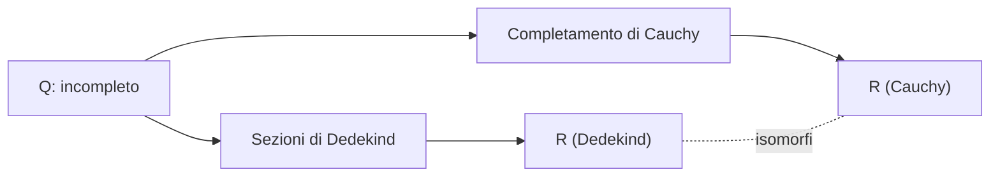
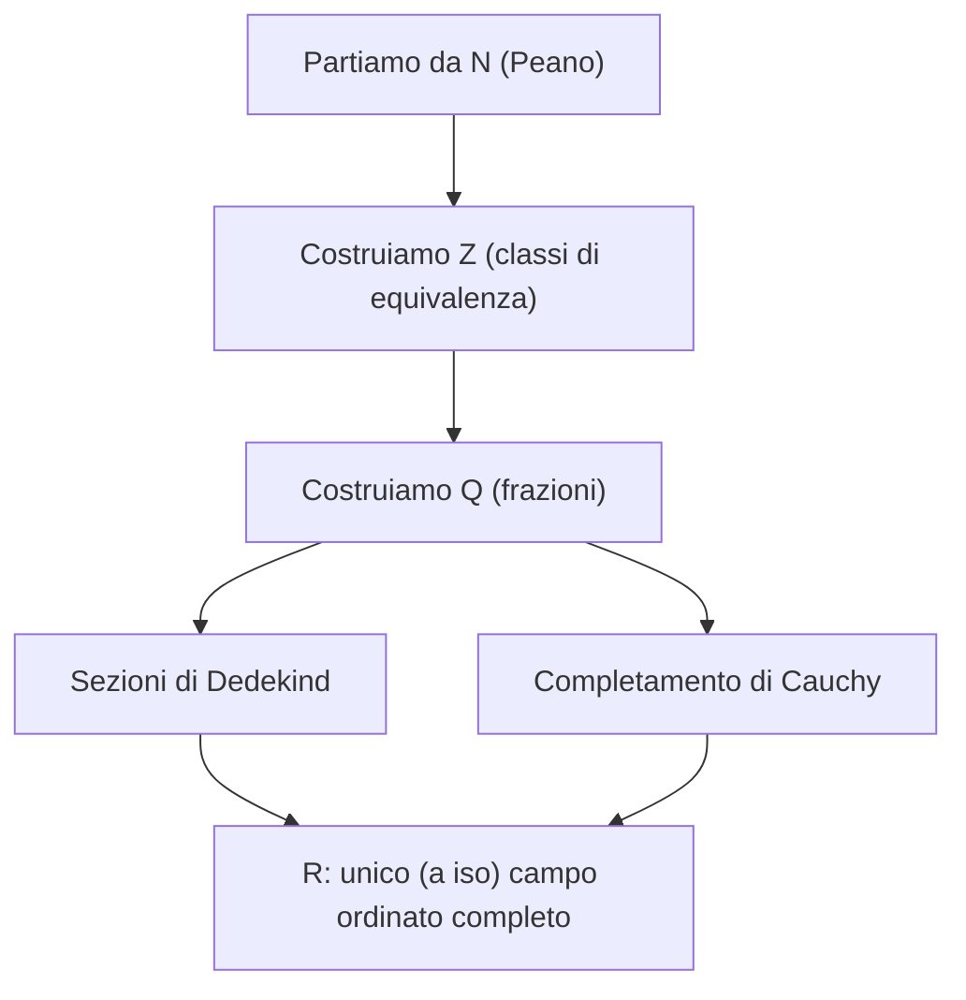

# Costruzione di $\mathbb{R}$: Dedekind e Cauchy

## Perché parlarne

Nelle sezioni 06–07 abbiamo **postulato** che esista un campo ordinato completo (chiamato $\mathbb{R}$) e ne abbiamo studiato le proprietà. Adesso facciamo il passo che mancava: **costruirlo davvero** a partire da $\mathbb{Q}$, dimostrando così che $\mathbb{R}$ esiste e non è solo un'astrazione consolatoria.

Due strade classiche:
1. **Dedekind (1872)** — un numero reale è un "taglio" dell'asse razionale.
2. **Cauchy (formalizzato da Méray, Cantor, ~1870)** — un numero reale è una "classe di successioni razionali che si addensano".

Entrambe portano allo stesso $\mathbb{R}$ (a meno di isomorfismo, sez. 06). Il completamento di Cauchy è inoltre una **tecnica generale**, che riapplicherete a tappare buchi in altri spazi (es. $L^p$ in analisi funzionale, $\mathbb{Q}_p$ in teoria dei numeri).

## L'idea generale

$\mathbb{Q}$ ha **buchi** (cap. 04): per esempio $\sqrt 2$ "dovrebbe" stare in mezzo ai razionali ma non c'è. Vogliamo costruire $\mathbb{R}$ riempiendo i buchi. Due modi di farlo:

1. **Dedekind**: ogni reale $r$ taglia $\mathbb{Q}$ in due insiemi: razionali $< r$ e razionali $\ge r$. Possiamo *identificare* $r$ con la sua metà sinistra del taglio. Anche per $\sqrt 2$: definiamo $\sqrt 2$ come l'insieme $\{q \in \mathbb{Q} : q^2 < 2\ \lor\ q \le 0\}$.

2. **Cauchy**: la successione $1, 1.4, 1.41, 1.414, \dots$ "vorrebbe convergere a $\sqrt 2$" ma il limite non sta in $\mathbb{Q}$. Identifichiamo $\sqrt 2$ con la successione stessa, modulo equivalenza con altre successioni che hanno lo stesso "limite ideale".

## Costruzione 1: Sezioni di Dedekind

### Definizione di sezione

**Definizione.** Una **sezione di Dedekind** è un sottoinsieme $\alpha \subseteq \mathbb{Q}$ che soddisfa:

- **(D1)** $\alpha \ne \emptyset$ e $\alpha \ne \mathbb{Q}$ (è "qualcosa, ma non tutto").
- **(D2)** Se $p \in \alpha$ e $q < p$ (in $\mathbb{Q}$), allora $q \in \alpha$. (chiuso "verso il basso").
- **(D3)** $\alpha$ **non ha massimo**.

L'insieme di tutte le sezioni si chiama $\mathbb{R}_D$ ("R alla Dedekind").

> **Glossarietto:**
>
> - $\alpha$ ("alfa") = un sottoinsieme di $\mathbb{Q}$ — la "metà sinistra" del taglio.
> - "Chiuso verso il basso" = se prendi un elemento, ogni razionale più piccolo è anche dentro.
> - "Non ha massimo" = non c'è un elemento più grande di tutti gli altri all'interno della sezione (può però avere un sup esterno).

### Esempi

**1.** Per $r \in \mathbb{Q}$, definiamo
$$\alpha_r := \{q \in \mathbb{Q} : q < r\}.$$
È una sezione. (D1)✓ (D2)✓ (D3): se $q < r$, per densità di $\mathbb{Q}$ esiste $q'$ con $q < q' < r$, quindi $q' \in \alpha_r$ e $q' > q$, dunque $q$ non è max.

**Quindi ogni razionale è "rappresentato" da una sezione**.

**2.** La sezione che corrisponde a $\sqrt 2$:
$$\alpha_{\sqrt 2} := \{q \in \mathbb{Q} : q \le 0\} \cup \{q \in \mathbb{Q}^+ : q^2 < 2\}.$$

È una sezione (verifica le D1, D2, D3). **Non è del tipo $\alpha_r$ con $r \in \mathbb{Q}$**, perché non esiste razionale con quadrato 2. Questo è il "buco" — e Dedekind dice: il buco *è* il numero $\sqrt 2$.

### Ordine

**Definizione.** $\alpha \le \beta \iff \alpha \subseteq \beta$ (l'inclusione fra insiemi).

Si verifica che è un ordine totale (esercizio non banale ma diretto).

### Somma

**Definizione.** $\alpha + \beta := \{p + q : p \in \alpha,\ q \in \beta\}$.

Si verifica che è ancora una sezione. Lo zero è $\alpha_0 = \{q \in \mathbb{Q} : q < 0\}$. L'opposto $-\alpha$ richiede un piccolo aggiustamento tecnico (per garantire (D3)): $-\alpha = \{-p : p \in \mathbb{Q} \setminus \alpha,\ p \text{ non è min di } \mathbb{Q} \setminus \alpha\}$.

### Prodotto

Più tecnico, definito per casi col segno. **Caso $\alpha, \beta \ge \alpha_0$**:
$$\alpha \cdot \beta := \alpha_0 \cup \{p q : p \in \alpha, q \in \beta, p \ge 0, q \ge 0\}.$$
Unità moltiplicativa: $\alpha_1 = \{q < 1\}$.

### Il punto chiave: completezza è automatica

**Teorema (completezza di $\mathbb{R}_D$).** Ogni famiglia non vuota di sezioni superiormente limitata ammette estremo superiore.

*Dim. (sorprendentemente semplice).* Sia $\mathcal F$ una famiglia di sezioni con un maggiorante $\gamma$ (cioè $\alpha \subseteq \gamma$ per ogni $\alpha \in \mathcal F$). Definisci
$$\sigma := \bigcup_{\alpha \in \mathcal F} \alpha.$$

Affermiamo che $\sigma$ è una sezione, ed è il sup di $\mathcal F$.

- **(D1)** $\sigma$ non vuota (eredita da una qualsiasi $\alpha \in \mathcal F$); $\sigma \subseteq \gamma \ne \mathbb{Q}$, quindi $\sigma \ne \mathbb{Q}$.
- **(D2)** Se $p \in \sigma$, allora $p \in \alpha$ per qualche $\alpha$; ogni $q < p$ sta in $\alpha \subseteq \sigma$.
- **(D3)** Se $p \in \sigma$, sta in qualche $\alpha$ che non ha max; quindi esiste $q \in \alpha$ con $q > p$, e $q \in \sigma$.

*Maggiorante*: $\alpha \subseteq \sigma$ per ogni $\alpha \in \mathcal F$ (banale).
*Minimo dei maggioranti*: se $\tau$ è maggiorante, $\alpha \subseteq \tau$ per ogni $\alpha$, quindi $\sigma = \bigcup \alpha \subseteq \tau$. ∎

> **Eleganza.** Il sup di una famiglia di sezioni è **semplicemente l'unione**. Niente di più. La completezza è incorporata nella struttura insiemistica. Bellissimo.

<svg viewBox="0 0 600 300" xmlns="http://www.w3.org/2000/svg">
  <rect x="0" y="0" width="600" height="300" fill="#111a30"/>
  <line x1="30" y1="180" x2="570" y2="180" stroke="#f3eed9" stroke-width="2"/>
  <text x="300" y="210" fill="#f3eed9" font-family="serif" font-size="13" text-anchor="middle">Q</text>
  <rect x="30" y="170" width="270" height="20" fill="#d4af37" fill-opacity="0.4"/>
  <text x="160" y="155" fill="#d4af37" font-family="serif" font-size="14">α (sezione)</text>
  <rect x="300" y="170" width="270" height="20" fill="#6aa9d8" fill-opacity="0.3"/>
  <text x="430" y="155" fill="#6aa9d8" font-family="serif" font-size="14">Q ∖ α</text>
  <line x1="300" y1="100" x2="300" y2="220" stroke="#e07a8d" stroke-width="2" stroke-dasharray="4 4"/>
  <text x="300" y="90" fill="#e07a8d" font-family="serif" font-size="14" text-anchor="middle">taglio = √2 (irrazionale!)</text>
  <text x="300" y="260" fill="#f3eed9" font-family="serif" font-size="13" text-anchor="middle">Una sezione di Dedekind è la metà sinistra del taglio</text>
</svg>

Sezione di Dedekind: la metà sinistra di un taglio di $\mathbb{Q}$. Il "punto di taglio" può non esistere in $\mathbb{Q}$ (come $\sqrt 2$), e questa stessa sezione *è* il nuovo numero reale.

### Immersione di $\mathbb{Q}$ in $\mathbb{R}_D$

$r \mapsto \alpha_r$ è iniettiva e conserva ordine, somma, prodotto. Quindi $\mathbb{Q}$ si identifica con un sottoinsieme di $\mathbb{R}_D$, e il "vecchio" $\mathbb{Q}$ vive dentro al "nuovo" $\mathbb{R}_D$.

## Costruzione 2: Completamento di Cauchy

### L'idea

$\sqrt 2$ non sta in $\mathbb{Q}$, ma la successione razionale
$$1,\ 1.4,\ 1.41,\ 1.414,\ 1.4142,\ \dots$$
*vorrebbe* convergere a $\sqrt 2$. I suoi termini "si avvicinano fra loro a piacere", anche se non hanno un limite in $\mathbb{Q}$.

L'idea di Cauchy: **identifichiamo i reali con queste successioni razionali**, modulo un'equivalenza che dice "due successioni rappresentano lo stesso reale se i loro termini convergono allo stesso limite ideale".

### Successioni di Cauchy in $\mathbb{Q}$

**Definizione.** Una successione $(a_n) \subseteq \mathbb{Q}$ è **di Cauchy** se i suoi termini si stringono fra loro a piacere:
$$\forall \varepsilon \in \mathbb{Q}^+,\ \exists N \in \mathbb{N} : \forall n, m \ge N,\ |a_n - a_m| < \varepsilon.$$

> **Glossarietto della formula:**
>
> - $\varepsilon$ = una distanza piccola positiva (razionale, per stare dentro $\mathbb{Q}$).
> - $\forall \varepsilon \in \mathbb{Q}^+$ = "per ogni soglia di vicinanza razionale positiva".
> - $\exists N$ = "esiste un indice $N$" (la "soglia temporale" da cui in poi la cosa vale).
> - $\forall n, m \ge N$ = "per ogni coppia di indici dopo $N$".
> - $|a_n - a_m| < \varepsilon$ = "$a_n$ e $a_m$ distano meno di $\varepsilon$".
>
> **Tradotto:** per quanto piccola scegli la soglia $\varepsilon$, **da un certo punto $N$ in poi** tutti i termini della successione sono entro $\varepsilon$ l'uno dall'altro. La successione "si addensa".

Esempio: $1, 1.4, 1.41, 1.414, \dots$ è di Cauchy in $\mathbb{Q}$ (verifica: $|a_n - a_m| \le 10^{-\min(n,m)}$, che va a zero).

### Equivalenza

**Definizione.** $(a_n) \sim (b_n)$ se la differenza tende a zero:
$$\forall \varepsilon > 0,\ \exists N : \forall n \ge N,\ |a_n - b_n| < \varepsilon.$$

> **Tradotto:** due successioni di Cauchy rappresentano lo stesso "limite ideale" se la loro differenza si annulla.

Verifica che è di equivalenza: riflessiva e simmetrica ovvie; transitiva via triangolare $|a_n - c_n| \le |a_n - b_n| + |b_n - c_n|$.

### Definizione di $\mathbb{R}_C$

$$\mathbb{R}_C := \frac{\{\text{successioni di Cauchy in } \mathbb{Q}\}}{\sim}.$$

Cioè: i reali "alla Cauchy" sono **classi di equivalenza di successioni di Cauchy razionali**. La classe $[(a_n)]$ rappresenta "il limite ideale" della successione.

### Operazioni

- **Somma**: $[(a_n)] + [(b_n)] := [(a_n + b_n)]$.
- **Prodotto**: $[(a_n)] \cdot [(b_n)] := [(a_n b_n)]$.

Buona definizione: somme e prodotti di successioni di Cauchy sono di Cauchy (richiede un po' di lavoro tecnico), e l'equivalenza si conserva.

### Ordine

$[(a_n)] < [(b_n)]$ se esiste $\varepsilon \in \mathbb{Q}^+$ e $N \in \mathbb{N}$ con $b_n - a_n \ge \varepsilon$ per $n \ge N$.

> **A parole:** "$(b_n)$ è definitivamente almeno $\varepsilon$ sopra $(a_n)$". Definizione tecnica, ma è quella giusta per essere indipendente dai rappresentanti.

### Completezza

**Teorema.** $\mathbb{R}_C$ è completo: ogni successione di Cauchy *in $\mathbb{R}_C$* converge *in $\mathbb{R}_C$*.

*Idea di dim.* Data una successione di Cauchy $(\xi_n)$ di reali (classi di Cauchy razionali), scegliamo un rappresentante razionale "vicino" per ognuno: $r_n \in \mathbb{Q}$ con $|\xi_n - r_n| < 1/n$. Si verifica che $(r_n)$ è una successione di Cauchy razionale. Sia $\xi = [(r_n)]$. Allora $\xi_n \to \xi$. ∎

> **Generalizzazione.** Questo schema (prendere Cauchy in uno spazio metrico $X$, identificarle modulo equivalenza, ottenere un nuovo spazio completo $\hat X$ contenente $X$ in modo denso) si chiama **completamento metrico** e si applica a *qualunque* spazio metrico. Lo userete in analisi funzionale.

## Equivalenza delle due costruzioni

**Teorema.** $\mathbb{R}_D$ e $\mathbb{R}_C$ sono entrambi campi ordinati completi. Per il teorema di unicità (sez. 06), sono **isomorfi**.

**Isomorfismo esplicito (idea).** Una sezione $\alpha$ corrisponde alla classe della successione $(a_n)$, dove $a_n$ = "il più grande razionale di denominatore $n$ che sta in $\alpha$".

Viceversa: una successione di Cauchy $(a_n)$ corrisponde alla sezione $\{q \in \mathbb{Q} : q < a_n \text{ definitivamente}\}$.

## Il risultato finale

$\mathbb{R}$ **esiste**, è **unico**, è **completo**, e tutte le proprietà postulate in sezione 06 sono in realtà **dimostrabili**. Adesso sappiamo che la matematica che useremo nei prossimi capitoli poggia su fondamenta solide.

## Perché due costruzioni?

**Dedekind**: più diretto, completezza incorporata (basta unione di insiemi). Limitato però: non si generalizza molto oltre $\mathbb{R}$.

**Cauchy**: tecnica più generale. Si applica:
- ai numeri $p$-adici $\mathbb{Q}_p$ (con un'altra metrica su $\mathbb{Q}$, ottieni un *altro* campo completo);
- al completamento di spazi vettoriali normati;
- all'analisi funzionale (gli spazi $L^p$ come completamenti di funzioni a gradino).

Nell'analisi moderna si usa quasi sempre la tecnica di Cauchy.

## Esempi numerici

**1.** $\sqrt 2$ in Dedekind: $\alpha = \{q \in \mathbb{Q} : q \le 0\} \cup \{q > 0 : q^2 < 2\}$.

**2.** $\sqrt 2$ in Cauchy (metodo di Erone): $a_0 = 1$, $a_{n+1} = \dfrac{a_n + 2/a_n}{2}$. Successione di Cauchy razionale, la cui classe è $\sqrt 2$.

**3.** $e$ in Cauchy: $a_n = \sum_{k=0}^n \frac{1}{k!}$. Successione di Cauchy razionale, classe = $e$.

**4.** $\pi$ in Cauchy: vari modi (Leibniz–Madhava $4(1 - \frac 1 3 + \frac 1 5 - \frac 1 7 + \dots)$, formula di Machin, ecc.).

## Numeri $p$-adici (cenno)

Su $\mathbb{Q}$ esistono metriche diverse da $|\cdot|$. Fissato un primo $p$:
$$|x|_p := p^{-v_p(x)}$$
dove $v_p(x)$ è l'esponente di $p$ nella fattorizzazione di $x$.

> **Esempio.** $v_2(12) = 2$ (perché $12 = 4 \cdot 3 = 2^2 \cdot 3$). Quindi $|12|_2 = 2^{-2} = 1/4$.

Con la metrica $p$-adica, "$x$ è piccolo" significa "$x$ è divisibile per molte potenze di $p$". Strano, ma è una metrica vera.

Il **completamento di Cauchy** di $\mathbb{Q}$ rispetto a $|\cdot|_p$ produce un campo $\mathbb{Q}_p$ — i numeri $p$-adici. È completo, ha cardinalità $\mathfrak{c}$, ma è **diverso** da $\mathbb{R}$ (non è nemmeno ordinabile).

**Teorema di Ostrowski.** Su $\mathbb{Q}$ esistono *solo*: la metrica banale, $|\cdot|$ (che dà $\mathbb{R}$), e $|\cdot|_p$ per $p$ primo (che danno $\mathbb{Q}_p$). Nient'altro.

## Esercizi

Esercizio 1 — Perché (D3)?

Spiega perché nella definizione di sezione richiediamo "$\alpha$ non ha massimo".

**Soluzione.** Senza (D3), $\alpha_r$ con $r$ razionale avrebbe **due** rappresentazioni come sezione: $\{q < r\}$ e $\{q \le r\}$. Sarebbero diverse come insiemi, ma rappresenterebbero lo stesso reale $r$, complicando la corrispondenza. (D3) fissa una scelta canonica, garantendo che ogni reale abbia **un'unica** sezione.

Esercizio 2 — Cauchy in $\mathbb{Q}$ che non converge in $\mathbb{Q}$

Dai un esempio esplicito.

**Soluzione.** $a_n$ = approssimazione decimale di $\sqrt 2$ a $n$ cifre: $1, 1.4, 1.41, 1.414, 1.4142, \dots$.

È di Cauchy razionale (in $\mathbb{Q}$): $|a_n - a_m| \le 10^{-\min(n, m)} \to 0$.

Non converge in $\mathbb{Q}$: se convergesse a $r \in \mathbb{Q}$, allora $a_n^2 \to r^2$ ma anche $a_n^2 \to 2$, quindi $r^2 = 2$ con $r \in \mathbb{Q}$ — impossibile (sez. 04).

Esercizio 3 — Sezione che rappresenta $-\sqrt 2$

Scrivi la sezione di Dedekind corrispondente a $-\sqrt 2$.

**Soluzione.** $\alpha_{-\sqrt 2} = \{q \in \mathbb{Q} : q < -\sqrt 2\} = \{q \in \mathbb{Q} : q < 0\ \text{e}\ q^2 > 2\}$.

In parole: tutti i razionali strettamente negativi con quadrato $> 2$. Si verifica (D1)–(D3).

Esercizio 4 — Somma di sezioni

Calcola $\alpha_{1/2} + \alpha_{1/3}$ e verifica che è uguale a $\alpha_{5/6}$.

**Soluzione.** Per definizione, $\alpha_{1/2} + \alpha_{1/3} = \{p + q : p < 1/2,\ q < 1/3\}$.

- **$\subseteq$**: se $p < 1/2$ e $q < 1/3$, allora $p + q < 5/6$.
- **$\supseteq$**: dato $s < 5/6$, sia $\delta = (5/6 - s)/2 > 0$. Prendi $p = 1/2 - \delta$ e $q = s - p$. Allora $p < 1/2$, e $q = s - 1/2 + \delta = s - 1/2 + (5/6 - s)/2 = (s + 5/6)/2 - 1/2 = (s - 1/6)/2$. Per $s < 5/6$, $q < (5/6 - 1/6)/2 = 1/3$. ✓

Quindi $s = p + q$ con $p \in \alpha_{1/2}$ e $q \in \alpha_{1/3}$.

Esercizio 5 — Completamento di uno spazio metrico generico

Generalizza la costruzione di Cauchy: dato uno spazio metrico $(X, d)$, definisci formalmente il completamento $\hat X$.

**Soluzione (schema).**

- Sia $\mathcal C$ l'insieme di tutte le successioni di Cauchy in $(X, d)$.
- Relazione: $(x_n) \sim (y_n) \iff d(x_n, y_n) \to 0$.
- $\hat X := \mathcal C / \sim$.
- Metrica: $\hat d([(x_n)], [(y_n)]) := \lim_n d(x_n, y_n)$. (Il limite esiste perché $(d(x_n, y_n))$ è una successione di Cauchy reale, e $\mathbb{R}$ è completo.)
- Immersione: $X \hookrightarrow \hat X$, $x \mapsto [(x, x, x, \dots)]$ (successione costante).
- $\hat X$ è completo (stessa logica di $\mathbb{R}_C$).
- $X$ è denso in $\hat X$.

Questa è la costruzione standard del **completamento metrico**, alla base di tutta l'analisi funzionale.

## Trappole comuni

- **Sezione ≠ insieme qualsiasi**: tutte e tre le proprietà (D1)–(D3) sono necessarie.
- **Cauchy razionale ≠ convergente in $\mathbb{Q}$**. Ogni successione che converge in $\mathbb{Q}$ è di Cauchy, ma il viceversa è falso (è proprio il fallimento della completezza di $\mathbb{Q}$).
- **Confondere "Cauchy" con "convergente"**: in uno spazio metrico generico, le successioni di Cauchy possono non convergere. **Completezza** = "ogni Cauchy converge".
- **Trascurare l'unicità a meno di isomorfismo**: una volta provato che esiste un campo ordinato completo, l'unicità ti dice che $\mathbb{R}_D$ e $\mathbb{R}_C$ sono "lo stesso oggetto" descritto in due lingue.

> **Pillola.** Quando un libro dice "consideriamo $\mathbb{R}$", presuppone tacitamente una di queste due costruzioni. Per usare l'analisi quotidianamente non importa quale: ti basta che $\mathbb{R}$ esista. Ma il giorno in cui dovrai completare $L^2$ o capire $\mathbb{Q}_p$, ti tornerà utile aver visto Cauchy.

## Riassunto in una riga

$\mathbb{R}$ si costruisce da $\mathbb{Q}$ in due modi equivalenti: **sezioni di Dedekind** (tagli sull'asse razionale) o **completamento di Cauchy** (classi di successioni razionali che si addensano) — entrambe producono lo stesso unico campo ordinato completo.
