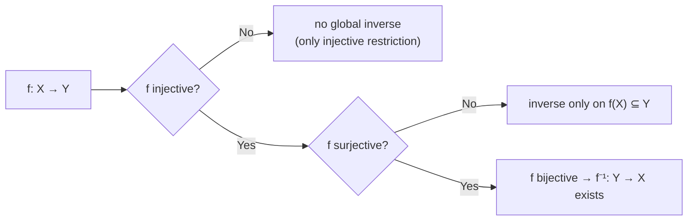

# Sets, relations, functions

## Why this matters

Analysis is *not* mostly about numbers — it's about **functions between sets of numbers**. Sentences like "$f$ is injective, so $f^{-1}$ exists on the image" are pure noise until you know what "injective", "$f^{-1}$", and "image" mean. Here we line up the vocabulary, one word at a time.

## What a set is (naive view)

A **set** is a collection of objects. That's it. We won't give the heavy axioms (Zermelo–Fraenkel). The "naive" version is enough: a set can be described in two ways:

- **Listing**: $A = \{1, 2, 3\}$ — "$A$ is the set containing 1, 2, 3".
- **By property**: $A = \{x \in X : P(x)\}$ — "$A$ is the set of $x$ in $X$ such that $P(x)$".

Examples:
- $\{x \in \mathbb{N} : x \text{ even}\}$ = the even naturals = $\{0, 2, 4, 6, \dots\}$.
- $\{x \in \mathbb{R} : x^2 < 4\}$ = the reals with square less than 4 = the interval $(-2, 2)$.

> **Quick glossary.** $\in$ = "belongs to"; $\notin$ = "does not belong to"; $\subseteq$ = "is a subset of" (all its elements are also in the other); $\emptyset$ = "empty set" (no elements).

**Historical warning.** Cantor allowed $\{x : P(x)\}$ *without* specifying the universe $X$. Russell found this leads to paradoxes: let $R = \{x : x \notin x\}$ ("the set of sets that don't contain themselves"); ask if $R \in R$. If yes → no. If no → yes. Paradox. We fix this by saying: **always start from a given universe $X$**, and take subsets of it. We'll always do so.

## Set operations

Given two subsets $A, B \subseteq X$:

- **Union** $A \cup B = \{x \in X : x \in A \lor x \in B\}$ — elements in *at least one* of the two.
- **Intersection** $A \cap B = \{x \in X : x \in A \land x \in B\}$ — elements in *both*.
- **Difference** $A \setminus B = \{x \in X : x \in A \land x \notin B\}$ — in $A$ but not in $B$.
- **Complement** $A^c = X \setminus A$ — everything in the universe that is *not* in $A$.
- **Symmetric difference** $A \triangle B = (A \setminus B) \cup (B \setminus A)$ — in exactly one of the two.

**Inclusion**: $A \subseteq B$ means $\forall x,\ (x \in A \Rightarrow x \in B)$. In words: every element of $A$ is also an element of $B$.

### Venn diagrams

<svg viewBox="0 0 600 300" xmlns="http://www.w3.org/2000/svg">
  <rect x="20" y="20" width="560" height="260" fill="#111a30" stroke="#f3eed9" stroke-width="1"/>
  <circle cx="240" cy="150" r="100" fill="#d4af37" fill-opacity="0.35" stroke="#d4af37" stroke-width="2"/>
  <circle cx="360" cy="150" r="100" fill="#6fb38a" fill-opacity="0.35" stroke="#6fb38a" stroke-width="2"/>
  <text x="170" y="155" fill="#f3eed9" font-family="serif" font-size="20">A</text>
  <text x="420" y="155" fill="#f3eed9" font-family="serif" font-size="20">B</text>
  <text x="295" y="155" fill="#f3eed9" font-family="serif" font-size="16" font-weight="bold" text-anchor="middle">A∩B</text>
  <text x="40" y="40" fill="#f3eed9" font-family="serif" font-size="16">X</text>
</svg>

The yellow region is $A$, the green is $B$. The overlap in the middle is $A \cap B$. The whole rectangle is the universe $X$.

### De Morgan's laws: how the complement "enters"

Before any formula, let's see it with numbers.

**Super concrete example.** Universe $X = \{1, 2, 3, 4, 5, 6, 7, 8, 9, 10\}$ (numbers 1 to 10).

Define:
- $A = \{2, 4, 6, 8, 10\}$ — the evens.
- $B = \{3, 6, 9\}$ — the multiples of 3.

Compute the union, then the complement of the union:
- $A \cup B = \{2, 3, 4, 6, 8, 9, 10\}$ — even **or** multiple of 3.
- $(A \cup B)^c$ = "neither even nor multiple of 3" = $\{1, 5, 7\}$.

Now the other way: complements first, then intersection:
- $A^c = \{1, 3, 5, 7, 9\}$ — the odds.
- $B^c = \{1, 2, 4, 5, 7, 8, 10\}$ — non-multiples of 3.
- $A^c \cap B^c$ = "in both" = $\{1, 5, 7\}$. **Same result.**

Coincidence? No, it's a **general rule** called **De Morgan's law**. In words:

> "Not in the union" is the **same** as "in none of the parts".

And conversely:

> "Not in all of them" is the same as "out of at least one".

In formulas:

$$\left(\bigcup_{i \in I} A_i\right)^{\!c} = \bigcap_{i \in I} A_i^c, \qquad \left(\bigcap_{i \in I} A_i\right)^{\!c} = \bigcup_{i \in I} A_i^c.$$

> **Glossary for the formula** — read symbol by symbol:
>
> - $A_i$ = a set indexed by the "subscript" $i$ (a numerical or symbolic label). Think of $A_1, A_2, A_3, \dots$ as a *list of sets*.
> - $I$ = the **index set**, i.e. the list of possible labels. If $I = \{1, 2, 3\}$ you have three sets; if $I = \mathbb{N}$ infinitely many.
> - $i \in I$ = "$i$ is one of the labels in $I$" (reads "$i$ belongs to $I$").
> - $\bigcup_{i \in I} A_i$ = **union over the whole family**: $A_{i_1} \cup A_{i_2} \cup A_{i_3} \cup \dots$ for every $i$ in $I$. Compact notation — that big $\bigcup$ is just a $\cup$ applied "to many".
> - $\bigcap_{i \in I} A_i$ = same thing but intersection.
> - $A^c$ = **complement** of $A$: everything in the universe $X$ but outside $A$. I.e. $A^c = X \setminus A$. The "c" above the symbol is *just a label* meaning "complement", not an operation or an exponent.
> - $A_i^c$ = the complement of the single set $A_i$.
> - $\left(\bigcup_i A_i\right)^c$ = the complement of the whole union, taken as a single big set.
> - $=$ = "the two sets contain exactly the same elements".
>
> In plain English the **first formula** says: "the complement of the union (left) equals the intersection of the complements (right)". The second: "the complement of the intersection equals the union of the complements". As we saw with evens and multiples of 3.

#### Proof of the first — step by step

We want: $\left(\bigcup A_i\right)^c = \bigcap A_i^c$.

To prove it, pick any $x$ and verify that "$x$ in the left" iff "$x$ in the right". I.e. we want the chain of equivalences:

$$x \in \left(\bigcup A_i\right)^c \iff x \in \bigcap A_i^c.$$

In 4 steps, each a paraphrase of the previous.

**Step 1.** $x \in \left(\bigcup A_i\right)^c$ means, *by definition of complement*, that $x$ is **not** inside the union:

$$x \in \left(\bigcup A_i\right)^c \quad\iff\quad x \notin \bigcup A_i.$$

**Step 2.** "$x$ not in the union" means $x$ is **in none** of the pieces:

$$x \notin \bigcup A_i \quad\iff\quad \forall i,\ x \notin A_i.$$

(That's the *definition* of union: being in the union = being in at least one. Negating: being in none.)

**Step 3.** "Not in $A_i$" is the definition of "in the complement of $A_i$":

$$\forall i,\ x \notin A_i \quad\iff\quad \forall i,\ x \in A_i^c.$$

**Step 4.** "$x$ in $A_i^c$ for every $i$" means, *by definition of intersection*, $x$ is in the intersection of the complements:

$$\forall i,\ x \in A_i^c \quad\iff\quad x \in \bigcap A_i^c.$$

**Conclusion.** Chaining the four steps: $x \in \left(\bigcup A_i\right)^c \iff x \in \bigcap A_i^c$ for every $x$. So the two sets have the same elements, hence are equal. $\blacksquare$

> **Reading note.** When you see a chain "$A \iff B \iff C \iff D$", it means $A$ and $D$ are equivalent, via two intermediate bridges. Each step is a *translation* of the same fact into slightly different words. If one step doesn't make sense, stop there — that's the point to clarify.

## Ordered pairs and Cartesian product

$$A \times B = \{(a, b) : a \in A,\ b \in B\}.$$

> **Glossary for the formula:**
>
> - $A \times B$ = the **Cartesian product** of $A$ and $B$ (named after the Cartesian plane).
> - $(a, b)$ = an **ordered pair**: two elements in a row, first from $A$ and second from $B$. Parentheses mean "pair".
> - $\{...\}$ = "the set of all objects satisfying the condition following the colon".
> - The colon `:` reads "such that".
> - $a \in A$ = "$a$ belongs to set $A$".

In words: $A \times B$ is the **set of all ordered pairs** $(a, b)$ where the first element is from $A$ and the second from $B$.

**Important.** Pairs are *ordered*: $(a, b) \ne (b, a)$ in general (unless $a = b$). The pair "Rome, Milan" is not the same as "Milan, Rome".

**Cardinality.** If $|A| = m$ and $|B| = n$ (cardinality = number of elements), then $|A \times B| = mn$.

This extends to more factors: $A_1 \times \dots \times A_n$ is the set of ordered $n$-tuples.

## Binary relations

A **binary relation** on $X$ is a subset $R \subseteq X \times X$. When $(x, y) \in R$, we write $x \sim y$ ("$x$ is related to $y$").

**Example.** On $\mathbb{Z}$ define $x \sim y \iff x - y$ is even. So $3 \sim 5$ ($3 - 5 = -2$ even), but $3 \not\sim 4$ ($3 - 4 = -1$ odd).

### The four properties that matter

| name | definition (symbolic) | in words |
|------|-----------------------|----------|
| reflexive | $\forall x,\ x \sim x$ | every element relates to itself |
| symmetric | $x \sim y \Rightarrow y \sim x$ | if it holds one way it holds the other |
| antisymmetric | $x \sim y \land y \sim x \Rightarrow x = y$ | both directions only when $x = y$ |
| transitive | $x \sim y \land y \sim z \Rightarrow x \sim z$ | chains |

### Equivalence relations

A relation is an **equivalence relation** if it is reflexive *and* symmetric *and* transitive. Think of "$\sim$" as "$=$ modulo something": it says when two elements are "indistinguishable from our viewpoint".

**Equivalence class** of $x$: the set of all its "friends" — elements related to $x$. Notation $[x] = \{y : y \sim x\}$.

**Quotient set** $X / {\sim}$: the set of classes.

**Theorem (partition).** The equivalence classes form a **partition** of $X$: every element belongs to a class, and two different classes don't overlap.

*Proof.* (a) Reflexivity gives $x \in [x]$, so every $x$ has its class, and the union of classes is all of $X$.
(b) Suppose $[x] \cap [y] \neq \emptyset$. Let $z$ be a common element: $z \sim x$ and $z \sim y$. By symmetry $x \sim z$, by transitivity $x \sim y$. So every $w \sim x$ is also $\sim y$ (transitivity): $[x] \subseteq [y]$, and by symmetry $[y] \subseteq [x]$. So $[x] = [y]$. ∎

**Cornerstone example — clocks.** On $\mathbb{Z}$ define $a \sim b \iff n \mid (a - b)$ ("$n$ divides $a - b$") for some fixed $n \ge 1$. The classes are remainders modulo $n$:
- $[0] = \{0, n, -n, 2n, -2n, \dots\}$
- $[1] = \{1, n+1, 1-n, 2n+1, \dots\}$
- … up to $[n - 1]$

The quotient $\mathbb{Z}/n\mathbb{Z}$ has exactly $n$ elements. Think of a clock: with $n = 12$, after 25 hours you're at the same time as after 1 hour, because $25 \equiv 1 \pmod{12}$.

### Order relations

A relation is an **order** if it is reflexive + antisymmetric + transitive. We write $\le$ instead of $\sim$.

- **Total order**: in addition $\forall x, y$ we have $x \le y$ or $y \le x$. Every pair is comparable.
- **Partial order**: comparability not required.

Examples:
- $\le$ on $\mathbb{R}$ is a **total** order (any two reals, one is $\le$ the other).
- $\subseteq$ on the power set $\mathcal{P}(X)$ (the collection of *all* subsets of $X$) is only **partial**: $\{1\}$ and $\{2\}$ are not comparable, neither contains the other.

## Functions: the central concept of analysis

A **function** $f : X \to Y$ is a rule that assigns to each $x \in X$ **exactly one** $y \in Y$. We write $y = f(x)$.

Formally: a function is a subset $f \subseteq X \times Y$ such that for every $x \in X$ there is a unique $y \in Y$ with $(x, y) \in f$.

Vocabulary:
- **Domain**: $X$ — the set where $f$ is defined ("where the $x$'s come from").
- **Codomain**: $Y$ — the set where $f$ "lives" ("where the $y$'s land").
- **Image** of a subset $A \subseteq X$: $f(A) = \{f(x) : x \in A\}$. Where the elements of $A$ "go".
- **Preimage** (or **inverse image**) of a subset $B \subseteq Y$: $f^{-1}(B) = \{x \in X : f(x) \in B\}$. Who "lands in" $B$.

> **Warning, false friend.** $f^{-1}(B)$ (notation with a *set* inside) is the preimage: it makes sense **always**, even if $f$ isn't invertible. The inverse function $f^{-1} : Y \to X$ (which eats an *element* at a time) exists **only** if $f$ is bijective (see below). Same symbol, two different things: look at what's inside the parentheses.

### Injective, surjective, bijective

**Injective** (a.k.a. "one-to-one"): different elements go to different elements.

$$f(x_1) = f(x_2) \Rightarrow x_1 = x_2 \quad\text{(equivalent: } x_1 \ne x_2 \Rightarrow f(x_1) \ne f(x_2)\text{)}.$$

> **Glossary:**
>
> - $x_1, x_2$ = two elements of the domain (subscripts 1 and 2 are just labels to distinguish them).
> - $f(x_1) = f(x_2)$ = "the two outputs are equal".
> - $\Rightarrow$ = "implies".
> - $x_1 = x_2$ = "actually they were the same input".
>
> **Translation:** "if two inputs give the same output, they were the same input". I.e. $f$ never "glues together" two different points. In school: "the graph crosses every horizontal line at most once".

**Surjective** (a.k.a. "onto"): every element of the codomain is reached.

$$\forall y \in Y,\ \exists x \in X : f(x) = y, \quad\text{i.e. } f(X) = Y.$$

> **Glossary:**
>
> - $\forall y \in Y$ = "for every $y$ in the codomain $Y$".
> - $\exists x \in X$ = "there is some $x$ in the domain $X$".
> - $: f(x) = y$ = "such that $f$ of $x$ equals $y$".
> - $f(X)$ = image of the whole domain = $\{f(x) : x \in X\}$ = the values reached by $f$.
>
> **Translation:** "every $y$ of the codomain is hit by at least one $x$ of the domain". No element of $Y$ is "missed". In school: "the graph hits every horizontal line at least once".

**Bijective**: injective *and* surjective. Every $y$ of the codomain has **exactly one** $x$ that maps to it (at least one by surjectivity, at most one by injectivity).

Only if $f$ is bijective does the **inverse function** $f^{-1} : Y \to X$ exist, defined by: $f^{-1}(y) = $ "the unique $x$ such that $f(x) = y$".

### Visual examples

- $f : \mathbb{R} \to \mathbb{R}$, $f(x) = x^2$. *Not injective* ($f(1) = f(-1) = 1$), *not surjective* (squares are $\ge 0$, negatives never hit).
  - **Restricting** domain and codomain: $f : [0, +\infty) \to [0, +\infty)$, $f(x) = x^2$. Now bijective. Inverse is the square root $\sqrt{\cdot}$.
- $f : \mathbb{R} \to \mathbb{R}$, $f(x) = x^3$. Injective (strictly increasing, two different inputs give different cubes). Surjective (every real has a real cube root). Bijective — inverse is $\sqrt[3]{\cdot}$.
- $f : \mathbb{Z} \to \mathbb{Z}/n\mathbb{Z}$, $f(k) = [k]_n$ (the class of $k$ mod $n$). Surjective (every class is hit). Not injective ($f(0) = f(n)$). Called the **canonical projection** onto the quotient.

### Composition of functions

If $f : X \to Y$ and $g : Y \to Z$, the **composition** $g \circ f : X \to Z$ is $(g \circ f)(x) = g(f(x))$.

In words: "apply $f$ first, then $g$ to the result".

**Example.** $f(x) = x + 1$, $g(y) = y^2$. Then $(g \circ f)(x) = g(f(x)) = g(x + 1) = (x + 1)^2$. Different from $(f \circ g)(x) = f(g(x)) = f(x^2) = x^2 + 1$.

**Properties.**

- **Associative**: $h \circ (g \circ f) = (h \circ g) \circ f$. (You can drop parentheses.)
- **Injectivity preserved**: if $f$ and $g$ are injective, $g \circ f$ is injective.
- **Surjectivity preserved**: if $f$ and $g$ are surjective, $g \circ f$ is surjective.
- **Warning**: $g \circ f$ injective does *not* imply $g$ injective (see Exercise 3). It only implies $f$ injective.

## How images and preimages behave

**Preimages** are "well-behaved": they commute with all set operations.

$$f^{-1}(B_1 \cup B_2) = f^{-1}(B_1) \cup f^{-1}(B_2), \qquad f^{-1}(B_1 \cap B_2) = f^{-1}(B_1) \cap f^{-1}(B_2).$$

> **Glossary** (recalling earlier definitions):
>
> - $B_1, B_2$ = two subsets of the codomain $Y$.
> - $f^{-1}(B)$ = **preimage** of $B$ = "all $x$'s of the domain that land inside $B$" = $\{x \in X : f(x) \in B\}$.
> - $B_1 \cup B_2$ = union (elements in *at least one* of the two).
> - $B_1 \cap B_2$ = intersection (in *both*).
>
> **Translation:** "the $x$'s landing in $B_1$ or $B_2$" equals "$x$'s landing in $B_1$, united with $x$'s landing in $B_2$". Same for intersection. Looks obvious, the advantage is it holds *always*, no hypotheses on $f$.

**Images** are *less* well-behaved:

$$f(A_1 \cup A_2) = f(A_1) \cup f(A_2) \quad\text{(equal, ok)},$$
$$f(A_1 \cap A_2) \subseteq f(A_1) \cap f(A_2) \quad\text{(only inclusion!)}.$$

> **Glossary:**
>
> - $A_1, A_2$ = two subsets of the **domain** $X$.
> - $f(A) = \{f(x) : x \in A\}$ = **image** of $A$ = "the values $f$ produces as input ranges over $A$".
> - $\subseteq$ = "subset of" (can be equal, or strictly smaller).
>
> **Translation:** for images, **union** works the same. For **intersection** we only get an arrow, not equality: there are values in $f(A_1) \cap f(A_2)$ but not in $f(A_1 \cap A_2)$ — see counterexample below.

## Flowchart: when does the inverse exist?

## Exercises

Exercise 1 — De Morgan with an infinite family

Let $A_n = (-1/n, 1/n) \subseteq \mathbb{R}$ for each $n = 1, 2, 3, \dots$. Compute $\bigcap_n A_n$ and $\big(\bigcap_n A_n\big)^c$.

**Solution.** An $x \neq 0$ falls outside $A_n$ as soon as $1/n < |x|$. Only $x = 0$ is in all $A_n$. So $\bigcap_n A_n = \{0\}$. The complement is $\mathbb{R} \setminus \{0\}$.

Check via De Morgan: $\mathbb{R} \setminus \{0\} = \bigcup_n A_n^c = \bigcup_n ((-\infty, -1/n] \cup [1/n, +\infty))$. As $n$ grows, the union "covers" all nonzero reals. ✓

Exercise 2 — A geometric equivalence relation

On $\mathbb{R}^2 \setminus \{(0, 0)\}$ define $(x, y) \sim (x', y')$ if there is $\lambda > 0$ with $(x', y') = \lambda (x, y)$. Show it's an equivalence relation and describe the classes.

**Solution.** Reflexive: $\lambda = 1$. Symmetric: if $(x', y') = \lambda(x, y)$ then $(x, y) = (1/\lambda)(x', y')$ and $1/\lambda > 0$. Transitive: compose with $\lambda \mu > 0$.

The classes are **rays from the origin** (excluding the origin): a point $(x, y)$ and all its positive multiples $\lambda(x, y)$.

The quotient is in bijection with the unit circle $S^1$: each ray meets $S^1$ in a unique point.

Exercise 3 — Composition and injectivity

Show: if $g \circ f$ is injective, then $f$ is injective. Then find a counterexample where $g \circ f$ is injective but $g$ is not.

**Solution.** Suppose $f(x_1) = f(x_2)$. Then $g(f(x_1)) = g(f(x_2))$, i.e. $(g \circ f)(x_1) = (g \circ f)(x_2)$. By injectivity of $g \circ f$, $x_1 = x_2$. So $f$ is injective. ∎

**Counterexample.** $f : \{0\} \to \{0, 1\}$ with $f(0) = 0$. $g : \{0, 1\} \to \{0\}$ with $g(0) = g(1) = 0$ (constant). Then $g \circ f : \{0\} \to \{0\}$ is trivially injective (one-point domain). But $g$ identifies $0$ and $1$, not injective.

Exercise 4 — Image doesn't commute with intersection

Find $f : X \to Y$ and $A_1, A_2 \subseteq X$ with $f(A_1 \cap A_2) \subsetneq f(A_1) \cap f(A_2)$ (strict inclusion).

**Solution.** $f : \{a, b\} \to \{0\}$ constant, $A_1 = \{a\}$, $A_2 = \{b\}$. Then $A_1 \cap A_2 = \emptyset$, $f(\emptyset) = \emptyset$. But $f(A_1) = f(A_2) = \{0\}$, so $f(A_1) \cap f(A_2) = \{0\}$. $\emptyset \subsetneq \{0\}$.

Exercise 5 — Arithmetic mod 5

On $\mathbb{Z}$, $a \equiv b \pmod 5$ if $5 \mid (a - b)$. How many classes has $\mathbb{Z}/5\mathbb{Z}$? Compute $[3] + [4]$ and $[2] \cdot [3]$.

**Solution.** Five classes: $[0], [1], [2], [3], [4]$ (possible remainders dividing by 5).

$[3] + [4] = [3 + 4] = [7] = [2]$ (because $7 = 5 + 2$, remainder 2).

$[2] \cdot [3] = [6] = [1]$ (because $6 = 5 + 1$).

(By the way: this structure $\mathbb{Z}/5\mathbb{Z}$ is a *field* — every nonzero element has a multiplicative inverse. Called $\mathbb{F}_5$.)

## Common pitfalls

- **$f^{-1}(B)$ vs $f^{-1}$**. The first takes a *set* and gives the preimage (always exists). The second is a *function*, exists only if $f$ is bijective. Same symbol, two different things.
- **Codomain ≠ image**. $f(x) = x^2$ with $f : \mathbb{R} \to \mathbb{R}$ has codomain $\mathbb{R}$ but image only $[0, +\infty)$. To be surjective you must change the codomain to $[0, +\infty)$.
- **Order relation ≠ total order**. $\subseteq$ is an order but not total. $\le$ on $\mathbb{R}$ is total: we'll always use it assuming comparability.
- **Images don't commute with $\cap$**. Common mistake. Re-prove it in your head every time you invoke it.

> **Operating pill — "well-definedness".** When you define a function "by passing to the quotient" — like $\bar f : X / {\sim} \to Y$ with $\bar f([x]) = f(x)$ — you must **always** verify **well-definedness**: if $x \sim x'$, then $f(x) = f(x')$. Otherwise you've written a symbol, not a function, because the value would depend on the chosen representative.

## One-line takeaway

A set is a collection, a function is "every input → a unique output", and all of analysis will live in the space of functions $\mathbb{R} \to \mathbb{R}$ — with composition, inverse, image, and preimage as daily operations.
