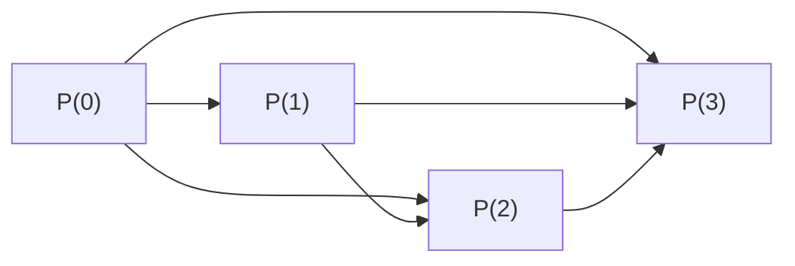

# Natural numbers and the principle of induction

## Why this matters

**Induction** is the trick by which mathematics proves **infinitely many cases** with a **finite** argument. Without it, you can't get started in analysis: every "holds for every $n$" rests on induction.

The intuition is the **infinite domino chain**: you have a long line of tiles; if you show that (a) the first one falls, and (b) every tile that falls knocks the next, then **all of them fall**. Formal induction is exactly this, written in mathematical language.

## What the natural numbers are

The **natural numbers** are the numbers we use to count: $\mathbb{N} = \{0, 1, 2, 3, 4, \dots\}$. (Convention: we include $0$; some Italian texts start from 1 — nothing essential changes.)

> **Glossary:**
>
> - $\mathbb{N}$ = symbol for "the naturals" (the "doubled" N is a typographic convention for large number sets). Reads "N".
> - $\{0, 1, 2, \dots\}$ = listing, the three dots mean "and so on forever".

### The Peano axioms (the formal definition of $\mathbb{N}$)

In 1889 Giuseppe Peano proposed this description: $\mathbb{N}$ is characterized by the following five axioms. We list them, then translate.

1. $0 \in \mathbb{N}$.
2. There is a **successor** function $S : \mathbb{N} \to \mathbb{N}$.
3. $0$ is no one's successor: $S(n) \ne 0$ for every $n \in \mathbb{N}$.
4. $S$ is injective: $S(m) = S(n) \Rightarrow m = n$.
5. **Induction principle.** If $A \subseteq \mathbb{N}$ with $0 \in A$ and $\forall n,\ (n \in A \Rightarrow S(n) \in A)$, then $A = \mathbb{N}$.

> **Glossary:**
>
> - $S$ = "successor", the function that given $n$ returns $n + 1$. Example: $S(3) = 4$, $S(0) = 1$.
> - "$S$ injective" means different numbers have different successors (no "merging" of the number line).
> - $A \subseteq \mathbb{N}$ = "$A$ is a subset of $\mathbb{N}$".

**What they mean together.** Axiom 1: there's a **start** ($0$). Axiom 2: there's a well-defined **next** ($S$). Axiom 3: the start is no one's next (the line goes forward, not back to 0). Axiom 4: the line doesn't fork or merge (different numbers don't share the same next). Axiom 5: every number is reachable starting from 0 by applying $S$ a finite number of times — no "isolated islands".

The fifth axiom is the induction principle. We restate it more usefully.

## Induction principle (usable form)

Let $P(n)$ be a property depending on the natural number $n$ — call it a "predicate". E.g.: $P(n) =$ "$n^2 \ge n$".

**Induction principle.** If:

- **(Base)** $P(0)$ is true, and
- **(Step)** $\forall n \in \mathbb{N},\ P(n) \Rightarrow P(n + 1)$,

then $P(n)$ is true **for every** $n \in \mathbb{N}$.

> **Glossary for the formula:**
>
> - $P(n)$ = a statement that varies with $n$ (true or false depending on $n$).
> - **Base** = the first case, $n = 0$ (or $n = 1$, or another chosen $n_0$).
> - **Step** = the "domino-to-domino" proof: *assuming* $P(n)$ is true (this assumption is the **inductive hypothesis**), prove that $P(n + 1)$ is also true.
> - $\Rightarrow$ = "implies".
> - $\forall n \in \mathbb{N}$ = "for every natural".
>
> **In plain English:** "if the first domino falls and every domino topples the next, then all dominoes fall".

**Variant with a different base.** Sometimes the property starts at $n = 1$ or $n = n_0$. You prove $P(n_0)$ as base, and the step $P(n) \Rightarrow P(n + 1)$ for $n \ge n_0$. Conclusion: $P(n)$ holds for every $n \ge n_0$.

## Guided example: Gauss's sum

**Theorem.** For every $n \in \mathbb{N}$,
$$0 + 1 + 2 + \dots + n = \frac{n(n + 1)}{2}.$$
In compact notation: $\displaystyle \sum_{k=0}^{n} k = \frac{n(n + 1)}{2}$.

> **Glossary:**
>
> - $\sum_{k=0}^{n} k$ = "sum" from $k = 0$ to $k = n$ of the term $k$ = $0 + 1 + 2 + \dots + n$. The symbol $\Sigma$ (capital sigma, Greek) means "sum".
> - $k$ is the **dummy variable** (the index that scrolls); below and above the $\Sigma$ are its initial and final values.

**Story.** Legend says young Gauss, asked to sum 1 to 100 in primary school to keep him quiet, returned $5050$ in seconds. He'd noticed: pair $1 + 100$, $2 + 99$, $3 + 98$, …, $50 + 51$: 50 pairs all equal to $101$, so $50 \times 101 = 5050$. The general formula is the algebraic version of that trick.

*Proof by induction.*

**(Base, $n = 0$).** Left: $\sum_{k=0}^{0} k = 0$. Right: $\frac{0 \cdot 1}{2} = 0$. They match. ✓

**(Step).** *Inductive hypothesis*: assume the formula holds for some $n$, i.e.
$$\sum_{k=0}^{n} k = \frac{n(n + 1)}{2}. \quad (\text{IH})$$

*Goal*: show it holds for $n + 1$, i.e.
$$\sum_{k=0}^{n + 1} k = \frac{(n + 1)(n + 2)}{2}.$$

*Computation.* The sum up to $n + 1$ is the sum up to $n$ plus the last term $n + 1$:
$$\sum_{k=0}^{n+1} k = \underbrace{\sum_{k=0}^{n} k}_{\text{use (IH)}} + (n + 1) = \frac{n(n + 1)}{2} + (n + 1).$$

Now factor $n + 1$:
$$\frac{n(n + 1)}{2} + (n + 1) = (n + 1)\left(\frac{n}{2} + 1\right) = (n + 1) \cdot \frac{n + 2}{2} = \frac{(n + 1)(n + 2)}{2}.$$

Exactly what we wanted. ∎

## Strong induction (a.k.a. "complete induction")

Sometimes to prove $P(n + 1)$ you need not just $P(n)$, but $P(n - 1), P(n - 2), \dots, P(0)$ — "all the previous ones".

**Strong induction.** If:

$$\forall n \in \mathbb{N},\ \big(\forall k < n,\ P(k)\big) \Rightarrow P(n)$$

then $P(n)$ is true for every $n$.

> **Glossary:**
>
> - $\forall k < n,\ P(k)$ = "for every $k$ less than $n$, $P(k)$ holds" — all previous cases.
> - Note: for $n = 0$ the antecedent "$\forall k < 0$" is **vacuous** (no $k < 0$ in $\mathbb{N}$), hence vacuously true (see sec. 01 on vacuity). So in strong induction the base is incorporated into the $n = 0$ case.

**Translation:** "if every property follows from the previous ones, and that includes the base case (vacuously), then it holds for all".

### Example: prime factorization

**Theorem.** Every integer $n \ge 2$ can be written as a product of prime numbers.

> **Glossary.** A **prime** number is an integer $p \ge 2$ divisible only by $1$ and itself. Examples: 2, 3, 5, 7, 11, …

*Proof by strong induction on $n$.*

Let $P(n) = $ "$n$ is a product of primes" (for $n \ge 2$).

*Case $n = 2$:* $2$ is prime, and $2 = 2$ is a "product of one prime". $P(2)$ true.

*Inductive step.* Let $n \ge 2$, and suppose $P(k)$ true for every $2 \le k < n$. Show $P(n)$.

- Case A: $n$ is prime. Then $n = n$ is the sought writing. Done.
- Case B: $n$ is composite, i.e. $n = a \cdot b$ with $1 < a, b < n$. By strong induction, *both* $a$ and $b$ factor into primes: $a = p_1 \cdots p_r$ and $b = q_1 \cdots q_s$. So $n = p_1 \cdots p_r \cdot q_1 \cdots q_s$, a product of primes.

In either case $P(n)$ holds. ∎

(For the curious: the **uniqueness** of factorization — the "fundamental theorem of arithmetic" — needs a bit more work.)

## Step diagrams

Visualize the difference between classical and strong induction:

*Classical induction*: each link depends **only on the previous** ($P(n) \Rightarrow P(n + 1)$).

*Strong induction*: $P(n)$ can use **all** $P(k)$ for $k < n$ — arrows from each to every successor.

## Classical inequalities by induction

### Example: $2^n > n$ for every $n \ge 1$

> **Glossary.** $2^n$ = "2 raised to the $n$" = $\underbrace{2 \cdot 2 \cdots 2}_{n \text{ times}}$. E.g. $2^3 = 2 \cdot 2 \cdot 2 = 8$.

*(Base, $n = 1$).* $2^1 = 2$ and $2 > 1$. ✓

*(Step).* Inductive hypothesis: $2^n > n$. We want $2^{n + 1} > n + 1$.

$$2^{n + 1} = 2 \cdot 2^n \overset{\text{(IH)}}{>} 2 \cdot n = n + n.$$

Since $n \ge 1$, $n + n \ge n + 1$. Putting together: $2^{n + 1} > n + 1$. ∎

### Bernoulli's inequality

**Theorem.** For every $x \ge -1$ and every $n \in \mathbb{N}$,
$$(1 + x)^n \ge 1 + n x.$$

> **Glossary for the formula:**
>
> - $x$ = a real number $\ge -1$ (so $1 + x \ge 0$, indispensable for powers to be controllable).
> - $(1 + x)^n$ = the base $(1 + x)$ raised to the $n$.
> - $1 + n x$ = linear approximation of $(1 + x)^n$ (exactly: the first two terms of Newton's binomial expansion).
>
> **Translation:** the quantity $(1 + x)^n$ is always *at least* $1 + n x$. A very useful growth estimate.

*Proof.*

*(Base, $n = 0$).* $(1 + x)^0 = 1$ and $1 + 0 \cdot x = 1$. True (with $\ge$). ✓

*(Step).* Inductive hypothesis: $(1 + x)^n \ge 1 + n x$. We want $(1 + x)^{n + 1} \ge 1 + (n + 1) x$.

Since $1 + x \ge 0$, multiplying both sides of the IH by $(1 + x)$ **preserves the inequality** (key rule: multiplying by $\ge 0$ doesn't flip direction). So:

$$(1 + x)^{n + 1} = (1 + x) \cdot (1 + x)^n \overset{\text{(IH)}}{\ge} (1 + x)(1 + n x).$$

Expand the right product:
$$(1 + x)(1 + n x) = 1 + n x + x + n x^2 = 1 + (n + 1) x + n x^2.$$

Now $n x^2 \ge 0$ ($n \ge 0$ and $x^2 \ge 0$), so we can "drop" it keeping the inequality:

$$1 + (n + 1) x + n x^2 \ge 1 + (n + 1) x.$$

Chaining: $(1 + x)^{n + 1} \ge 1 + (n + 1) x$. ∎

**Typical use.** We'll use it to estimate the growth rate of $a^n$ (chapters on sequences and exponentials).

### AM–GM for two terms (aside)

For every $a, b \ge 0$:
$$\frac{a + b}{2} \ge \sqrt{a b}.$$

> **Glossary.** AM = "Arithmetic Mean" $(a + b)/2$. GM = "Geometric Mean" $\sqrt{a b}$. The inequality says: arithmetic mean is always $\ge$ geometric mean.

*Proof.* $(a - b)^2 \ge 0$ (squares are never negative). Expanding:
$$a^2 - 2 a b + b^2 \ge 0 \Longrightarrow a^2 + b^2 \ge 2 a b.$$
Substitute $a \to \sqrt a, b \to \sqrt b$ (legal because $a, b \ge 0$):
$$a + b \ge 2 \sqrt{a b} \quad\Longrightarrow\quad \frac{a + b}{2} \ge \sqrt{a b}. \quad \blacksquare$$

The extension to $n$ terms is by induction (Exercise 4).

## Recursive definitions

A **recursive definition** defines $f(n + 1)$ in terms of $f(n)$ (or earlier values). It's legitimate thanks to induction.

**Example 1 — factorial.**
$$0! = 1, \qquad (n + 1)! = (n + 1) \cdot n!.$$

> **Glossary.** $n!$ reads "n factorial". $n!$ = product of all naturals from 1 to $n$. Examples: $3! = 1 \cdot 2 \cdot 3 = 6$, $5! = 120$. Convention: $0! = 1$ (keeps formulas clean).

**Example 2 — Fibonacci.**
$$F_0 = 0, \quad F_1 = 1, \quad F_{n + 2} = F_{n + 1} + F_n.$$

The first terms: $0, 1, 1, 2, 3, 5, 8, 13, 21, 34, 55, \dots$ — each is the sum of the two before.

These definitions are justified by Dedekind's **recursion theorem**: given a starting point $a$ and a passing rule $h$, there exists *a unique* function $f : \mathbb{N} \to X$ with $f(0) = a$ and $f(n + 1) = h(n, f(n))$. (Holds also for "two-step" recursions like Fibonacci, with small modifications.)

### Fibonacci identity (induction example)

**Theorem.** $\displaystyle \sum_{k=0}^{n} F_k = F_{n + 2} - 1$.

*Proof by induction.*

*(Base, $n = 0$).* Left: $F_0 = 0$. Right: $F_2 - 1 = 1 - 1 = 0$. ✓

*(Step).* Inductive hypothesis: $\sum_{k=0}^{n} F_k = F_{n + 2} - 1$. Want $\sum_{k=0}^{n+1} F_k = F_{n + 3} - 1$.

$$\sum_{k=0}^{n+1} F_k = \underbrace{\sum_{k=0}^{n} F_k}_{= F_{n+2} - 1\text{ by (IH)}} + F_{n+1} = (F_{n+2} - 1) + F_{n+1} = (F_{n+1} + F_{n+2}) - 1 = F_{n+3} - 1.$$

(In the last step we use the recurrence $F_{n+1} + F_{n+2} = F_{n+3}$.) ∎

### Exponential growth of Fibonacci

Fibonacci numbers grow exponentially with base $\varphi$ (the **golden ratio**, $\approx 1.618$).

> **Glossary.** $\varphi = (1 + \sqrt 5)/2 \approx 1.618$ is the "golden ratio", satisfying $\varphi^2 = \varphi + 1$. Its "minor" version is $\psi = (1 - \sqrt 5)/2 \approx -0.618$.

**Binet's formula** (for the curious): $F_n = \frac{\varphi^n - \psi^n}{\sqrt 5}$. Since $|\psi| < 1$, the term $\psi^n$ is exponentially small, so $F_n \approx \varphi^n / \sqrt 5$.

<svg viewBox="0 0 600 300" xmlns="http://www.w3.org/2000/svg">
  <rect x="0" y="0" width="600" height="300" fill="#111a30"/>
  <line x1="40" y1="270" x2="580" y2="270" stroke="#f3eed9" stroke-width="1"/>
  <line x1="40" y1="20" x2="40" y2="270" stroke="#f3eed9" stroke-width="1"/>
  <text x="290" y="295" fill="#f3eed9" font-family="serif" font-size="12" font-style="italic">n</text>
  <text x="10" y="30" fill="#f3eed9" font-family="serif" font-size="12" font-style="italic">Fₙ</text>
  <polyline points="60,270 100,268 140,266 180,262 220,256 260,246 300,228 340,202 380,164 420,114 460,52" fill="none" stroke="#d4af37" stroke-width="2"/>
  <polyline points="60,270 100,265 140,256 180,242 220,219 260,180 300,130 340,70" fill="none" stroke="#6fb38a" stroke-width="2" stroke-dasharray="4 4"/>
  <text x="450" y="40" fill="#d4af37" font-family="serif" font-size="13" font-style="italic">Fₙ (Fibonacci)</text>
  <text x="350" y="60" fill="#6fb38a" font-family="serif" font-size="13" font-style="italic">φⁿ/√5 (golden ratio)</text>
</svg>

$F_n$ grows like $\varphi^n / \sqrt{5}$ with $\varphi = (1 + \sqrt 5)/2$. The difference is exponentially small.

## "Transfinite" induction (just a sketch)

The induction principle extends to sets bigger than $\mathbb{N}$ — the **ordinals**. Briefly:

- A set is **well-ordered** if every nonempty subset has a minimum. $\mathbb{N}$ is; $\mathbb{Z}$ isn't (the set $\{n \in \mathbb{Z} : n \le 0\}$ has no minimum).
- On ordinals you do induction with two kinds of step: **successor** (as in $\mathbb{N}$) and **limit** (for "type $\omega$" ordinals, the limit of all previous).

You may (eventually) use it in set theory and Zorn's lemma. For Calculus I, just knowing it exists is enough.

## Classic mistakes: "Pólya's horses"

George Pólya told this fake "proof" to illustrate a typical error.

**"All the horses in the world are the same color."**

*"Proof" by induction on the number $n$ of horses.*

*Base.* $n = 1$: trivial, one horse is the same color as itself. ✓

*"Step".* Assume every set of $n$ horses is monochromatic. Take $n + 1$ horses, call them $c_1, \dots, c_{n+1}$.

- Consider the first $n$: $\{c_1, \dots, c_n\}$. By hypothesis, same color.
- Consider the last $n$: $\{c_2, \dots, c_{n+1}\}$. By hypothesis, same color.
- The two groups overlap in $\{c_2, \dots, c_n\}$ (horses in common), so the color is the same for all. ∎(?)

### The mistake

The step goes from $n$ to $n + 1$. Let's check it for the **first useful case**: $n = 1$, so $n + 1 = 2$. The two groups:

- First $n = 1$: $\{c_1\}$.
- Last $n = 1$: $\{c_2\}$.

They overlap in $\{c_2, \dots, c_n\} = \{c_2, \dots, c_1\}$ — **empty** (no horse from index 2 to index 1). So the two groups are **disjoint**, and the "common color" argument breaks.

**Moral.** When proving a step $P(n) \Rightarrow P(n + 1)$, check that the logic works also for the *first* relevant $n$, not just "in general". Often the first case is where a hidden hole lives.

## Exercises

Exercise 1 — Sum of squares

Prove by induction that $\displaystyle \sum_{k=1}^{n} k^2 = \frac{n(n + 1)(2 n + 1)}{6}$.

**Solution.**

*(Base, $n = 1$).* Left: $1^2 = 1$. Right: $\frac{1 \cdot 2 \cdot 3}{6} = 1$. ✓

*(Step).* IH: $\sum_{k=1}^{n} k^2 = \frac{n(n + 1)(2 n + 1)}{6}$.

$$\sum_{k=1}^{n+1} k^2 = \frac{n(n+1)(2n+1)}{6} + (n+1)^2 = \frac{(n+1)[n(2n+1) + 6(n+1)]}{6} = \frac{(n+1)(2n^2 + 7n + 6)}{6}.$$

Factor: $2n^2 + 7n + 6 = (n + 2)(2n + 3)$ (check: $(n+2)(2n+3) = 2n^2 + 3n + 4n + 6 = 2n^2 + 7n + 6$ ✓).

So the sum is $\frac{(n+1)(n+2)(2(n+1)+1)}{6}$, exactly the formula with $n \to n+1$. ∎

Exercise 2 — $n! > 2^n$ for large $n$

Find the smallest $n_0$ such that $n! > 2^n$ for every $n \ge n_0$, and prove it.

**Solution.** Compute first cases:

| $n$ | $n!$ | $2^n$ |
|---|---|---|
| 1 | 1 | 2 |
| 2 | 2 | 4 |
| 3 | 6 | 8 |
| 4 | 24 | 16 |

From $n = 4$ onward $n! > 2^n$. So $n_0 = 4$.

*(Base, $n = 4$).* $24 > 16$. ✓

*(Step).* IH: $n! > 2^n$ with $n \ge 4$. Then
$$(n+1)! = (n+1) \cdot n! \overset{\text{(IH)}}{>} (n+1) \cdot 2^n \ge 2 \cdot 2^n = 2^{n+1},$$
because $n + 1 \ge 5 \ge 2$. ∎

Exercise 3 — Divisibility

Prove that $6 \mid (n^3 - n)$ for every $n \in \mathbb{N}$.

**Solution (via algebra).** $n^3 - n = n(n^2 - 1) = n(n - 1)(n + 1)$. Product of three consecutive integers. Among three consecutives: one is a multiple of 3, at least one is even, so the product is a multiple of $2 \cdot 3 = 6$.

**Solution (by induction).**

*(Base, $n = 0$).* $0^3 - 0 = 0 = 6 \cdot 0$. ✓

*(Step).* IH: $6 \mid (n^3 - n)$. Then
$$(n+1)^3 - (n+1) = (n^3 + 3n^2 + 3n + 1) - (n + 1) = (n^3 - n) + 3n^2 + 3n = (n^3 - n) + 3n(n+1).$$

First summand multiple of 6 by IH. Second is $3 n (n + 1)$ — but $n(n + 1)$ is the product of two consecutive integers, hence even. So $3 n (n + 1) = 6 k$ for some $k$. Multiple of 6.

Sum of two multiples of 6 is a multiple of 6. ∎

Exercise 4 — AM–GM for $n$ terms

Prove that for $a_1, \dots, a_n \ge 0$,
$$\frac{a_1 + \dots + a_n}{n} \ge \sqrt[n]{a_1 \cdots a_n}.$$

**Sketch (Cauchy's "two-phase" induction).**

*Phase 1 — induction on powers of 2.* For $n = 2^k$, induction on $k$:

- $k = 0$ ($n = 1$): trivial, $a_1 \ge a_1$.
- $k = 1$ ($n = 2$): two-term AM–GM, already proved.
- Step: with $2^{k+1}$ terms, split in two halves of $2^k$. Each half satisfies AM–GM by IH. Apply two-term AM–GM to the two means.

*Phase 2 — "padding" for general $n$.* For any $n$ and $\bar a = (a_1 + \dots + a_n)/n$, add copies of $\bar a$ up to the next power of 2: $a_1, \dots, a_n, \bar a, \bar a, \dots, \bar a$. The mean stays $\bar a$ (because adding copies of the mean doesn't change it).

Applying Phase 1: $\bar a \ge \sqrt[2^k]{a_1 \cdots a_n \cdot \bar a^{2^k - n}}$. Rearrange to get $n$-term AM–GM. ∎

Exercise 5 — Find the error

"Proof": $\forall n \in \mathbb{N},\ n = n + 1$.

*Base*: omitted.

*Step*: assume $n = n + 1$. Add 1 to both sides: $n + 1 = n + 2$. ✓

Conclusion: $n = n + 1$ for every $n$. ∎

What's wrong?

**Solution.** **The base is missing**, and indeed it doesn't exist: $0 \ne 1$. The induction principle requires **both** base and step. A step alone only says: "if one falls, all fall". But if *no one falls* (i.e. the base fails), the whole structure collapses. Without the first domino falling, the chain reaction never starts.

## Common pitfalls

- **Skipping the base.** Without $P(0)$ (or $P(n_0)$), the step is free and proves nothing — see Exercise 5.
- **Wrong base.** Checking the base only for $n = 1$ when the step needs $n \ge 2$. Pólya's horses: the proof works for $n \ge 2$ but the base is $n = 1$. Result: holes.
- **Confusing "for some $n$" with "for every $n$".** $P(n)$ true for a *specific* $n$ says nothing about the others. Induction is precisely how you upgrade from "true in a cascade" to "true for every".
- **Inducting on $\mathbb{R}$.** Doesn't work: reals are not well-ordered by the usual $\le$ (e.g. $(0, 1]$ has no minimum). For reals, use different arguments (supremum, completeness — secs. 06-07).

> **Operating pill.** Always write out the predicate $P(n)$ **explicitly** at the start of a proof. Don't write "by induction" without declaring what varies with $n$: half the mistakes come from quietly changing the predicate mid-step.

## One-line takeaway

Induction is the "infinite domino chain": base ($P(0)$ true) + step ($P(n) \Rightarrow P(n + 1)$) ⇒ $P$ true for every natural — the standard way to prove statements involving all numbers.
