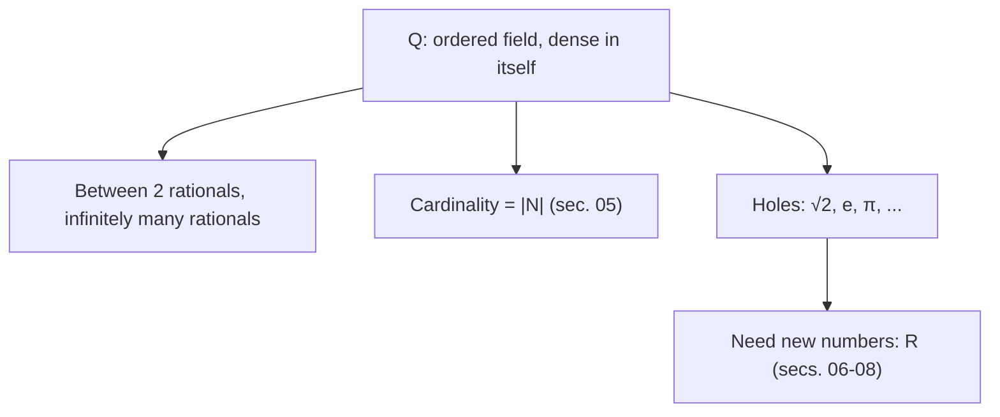

# Integers and rationals

## Why this matters

Everyone knows what $-3$ or $7/4$ are — we've used them since primary school. But mathematics has a **rigorous construction**: start from $\mathbb{N}$ (the naturals) and *manufacture* $\mathbb{Z}$ and $\mathbb{Q}$ via **quotient operations** (see sec. 02 on equivalence relations).

What's the practical point? Two things:
1. **Legitimize the objects**: writing $-3$ and $\frac 7 4$ should mean something precise, not just an intuition.
2. **Learn the "quotient" technique**: we'll use it identically to build $\mathbb{R}$ (sec. 08).

## From $\mathbb{N}$ to $\mathbb{Z}$: adding the "opposites"

In $\mathbb{N} = \{0, 1, 2, 3, \dots\}$ you can't always solve $a + x = b$. Example: $3 + x = 1$ — no natural $x$ works (every natural is $\ge 0$).

We want to "extend" $\mathbb{N}$ by adding **opposites**: numbers like $-3$ such that $3 + (-3) = 0$.

### The idea: an integer is a "difference"

Think of an integer as $a - b$, with $a, b$ naturals. For example:
- $5 = 5 - 0 = 6 - 1 = 7 - 2 = \dots$
- $-3 = 0 - 3 = 1 - 4 = 2 - 5 = \dots$

Notice that **many different pairs** $(a, b)$ represent the same integer. The pair $(5, 0)$ and $(6, 1)$ both represent $5$. When do two pairs represent the same integer?

> Answer: $(a, b)$ and $(c, d)$ represent the same integer when $a - b = c - d$, i.e. (rewriting without the "$-$" we don't have yet) when $a + d = b + c$.

### Formal construction

**Definition.** On $\mathbb{N} \times \mathbb{N}$ (ordered pairs of naturals) define the relation:
$$(a, b) \sim (c, d) \iff a + d = b + c.$$

> **Glossary:**
>
> - $\mathbb{N} \times \mathbb{N}$ = Cartesian product (sec. 02) = set of all ordered pairs $(a, b)$ with $a, b$ naturals.
> - $\sim$ = "is related to" — here, "represents the same integer".

**Verify $\sim$ is an equivalence** (reflexive + symmetric + transitive — see sec. 02):

- **Reflexive**: $(a, b) \sim (a, b)$ means $a + b = b + a$. True (commutativity).
- **Symmetric**: if $(a, b) \sim (c, d)$ then $a + d = b + c$, which is the same as $c + b = d + a$, i.e. $(c, d) \sim (a, b)$. ✓
- **Transitive**: if $(a, b) \sim (c, d)$ and $(c, d) \sim (e, f)$, then $a + d = b + c$ and $c + f = d + e$. Adding: $a + d + c + f = b + c + d + e$, and canceling $c + d$ (cancellation in $\mathbb{N}$): $a + f = b + e$, i.e. $(a, b) \sim (e, f)$. ✓

**Definition.** $\mathbb{Z} := (\mathbb{N} \times \mathbb{N}) / \sim$. So **integers** are equivalence classes of pairs of naturals. The class $[(a, b)]$ "represents" the integer $a - b$.

> **Glossary:**
>
> - $/$ in $X/\sim$ is the **quotient set** symbol (sec. 02): "group elements of $X$ by the relation $\sim$; each class is a new element".
> - $[(a, b)]$ = "the equivalence class containing $(a, b)$".

### Operations on $\mathbb{Z}$

Define sum, product and opposite using representatives:

- **Sum**: $[(a, b)] + [(c, d)] := [(a + c,\ b + d)]$.
  *Why?* Thinking $[(a,b)] = a - b$ and $[(c,d)] = c - d$, the sum is $(a - b) + (c - d) = (a + c) - (b + d) = [(a+c, b+d)]$.
- **Product**: $[(a, b)] \cdot [(c, d)] := [(a c + b d,\ a d + b c)]$.
  *Why?* $(a - b)(c - d) = ac - ad - bc + bd = (ac + bd) - (ad + bc) = [(ac+bd, ad+bc)]$.
- **Opposite**: $-[(a, b)] := [(b, a)]$.
  *Why?* $-(a - b) = b - a = [(b, a)]$.

**Well-definedness.** Every operation on equivalence classes must be verified: the result must not depend on the chosen representative. For sum: if $(a, b) \sim (a', b')$ and $(c, d) \sim (c', d')$, then $a + b' = a' + b$ and $c + d' = c' + d$. Adding: $(a + c) + (b' + d') = (a' + c') + (b + d)$, i.e. $(a + c, b + d) \sim (a' + c', b' + d')$. ✓

### Embedding $\mathbb{N}$ into $\mathbb{Z}$

The naturals "live inside" the integers via $n \mapsto [(n, 0)]$:
$$\mathbb{N} \hookrightarrow \mathbb{Z}, \qquad n \mapsto [(n, 0)].$$

> **Glossary.** The hooked arrow $\hookrightarrow$ denotes an **injective embedding**: each natural lands in a different integer, so we "find" $\mathbb{N}$ inside $\mathbb{Z}$.

Injective: $[(n, 0)] = [(m, 0)] \iff n + 0 = 0 + m \iff n = m$. ✓

From now on, we **identify** $n \in \mathbb{N}$ with $[(n, 0)] \in \mathbb{Z}$, and simply write:
- $n$ instead of $[(n, 0)]$ (non-negative integers).
- $-n$ instead of $[(0, n)]$ (negative integers).

We get the usual notation $\mathbb{Z} = \{\dots, -3, -2, -1, 0, 1, 2, 3, \dots\}$.

### Quotient diagram

<svg viewBox="0 0 600 300" xmlns="http://www.w3.org/2000/svg">
  <rect x="0" y="0" width="600" height="300" fill="#111a30"/>
  <line x1="40" y1="270" x2="580" y2="270" stroke="#f3eed9"/>
  <line x1="40" y1="20" x2="40" y2="270" stroke="#f3eed9"/>
  <text x="295" y="293" fill="#f3eed9" font-family="serif" font-size="12" font-style="italic">a (first)</text>
  <text x="10" y="150" fill="#f3eed9" font-family="serif" font-size="12" font-style="italic">b (second)</text>

  <line x1="40" y1="250" x2="280" y2="10" stroke="#6fb38a" stroke-width="1" stroke-dasharray="3 3"/>
  <line x1="80" y1="270" x2="320" y2="30" stroke="#d4af37" stroke-width="1" stroke-dasharray="3 3"/>
  <line x1="160" y1="270" x2="400" y2="30" stroke="#e8a04a" stroke-width="1" stroke-dasharray="3 3"/>
  <line x1="240" y1="270" x2="480" y2="30" stroke="#6aa9d8" stroke-width="1" stroke-dasharray="3 3"/>
  <line x1="320" y1="270" x2="560" y2="30" stroke="#e07a8d" stroke-width="1" stroke-dasharray="3 3"/>

  <circle cx="120" cy="190" r="3" fill="#d4af37"/>
  <circle cx="160" cy="150" r="3" fill="#d4af37"/>
  <circle cx="200" cy="110" r="3" fill="#d4af37"/>
  <text x="125" y="180" fill="#d4af37" font-family="serif" font-size="11">(2,2)</text>
  <text x="165" y="140" fill="#d4af37" font-family="serif" font-size="11">(3,3)</text>

  <text x="290" y="20" fill="#6fb38a" font-family="serif" font-size="12">b−a = +2 (integer −2)</text>
  <text x="500" y="20" fill="#e07a8d" font-family="serif" font-size="12">a−b = +2 (integer +2)</text>
</svg>

Pairs $(a, b) \in \mathbb{N}^2$ are points in the plane. Each 45° line is a class: all points have the same "difference" $a - b$, so they represent the same integer. The "main diagonal" class (passing through (2,2), (3,3) etc.) corresponds to the integer 0.

### Order on $\mathbb{Z}$

$[(a, b)] \le [(c, d)] \iff a + d \le b + c$.

> **Translation:** the condition "$a - b \le c - d$" becomes, rewritten without subtraction, "$a + d \le b + c$". A total order (any two integers comparable), and sum/product (by positive factors) preserve it.

## From $\mathbb{Z}$ to $\mathbb{Q}$: adding multiplicative inverses

In $\mathbb{Z}$ you can't always solve $b \cdot x = a$. Example: $2 x = 1$ — no integer $x$ works.

We want to extend $\mathbb{Z}$ by adding **inverses**: numbers like $\frac 1 2$ with $2 \cdot \frac 1 2 = 1$.

### The idea: a rational is a "fraction"

Same trick as $\mathbb{N} \to \mathbb{Z}$. Encode a rational as a pair $(a, b)$ with $b \ne 0$, thought of as $\frac a b$. Identify pairs representing the same fraction:
$$\frac{1}{2} = \frac{2}{4} = \frac{3}{6} = \dots$$
I.e. $(a, b)$ and $(c, d)$ represent the same rational when $\frac a b = \frac c d$, which without division becomes $a d = b c$.

### Formal construction

**Definition.** On $\mathbb{Z} \times (\mathbb{Z} \setminus \{0\})$ (pairs with nonzero second element) define:
$$(a, b) \sim (c, d) \iff a d = b c.$$

> **Glossary:**
>
> - $\mathbb{Z} \setminus \{0\}$ = "$\mathbb{Z}$ minus zero" = nonzero integers. We exclude zero as denominator to avoid division by zero.

**Verify $\sim$ is an equivalence.**

- Reflexive: $ab = ba$ (commutative). ✓
- Symmetric: obvious.
- Transitive: $(a, b) \sim (c, d)$ and $(c, d) \sim (e, f)$ give $a d = b c$ and $c f = d e$. Multiply the first by $f$: $a d f = b c f$. Substitute $c f = d e$: $a d f = b d e$. Cancel $d$ (legal since $d \ne 0$): $a f = b e$, i.e. $(a, b) \sim (e, f)$. ✓

**Definition.** $\mathbb{Q} := (\mathbb{Z} \times (\mathbb{Z} \setminus \{0\})) / \sim$. We write $\frac{a}{b}$ (or $a/b$) for the class $[(a, b)]$.

### Operations on $\mathbb{Q}$

The familiar fraction rules:

- **Sum**: $\dfrac{a}{b} + \dfrac{c}{d} := \dfrac{a d + b c}{b d}$.
- **Product**: $\dfrac{a}{b} \cdot \dfrac{c}{d} := \dfrac{a c}{b d}$.
- **Opposite**: $-\dfrac{a}{b} := \dfrac{-a}{b}$.
- **Inverse** (for $a \ne 0$): $\left(\dfrac{a}{b}\right)^{-1} := \dfrac{b}{a}$.

All must be verified "well-defined", i.e. independent of representative (see Exercise 2).

### $\mathbb{Q}$ is an ordered field

**Definition.** A **field** is a set $K$ with two operations $+$ and $\cdot$ satisfying the familiar properties:

- **For sum**: associative, commutative, zero, opposite.
- **For product** (on nonzero elements): associative, commutative, one, inverse.
- **Distributive**: $a(b + c) = ab + ac$.

In addition $\mathbb{Q}$ is **ordered** compatibly: there's a total order $\le$ such that:
- $a \le b \Rightarrow a + c \le b + c$ (sum doesn't disorder).
- $0 \le a$ and $0 \le b$ implies $0 \le ab$.

> **Translation.** $\mathbb{Q}$ is "a structure complete for the 4 operations" (plus, minus, times, divided — minus division by zero), and the numbers are ordered so operations respect the order. Almost everything you want with ordinary numbers, you can do in $\mathbb{Q}$. Almost.

## $\mathbb{Q}$ is "dense in itself"

**Theorem (internal density).** Between two distinct rationals, there's always another rational.

*Proof.* Let $p, q \in \mathbb{Q}$ with $p < q$. Consider the midpoint $m = \frac{p + q}{2}$. It's rational. And $p < m < q$ (because $p < q$). ∎

**Corollary.** Between two distinct rationals there are **infinitely many** rationals (iterate: take the midpoint, then the midpoint of $p$ and $m$, etc.).

> **Translation.** Rationals are "extremely thick": no "minimum distance" between two consecutive rationals — there isn't even a "next rational". And yet, as we'll see, there are **huge holes** between rationals.

## The first hole: $\sqrt 2 \notin \mathbb{Q}$

Already seen in ch. 01 — quick recap.

**Theorem (Pythagoras, Euclid).** There is no $r \in \mathbb{Q}$ with $r^2 = 2$.

*Proof (by contradiction).* Suppose $r = p/q$ with $p, q$ integers, $q \ne 0$, $\gcd(p, q) = 1$. Then $p^2 = 2 q^2$, so $p^2$ is even, so $p$ is even (sec. 01), $p = 2m$. Substituting: $4m^2 = 2 q^2$, i.e. $q^2 = 2 m^2$, so $q$ is even. But then $\gcd(p, q)$ has the factor 2, against $\gcd(p, q) = 1$. Contradiction. ∎

**Lesson.** The equation $x^2 = 2$ has no rational solution. *Yet* the sequence $1, 1.4, 1.41, 1.414, 1.4142, \dots$ (all rationals) seems to "converge to something". That "something" is $\sqrt 2 \approx 1.4142\dots$, and *it's not in $\mathbb{Q}$*.

## $\mathbb{Q}$ is not complete

Here's the heart of the chapter, the reason we'll need the reals.

### What "completeness" is

**Provisional definition.** A totally ordered set $(K, \le)$ is **complete** if every nonempty *upper-bounded* subset has a **supremum** in $K$.

> **Glossary** (formalized in chs. 06–07, here in words):
>
> - **Upper-bounded**: there's a "cap" $M$ never exceeded — $\forall x \in A,\ x \le M$. $M$ is an **upper bound**.
> - **Supremum** ($\sup$): the smallest of the upper bounds. The "tightest cap" above the set.

Example: $A = \{x \in \mathbb{Q} : x < 1\}$. Upper-bounded (e.g. by 2). Of all upper bounds, the smallest is $1$. So $\sup A = 1$.

### $\mathbb{Q}$ has a "visible" hole

**Theorem.** $\mathbb{Q}$ is **not** complete.

*Idea.* Consider "positive rationals with square $< 2$": its supremum should be $\sqrt 2$, but $\sqrt 2 \notin \mathbb{Q}$. So no sup exists in $\mathbb{Q}$.

*Proof.* Let
$$A = \{q \in \mathbb{Q} : q > 0,\ q^2 < 2\}.$$

$A$ is:
- **Nonempty**: $1 \in A$ ($1 > 0$ and $1^2 = 1 < 2$). ✓
- **Upper-bounded**: $2$ is an upper bound (if $q > 2$ then $q^2 > 4 > 2$, so $q \notin A$). ✓

Show $A$ has **no supremum in $\mathbb{Q}$**. By contradiction, suppose $s = \sup A$ exists in $\mathbb{Q}$. Then $s$ is rational, $s^2$ is rational. Three cases.

**Case 1: $s^2 < 2$.** Then $s \in A$. We show we can find $q \in A$ with $q > s$, contradicting "$s$ is an upper bound".

Try $q = s + \varepsilon$ with $\varepsilon > 0$ small rational, so $q \in A$ i.e. $q^2 < 2$:
$$q^2 = (s + \varepsilon)^2 = s^2 + 2 s \varepsilon + \varepsilon^2.$$
Want $q^2 < 2$, i.e. $2 s \varepsilon + \varepsilon^2 < 2 - s^2$. For $\varepsilon \in (0, 1)$, $\varepsilon^2 < \varepsilon$, so:
$$2 s \varepsilon + \varepsilon^2 < (2 s + 1) \varepsilon.$$
Pick $\varepsilon$ with $0 < \varepsilon < \min\left(1,\ \frac{2 - s^2}{2 s + 1}\right)$ — exists rational — and we get $q \in A$ with $q > s$. Contradiction.

**Case 2: $s^2 > 2$.** Show there's a smaller upper bound, contradicting "smallest upper bound".

Try $r = s - \varepsilon$ with $\varepsilon > 0$ small rational, so $r$ is still upper bound of $A$. Equivalently (since $q > 0$ and we want $r > 0$): $q^2 < r^2$.

For every $q \in A$, $q^2 < 2$. If we can get $r^2 > 2$, then $q^2 < 2 < r^2$. So find $\varepsilon$ with $r^2 = (s - \varepsilon)^2 > 2$:
$$(s - \varepsilon)^2 = s^2 - 2 s \varepsilon + \varepsilon^2 > s^2 - 2 s \varepsilon.$$
Enough that $s^2 - 2 s \varepsilon > 2$, i.e. $\varepsilon < \frac{s^2 - 2}{2 s}$. Plus $\varepsilon < s$ (so $r > 0$). Both satisfiable. So $r$ is smaller upper bound. Contradiction.

**Case 3: $s^2 = 2$.** But $s \in \mathbb{Q}$, and we just proved no rational has square 2. Absurd.

All three cases lead to contradictions. So $\sup A$ doesn't exist in $\mathbb{Q}$. ∎

> **Translation.** $A$ "naturally" should have $\sqrt 2$ as supremum — but $\sqrt 2$ isn't in $\mathbb{Q}$. So $\mathbb{Q}$ doesn't "close" this sup. There's a **hole**. And it's not the only one: $\sqrt 3$, $\sqrt 5$, $\pi$, $e$, … are all holes.

## Philosophical consequences

For analysis (limits, derivatives, integrals) we need **complete** sets: every "would-be convergent" sequence must have a *really existing* limit. $\mathbb{Q}$ isn't — it's full of holes.

The construction of $\mathbb{R}$ (sec. 08) will be the art of **plugging those holes**, adding "enough" numbers so every sup exists.

## Guided examples

**1.** Sum of two fractions: $\dfrac{7}{12} + \dfrac{1}{8} = ?$

*Solution.* Common denominator of 12 and 8: $\text{lcm}(12, 8) = 24$.
$\dfrac{7}{12} = \dfrac{14}{24}$. $\dfrac{1}{8} = \dfrac{3}{24}$. Sum: $\dfrac{17}{24}$.

**2.** $\sqrt 3 \notin \mathbb{Q}$. Analogous proof to $\sqrt 2$ (see ch. 01).

**3.** $\log_{10} 2 \notin \mathbb{Q}$. *Solution.* If $\log_{10} 2 = p/q$ with $p, q$ positive integers, then $10^{p/q} = 2$, i.e. $10^p = 2^q$, i.e. $2^p \cdot 5^p = 2^q$. By **uniqueness of prime factorization** (ch. 03), exponents of $2$ and $5$ must match left and right. Right side has no factor $5$, so $p = 0$. But then $\log_{10} 2 = 0$, i.e. $10^0 = 2$, false. ∎

## Exercises

Exercise 1 — $\sqrt 5$ irrational

Prove $\sqrt 5 \notin \mathbb{Q}$.

**Solution.** By contradiction, $\sqrt 5 = p/q$ with $\gcd(p, q) = 1$. Then $p^2 = 5 q^2$, so $5 \mid p^2$. Since 5 is prime, $5 \mid p$, write $p = 5m$. Substituting: $25 m^2 = 5 q^2 \Rightarrow q^2 = 5 m^2$, so $5 \mid q$. Then $5 \mid \gcd(p, q) = 1$. Contradiction. ∎

Exercise 2 — Well-definedness of product

Verify the product on $\mathbb{Q}$ is well-defined: if $(a, b) \sim (a', b')$ and $(c, d) \sim (c', d')$, then $(a c, b d) \sim (a' c', b' d')$.

**Solution.** Hypotheses: $a b' = a' b$ and $c d' = c' d$. Want $(a c)(b' d') = (a' c')(b d)$:
$$(ac)(b' d') = (a b')(c d') = (a' b)(c' d) = (a' c')(b d). \quad\blacksquare$$

Exercise 3 — No rational squares to 3

Let $B = \{q \in \mathbb{Q}^+ : q^2 < 3\}$. Show it has no supremum in $\mathbb{Q}$.

**Solution.** Same scheme as the $\mathbb{Q}$-not-complete proof. Three cases $s^2 < 3, s^2 > 3, s^2 = 3$ lead to absurd. For first, $q = s + \varepsilon$ with $0 < \varepsilon < \min(1, (3 - s^2)/(2s + 1))$. For second, $r = s - \varepsilon$ with $\varepsilon < (s^2 - 3)/(2 s)$. For third, $\sqrt 3 \notin \mathbb{Q}$.

Exercise 4 — Dyadic fractions are dense

Show that for every $p, q \in \mathbb{Q}$ with $p < q$ there's a rational of the form $k / 2^n$ ("**dyadic fraction**") strictly between $p$ and $q$.

**Solution.** Pick $n \in \mathbb{N}$ with $2^n > \frac{1}{q - p}$ (exists, naturals are unbounded). Then $\frac{1}{2^n} < q - p$.

Let $k = \lfloor 2^n p \rfloor + 1$. Then:
- $k > 2^n p$, so $k / 2^n > p$.
- $k \le 2^n p + 1$, so $k / 2^n \le p + 1/2^n < p + (q - p) = q$.

Together: $p < k/2^n < q$. ∎

Exercise 5 — Perfect squares vs rational roots

Let $n \ge 2$ be an integer. Show $\sqrt n \in \mathbb{Q}$ **iff** $n$ is a perfect square (i.e. $n = m^2$ for some $m \in \mathbb{N}$).

**Solution.**

*"If"*: $n = m^2 \Rightarrow \sqrt n = m \in \mathbb{Z} \subset \mathbb{Q}$.

*"Only if"*: by contradiction, $\sqrt n = p/q$ with $\gcd(p, q) = 1$. Then $p^2 = n q^2$.

Take any prime $r$ and suppose $r^a \| n$ (i.e. $r^a$ divides $n$ but $r^{a+1}$ doesn't — exact exponent of $r$ in $n$).

From $p^2 = n q^2$ and $\gcd(p, q) = 1$: all prime factors of $p^2$ come from $n$ (since $q$ and $p$ share no factors). Exponent of $r$ in $p^2$ is even ($= 2 \times$ exponent in $p$). So exponent of $r$ in $n q^2$ is even — and going from $n q^2$ to $n$ removes $r^{2 \cdot (\text{exp in } q)}$, still even.

So exponent of $r$ in $n$ is even. For *every* prime dividing $n$, hence every exponent is even, and $n$ is a perfect square. ∎

## Common pitfalls

- **Confusing "fraction" with "pair"**. The fraction $a/b$ is the *equivalence class* — $1/2$ and $2/4$ are **the same fraction**, different pairs.
- **Forgetting $b \ne 0$**. The construction excludes zero denominator. $1/0$ isn't "infinity": it doesn't exist in $\mathbb{Q}$.
- **Thinking $\mathbb{Q}$ is enough for analysis**. It's not: analysis needs completeness, and $\mathbb{Q}$ is full of holes. All existence theorems in analysis (Bolzano, Weierstrass, mean value) use $\mathbb{R}$'s completeness.
- **Thinking "irrational = weird"**. Actually they're the **rule**, not the exception: irrationals are "many more" than rationals (ch. 05 — Cantor). Almost every real number you'll meet is irrational.

> **Operating pill.** When you see an "equivalence class construction", remember two things: (a) the class is a *set of representatives*, never a single representative; (b) every operation defined "on representatives" must be checked **well-defined** on classes (independent of representative choice). It's the mental exercise that separates understanding from repetition.

## One-line takeaway

$\mathbb{Z}$ is built from $\mathbb{N}$ by identifying pairs with the same difference, $\mathbb{Q}$ from $\mathbb{Z}$ by identifying pairs with the same fraction — and $\mathbb{Q}$, though dense, is full of holes (like $\sqrt 2$) that force us to build $\mathbb{R}$.
