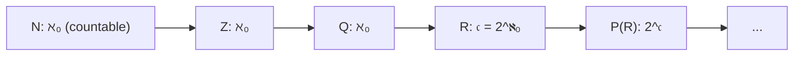

# Cardinality and infinity (Cantor)

## Why this matters

Between 1873 and 1891 Georg Cantor discovered something that changed mathematics: **not all infinities are equal**. $\mathbb{N}$ (the naturals) and $\mathbb{R}$ (the reals) both have infinitely many elements, but $\mathbb{R}$ has **strictly more**.

Sounds paradoxical: how do you "count" two infinite things? Cantor found the right answer, and it's elegant. Understanding it changes how you think about:
- **Sequences and series** (what "listing" means).
- **Measure and probability** (why "randomly hitting a rational" has probability zero).
- **Computability** (what a machine can or can't enumerate).

## The idea: count without counting

For two *finite* sets we know what "same number of elements" means: count, and if you count the same, you have the same. But for two *infinite* sets, counting doesn't work.

**Cantor's idea**: two sets have the same "number" of elements (the same **cardinality**) if we can put them in **one-to-one correspondence** — i.e. if a bijection exists between them.

> **Everyday example.** You have 30 chairs and a crowd. To know if there are "as many people as chairs" you don't have to count: say "sit down" and see if everyone has a chair and every chair has someone. If yes, same cardinality. *Even* if there are 30, even if infinitely many. That's the bijection principle.

### Formal definition

**Definition.** Two sets $A$ and $B$ are **equipotent** (symbolically $A \sim B$ or $|A| = |B|$) if there exists a **bijection** $f : A \to B$.

> **Glossary:**
>
> - $|A|$ = "cardinality of $A$" = "the (possibly infinite) number of elements of $A$".
> - $A \sim B$ = "$A$ and $B$ are equipotent".
> - **Bijection**: function injective (different inputs → different outputs) **and** surjective (every output reached). See sec. 02.

Equipotence is an equivalence relation (sec. 02): reflexive (identity function), symmetric (inverse bijection), transitive (composition of bijections is a bijection).

**Definition of "$\le$".** $|A| \le |B|$ if there's an **injective** function $A \to B$ (every element of $A$ "fits in" $B$, possibly with $B$ having leftovers).

**Definition of "$<$".** $|A| < |B|$ if $|A| \le |B|$ but $A \not\sim B$ (injection exists but no bijection).

## Surprising examples

The intuition "$A \subset B \Rightarrow |A| < |B|$" works for finite sets but **not** for infinite ones.

### 1. $\mathbb{N} \sim \mathbb{N}_{\text{even}}$ (even naturals are "as many" as all naturals)

Bijection: $f(n) = 2n$. The correspondence $0 \leftrightarrow 0, 1 \leftrightarrow 2, 2 \leftrightarrow 4, 3 \leftrightarrow 6, \dots$. Every natural has exactly one even partner, every even has exactly one natural partner.

> **Translation.** "Removing half the naturals (the odds), I have just as many left." Seems like magic, but it's the signature of infinity.

**Dedekind's definition of "infinite".** A set is **infinite** if it's equipotent to one of its proper subsets. (For finite sets, $|A| < |B|$ if $A \subsetneq B$. For infinite, no.)

### 2. $\mathbb{N} \sim \mathbb{Z}$

Idea: enumerate integers alternating positives and negatives: $0, 1, -1, 2, -2, 3, -3, \dots$

Formally $f : \mathbb{N} \to \mathbb{Z}$,
$$f(n) = \begin{cases} n/2 & \text{if } n \text{ even} \\ -(n + 1)/2 & \text{if } n \text{ odd} \end{cases}$$

Check: $f(0) = 0$, $f(1) = -1$, $f(2) = 1$, $f(3) = -2$, $f(4) = 2$, …

### 3. $(0, 1) \sim \mathbb{R}$ (a tiny interval "contains all of $\mathbb{R}$")

Explicit bijection: $f(x) = \tan(\pi (x - 1/2))$.

> **Glossary.** $\tan$ is the tangent function (see sec. 19). On $(-\pi/2, \pi/2)$, tangent is a bijection with $\mathbb{R}$. Map $(0, 1)$ to $(-\pi/2, \pi/2)$ with $x \mapsto \pi(x - 1/2)$, then apply tangent.

Don't worry if you're not familiar with tangent yet: the point is that a tiny open interval has *the same points* as the entire real line.

## Countability: the "first" infinity

**Definition.** A set $A$ is **countable** if $A \sim \mathbb{N}$ (i.e. a bijection $\mathbb{N} \to A$ exists).

Having a bijection with $\mathbb{N}$ means you can **enumerate** the elements: $A = \{a_0, a_1, a_2, a_3, \dots\}$, an infinite "list" indexed by naturals.

> **Convention.** Some authors call "countable" any set finite-or-bijective-with-$\mathbb{N}$. We say **at most countable** for "finite or countable", and **countable** only for the infinite version.

### Base theorems

**Theorem 1.** Every **infinite** subset of $\mathbb{N}$ is countable.

*Proof.* Let $A \subseteq \mathbb{N}$ infinite. Define recursively:
$$a_0 := \min A, \qquad a_{n+1} := \min(A \setminus \{a_0, \dots, a_n\}).$$

> **Glossary:**
>
> - $\min A$ = the smallest element of $A$. Exists because $\mathbb{N}$ is **well-ordered**: every nonempty subset has a minimum (fundamental property of naturals, ch. 03).

At each step we remove an element; since $A$ is infinite, it's never exhausted. The function $n \mapsto a_n$ is injective (by construction, all $a_n$ are distinct). It's also surjective: if some $b \in A$ were never $a_n$, then at each step $a_n \le b$ (because $a_n$ is the min of a set containing $b$), but there are only finitely many naturals $\le b$, so we'd run out of $a_n$. Contradiction. ∎

**Theorem 2.** A **countable** union of **countable** sets is countable.

In symbols: if $A_k$ is countable for every $k \in \mathbb{N}$, then $\bigcup_{k \in \mathbb{N}} A_k$ is countable.

*Proof (idea — the "infinite table").* Write each $A_k$ as a list:
$$A_k = \{a_{k, 0},\ a_{k, 1},\ a_{k, 2},\ \dots\}.$$

Arrange in an **infinite table**:

$$\begin{array}{c|cccc}
& 0 & 1 & 2 & \cdots \\\hline
A_0 & a_{0,0} & a_{0,1} & a_{0,2} & \cdots \\
A_1 & a_{1,0} & a_{1,1} & a_{1,2} & \cdots \\
A_2 & a_{2,0} & a_{2,1} & a_{2,2} & \cdots \\
\vdots & & & & \ddots
\end{array}$$

Enumerate this table **by diagonals**:
$$a_{0,0},\ \underbrace{a_{1,0},\ a_{0,1}}_{\text{index sum} = 1},\ \underbrace{a_{2,0},\ a_{1,1},\ a_{0,2}}_{\text{index sum} = 2},\ \dots$$

Each diagonal has finitely many elements (index sum $k + j = n$ fixed: $n + 1$ elements). Diagonals are countable in number (one per $n \in \mathbb{N}$). So we enumerate the table with naturals. Removing any duplicates, we get a bijection $\mathbb{N} \to \bigcup A_k$. ∎

This technique is called **Cantor's diagonal (constructive version)** and is the standard way to prove countability.

<svg viewBox="0 0 600 300" xmlns="http://www.w3.org/2000/svg">
  <rect x="0" y="0" width="600" height="300" fill="#111a30"/>
  <g stroke="#f3eed9" stroke-opacity="0.3" stroke-width="0.5">
    <line x1="60" y1="40" x2="540" y2="40"/>
    <line x1="60" y1="80" x2="540" y2="80"/>
    <line x1="60" y1="120" x2="540" y2="120"/>
    <line x1="60" y1="160" x2="540" y2="160"/>
    <line x1="60" y1="200" x2="540" y2="200"/>
    <line x1="60" y1="240" x2="540" y2="240"/>
    <line x1="60" y1="40" x2="60" y2="260"/>
    <line x1="120" y1="40" x2="120" y2="260"/>
    <line x1="180" y1="40" x2="180" y2="260"/>
    <line x1="240" y1="40" x2="240" y2="260"/>
    <line x1="300" y1="40" x2="300" y2="260"/>
    <line x1="360" y1="40" x2="360" y2="260"/>
    <line x1="420" y1="40" x2="420" y2="260"/>
    <line x1="480" y1="40" x2="480" y2="260"/>
  </g>
  <g fill="#f3eed9" font-family="serif" font-size="13" text-anchor="middle">
    <text x="90" y="65">1/1</text><text x="150" y="65">1/2</text><text x="210" y="65">1/3</text><text x="270" y="65">1/4</text><text x="330" y="65">1/5</text>
    <text x="90" y="105">2/1</text><text x="150" y="105">2/2</text><text x="210" y="105">2/3</text><text x="270" y="105">2/4</text><text x="330" y="105">2/5</text>
    <text x="90" y="145">3/1</text><text x="150" y="145">3/2</text><text x="210" y="145">3/3</text><text x="270" y="145">3/4</text>
    <text x="90" y="185">4/1</text><text x="150" y="185">4/2</text><text x="210" y="185">4/3</text>
    <text x="90" y="225">5/1</text><text x="150" y="225">5/2</text>
  </g>
  <polyline points="90,65 90,105 150,65 210,65 150,105 90,145 90,185 150,145 210,105 270,65" fill="none" stroke="#d4af37" stroke-width="2.5"/>
  <text x="380" y="280" fill="#d4af37" font-family="serif" font-size="12">diagonal enumeration → Q+ is countable</text>
</svg>

Fractions $a/b$ with $a, b \ge 1$ form an infinite table. Traverse by diagonals (increasing $a + b$ sum), skipping duplicates: you get a numbered list of all positive rationals.

### Consequences: $\mathbb{Z}$ and $\mathbb{Q}$ are countable

**Theorem 3.** $\mathbb{Z}$ is countable. (Already shown with the list $0, 1, -1, 2, -2, \dots$.)

**Theorem 4.** $\mathbb{Q}$ is countable.

*Proof.* A positive fraction $p/q$ (reduced) is a pair $(p, q) \in \mathbb{N}^2$. Cantor's diagonal enumerates $\mathbb{N}^2$. So $\mathbb{Q}^+$ is countable (at most). Also $\mathbb{N} \subseteq \mathbb{Q}^+$, so $\mathbb{Q}^+$ isn't finite. Hence $\mathbb{Q}^+$ is countable.

Adding zero and negatives (both countable or finite), $\mathbb{Q}$ stays countable. ∎

> **Meaning.** Strange-seeming: $\mathbb{Q}$ is **dense** (ch. 04 — between two rationals are infinitely many), yet "enumerable" as a list. Density is topological, countability is cardinal. They're distinct concepts.

## The big surprise: $\mathbb{R}$ is uncountable

**Theorem (Cantor 1891).** $\mathbb{R}$ is **not** countable. Equivalently: $|\mathbb{R}| > |\mathbb{N}|$.

*Proof (Cantor's diagonal — the famous one).*

Enough to show $(0, 1)$ isn't countable, since $(0, 1) \sim \mathbb{R}$.

**By contradiction**, suppose there's a bijection $f : \mathbb{N} \to (0, 1)$. So we can "list" every number of $(0, 1)$ as:
$$f(0), f(1), f(2), f(3), \dots$$

Write each in **decimal form**:
$$\begin{aligned}
f(0) &= 0.\,d_{0,0}\,d_{0,1}\,d_{0,2}\,d_{0,3}\,\dots \\
f(1) &= 0.\,d_{1,0}\,d_{1,1}\,d_{1,2}\,d_{1,3}\,\dots \\
f(2) &= 0.\,d_{2,0}\,d_{2,1}\,d_{2,2}\,d_{2,3}\,\dots \\
&\,\vdots
\end{aligned}$$

> **Glossary:**
>
> - $d_{n, k}$ = the $k$-th decimal digit of $f(n)$.
> - Convention: avoid trailing-9 representations (e.g. $0.4999\dots = 0.5000\dots$ — each number has a **unique** representation).

**Construct a number $x$ differing from ALL listed numbers.** Define $x = 0.e_0\,e_1\,e_2\,e_3\,\dots$ with digits $e_n$:

$$e_n := \begin{cases} 5 & \text{if } d_{n,n} \ne 5 \\ 6 & \text{if } d_{n,n} = 5 \end{cases}$$

> **Translation.** Look at the **diagonal** of the list (digits $d_{0,0}, d_{1,1}, d_{2,2}, \dots$) and put a **different** digit in $e_n$. Choosing only 5 or 6 avoids issues (leading zero, trailing 9s, etc.).

Then:
- $x \in (0, 1)$ (decimal with digits 5 or 6).
- $x \ne f(n)$ for every $n$, because they differ at least in the **$n$-th digit**: $x$ has $e_n$, $f(n)$ has $d_{n,n} \ne e_n$.

But then $f$ isn't surjective: $x$ isn't any $f(n)$. **Contradiction**, since $f$ was a bijection.

Conclusion: no $f : \mathbb{N} \to (0, 1)$ can be bijective. So $(0, 1)$ (and $\mathbb{R}$) is uncountable. ∎

<svg viewBox="0 0 600 300" xmlns="http://www.w3.org/2000/svg">
  <rect x="0" y="0" width="600" height="300" fill="#111a30"/>
  <text x="30" y="50" fill="#f3eed9" font-family="monospace" font-size="14">f(0) = 0.</text>
  <text x="30" y="80" fill="#f3eed9" font-family="monospace" font-size="14">f(1) = 0.</text>
  <text x="30" y="110" fill="#f3eed9" font-family="monospace" font-size="14">f(2) = 0.</text>
  <text x="30" y="140" fill="#f3eed9" font-family="monospace" font-size="14">f(3) = 0.</text>
  <text x="30" y="170" fill="#f3eed9" font-family="monospace" font-size="14">f(4) = 0.</text>

  <rect x="125" y="36" width="20" height="20" fill="#d4af37" fill-opacity="0.3"/>
  <rect x="151" y="66" width="20" height="20" fill="#d4af37" fill-opacity="0.3"/>
  <rect x="177" y="96" width="20" height="20" fill="#d4af37" fill-opacity="0.3"/>
  <rect x="203" y="126" width="20" height="20" fill="#d4af37" fill-opacity="0.3"/>
  <rect x="229" y="156" width="20" height="20" fill="#d4af37" fill-opacity="0.3"/>

  <text x="125" y="52" fill="#f3eed9" font-family="monospace" font-size="14">3 1 4 1 5 9 ...</text>
  <text x="125" y="82" fill="#f3eed9" font-family="monospace" font-size="14">2 7 1 8 2 8 ...</text>
  <text x="125" y="112" fill="#f3eed9" font-family="monospace" font-size="14">5 0 0 0 0 0 ...</text>
  <text x="125" y="142" fill="#f3eed9" font-family="monospace" font-size="14">7 7 7 4 7 7 ...</text>
  <text x="125" y="172" fill="#f3eed9" font-family="monospace" font-size="14">1 2 3 4 5 6 ...</text>

  <text x="30" y="220" fill="#e07a8d" font-family="monospace" font-size="14">x   = 0.6 5 5 5 6 ...</text>
  <text x="30" y="250" fill="#e07a8d" font-family="serif" font-size="13">x differs from f(n) at digit n → not in list</text>
</svg>

Building the "off-list" number: change the $n$-th digit of $f(n)$ so it always differs. The new $x$ can't be any $f(n)$.

## Cantor-Bernstein-Schroeder (CBS)

Back to cardinality inequalities: there's a wonderfully convenient result.

**Theorem (Cantor-Bernstein-Schroeder).** If $|A| \le |B|$ and $|B| \le |A|$, then $|A| = |B|$.

**Translation.** If there are injections $A \to B$ and $B \to A$, then a bijection $A \to B$ exists.

> **Practical use.** To prove $|A| = |B|$ you don't need to build a bijection explicitly: just find two injections, one each way.

*Idea of proof.* Given injective $f : A \to B$ and $g : B \to A$, consider the "chains" of an element $a \in A$:
$$a \mapsto f(a) \in B \mapsto g(f(a)) \in A \mapsto \dots$$
And backwards:
$$a, \quad g^{-1}(a) \in B\ (\text{if exists}), \quad f^{-1}(g^{-1}(a)) \in A\ (\text{if exists}), \dots$$

Every element belongs to a chain. Based on chain type (ends in $A$, ends in $B$, infinite), decide whether to send via $f$ or $g^{-1}$. You get a bijection $h : A \to B$. (Full proof: 1–2 pages. See Halmos *Naive Set Theory*.)

## The "cardinality of the continuum"

**Historic notation:**
- $\aleph_0$ ("aleph zero", from $\aleph$, first letter of the Hebrew alphabet) $= |\mathbb{N}|$.
- $\mathfrak{c}$ ("Fraktur c") $= |\mathbb{R}|$, **cardinality of the continuum**.

We proved: $\aleph_0 < \mathfrak{c}$.

**Result.** $\mathfrak{c} = 2^{\aleph_0}$, i.e. $|\mathbb{R}| = |\mathcal{P}(\mathbb{N})|$ (cardinality of the power set of $\mathbb{N}$).

> **Glossary:**
>
> - $\mathcal{P}(X)$ = **power set** of $X$ = set of all subsets of $X$. E.g. $\mathcal{P}(\{1, 2\}) = \{\emptyset, \{1\}, \{2\}, \{1, 2\}\}$.
> - If $|X| = n$ finite, $|\mathcal{P}(X)| = 2^n$ (for each element of $X$, choose "in" or "out"). The symbol $2^{\aleph_0}$ generalizes the cardinality of "in/out choices" over countably many elements.

*Proof idea for $\mathfrak{c} = 2^{\aleph_0}$.* Every real in $(0, 1)$ has a binary representation. A sequence $(a_0, a_1, a_2, \dots) \in \{0, 1\}^{\mathbb{N}}$ corresponds to the set of indices where it's 1, i.e. to an element of $\mathcal{P}(\mathbb{N})$. Modulo double-representation (trailing 1s) — a countable set — fixed via CBS.

### The "parent" theorem: power set is bigger

**Theorem (Cantor).** For every set $X$, $|X| < |\mathcal{P}(X)|$.

*Proof.* Injection $X \to \mathcal{P}(X)$ obvious: $x \mapsto \{x\}$. So $|X| \le |\mathcal{P}(X)|$. Strict inequality next.

By contradiction, suppose $f : X \to \mathcal{P}(X)$ is **surjective**. Define
$$D := \{x \in X : x \notin f(x)\}.$$

> **Translation.** $D$ is the set of $x \in X$ that **don't belong** to their image $f(x)$ (recall $f(x)$ is a subset of $X$, so "$x \in f(x)$" makes sense).

$D \in \mathcal{P}(X)$, so by surjectivity there's $x_0 \in X$ with $f(x_0) = D$. Ask: **is $x_0 \in D$?**

- If $x_0 \in D$: by definition of $D$, $x_0 \notin f(x_0) = D$. Contradiction.
- If $x_0 \notin D$: by definition of $D$, $x_0 \in f(x_0) = D$. Contradiction.

Either way, contradiction. So no $f$ is surjective. ∎

**Consequence.** There's an **infinite hierarchy of infinities**:
$$|\mathbb{N}| < |\mathcal{P}(\mathbb{N})| < |\mathcal{P}(\mathcal{P}(\mathbb{N}))| < |\mathcal{P}(\mathcal{P}(\mathcal{P}(\mathbb{N})))| < \dots$$

There's no "biggest infinity". Infinity itself climbs an endless ladder.

## Continuum hypothesis (a brief mention)

**Cantor's question.** Does there exist a set $X$ with $\aleph_0 < |X| < \mathfrak{c}$?

The **Continuum Hypothesis** (CH) says: *no*, no intermediate cardinality exists between $\mathbb{N}$ and $\mathbb{R}$.

Cantor suspected CH and tried to prove it, unsuccessfully. Modern results:
- **Gödel (1940)**: CH is consistent with ZFC (can't be disproved).
- **Cohen (1963)**: CH is **independent** of ZFC (can't be proved either).

So CH is **undecidable** in standard mathematics. Neither true nor false — it depends on which axioms you add. Shocking.

## Visual hierarchy

## Unexpected consequences

**1.** $\mathbb{Q}[\sqrt 2] = \{a + b \sqrt 2 : a, b \in \mathbb{Q}\}$ is countable (injects into $\mathbb{Q} \times \mathbb{Q}$).

**2. Algebraic numbers are countable.** A number is **algebraic** if it's a root of a polynomial with integer coefficients. *Proof.* Polynomials with integer coefficients are $\bigcup_n \mathbb{Z}^{n+1}$, countable union of countables → countable. Each polynomial has finitely many roots. Countable union of finites → countable. ∎

**Powerful corollary.** **Transcendental numbers** (= non-algebraic) exist: because $\mathbb{R} \setminus \mathbb{A}$ (algebraic numbers $\mathbb{A}$) is nonempty, in fact has cardinality $\mathfrak{c}$. So *almost all* reals are transcendental.

> **Historical curiosity.** Cantor proved (1874) transcendentals exist by **counting**, before any concrete example was known. One of the first **non-constructive** proofs in mathematics. $e$ was proved transcendental by Hermite (1873), $\pi$ by Lindemann (1882) — but Cantor already knew there were "many more" without naming one.

**3.** Finite sequences of integers $\bigcup_n \mathbb{Z}^n$: countable.

**4.** Infinite sequences $\{0, 1\}^{\mathbb{N}}$: cardinality $\mathfrak{c}$.

## Exercises

Exercise 1 — Explicit bijection $\mathbb{N} \times \mathbb{N} \to \mathbb{N}$

Find an explicit bijection $\pi : \mathbb{N}^2 \to \mathbb{N}$.

**Solution.** **Cantor's pairing function**:
$$\pi(m, n) = \frac{(m + n)(m + n + 1)}{2} + m.$$

Check first values: $\pi(0,0) = 0$, $\pi(1,0) = 1$, $\pi(0,1) = 2$, $\pi(2,0) = 3$, $\pi(1,1) = 4$, $\pi(0,2) = 5$, $\pi(3,0) = 6$, …

The idea: number pairs by **antidiagonals** (constant sum $m + n$). The $k$-th antidiagonal has $k + 1$ points, and before it there are $1 + 2 + \dots + k = k(k+1)/2$ points. On antidiagonal $k = m + n$, point $(m, n)$ is at position $m$. So $\pi(m, n) = k(k+1)/2 + m$.

Exercise 2 — $|\{0, 1\}^{\mathbb{N}}| = \mathfrak{c}$

Show that infinite binary sequences have cardinality $\mathfrak{c}$.

**Solution.** Injection $\{0, 1\}^{\mathbb{N}} \to (0, 1)$: to a sequence $a = (a_0, a_1, a_2, \dots)$ associate $\sum_{n=0}^\infty a_n / 2^{n+1}$ (binary expansion).

Injection $(0, 1) \to \{0, 1\}^{\mathbb{N}}$: standard binary expansion (avoiding trailing 1s).

By CBS, $|\{0, 1\}^{\mathbb{N}}| = |(0, 1)| = |\mathbb{R}| = \mathfrak{c}$. ∎

Exercise 3 — Cardinality of a "thin" set

Let $A$ be the set of reals in $[0, 1]$ whose decimal expansion contains **only** digits $0$ and $1$. Find $|A|$.

**Solution.** $A$ is in bijection with $\{0, 1\}^{\mathbb{N}}$ (modulo double representation, a countable set, fixable with CBS). So $|A| = \mathfrak{c}$.

**Notable.** $A$ has "measure zero" (a Cantor-type set in base 10), yet has the same cardinality as all of $\mathbb{R}$. **Cardinality and measure are different concepts.**

Exercise 4 — $\mathbb{R}^2 \sim \mathbb{R}$

Show the plane $\mathbb{R}^2$ has the same cardinality as the line $\mathbb{R}$.

**Solution (idea).**

Injection $\mathbb{R} \to \mathbb{R}^2$: obvious, $x \mapsto (x, 0)$.

Injection $\mathbb{R}^2 \to \mathbb{R}$: work on $(0, 1)^2 \to (0, 1)$. Given $(0.a_1 a_2 a_3 \dots,\ 0.b_1 b_2 b_3 \dots)$ associate $0.a_1 b_1 a_2 b_2 a_3 b_3 \dots$ — **interleave digits**. Almost bijective (trailing-9 issues fixed with CBS).

By CBS, $|\mathbb{R}^2| = |\mathbb{R}|$.

**Curiosity.** Cantor wrote to Dedekind in 1877: "*I see it, but I don't believe it*". The idea that a line and a square have the same number of points contradicted everyone's intuition then.

(Technical note: there's *no* **continuous** bijection between $\mathbb{R}$ and $\mathbb{R}^2$. Peano curves approximate but aren't bijective.)

Exercise 5 — Existence of transcendentals

Prove transcendentals exist, **without** exhibiting one.

**Solution.** Algebraic numbers are countable (example 2 above). If transcendentals **didn't** exist, $\mathbb{R}$ would equal the algebraics, hence countable. But $\mathbb{R}$ isn't countable (Cantor). Contradiction.

So transcendentals exist, in fact $\mathfrak{c}$ of them. ∎

Classic **non-constructive** proof.

## Common pitfalls

- **"All infinities are equal."** **False.** $|\mathbb{N}| < |\mathbb{R}|$.
- **"Between consecutive integers there's nothing, so $\mathbb{Z}$ is smaller than $\mathbb{Q}$."** **False.** $|\mathbb{Z}| = |\mathbb{Q}| = \aleph_0$. **Density** is topological, **cardinality** is set-theoretic.
- **"$\mathbb{Q}$ is dense in $\mathbb{R}$, so it must have the same cardinality."** **False.** $\mathbb{Q}$ is dense AND countable; $\mathbb{R}$ is uncountable.
- **"There's a list of all reals."** **False.** Exactly what Cantor's diagonal refutes.
- **"Measure zero ⇒ few points."** **False.** The Cantor set (ch. 56) has measure zero but cardinality $\mathfrak{c}$.

> **Pill.** When you hear "**infinity**", always ask "*which* infinity?". $\aleph_0$, $\mathfrak{c}$, $2^{\mathfrak{c}}$, $\dots$ — Cantor opened the door to an entire hierarchy of infinite sizes.

## One-line takeaway

Not all infinities are equal: $|\mathbb{N}| = |\mathbb{Z}| = |\mathbb{Q}| = \aleph_0$ ("countable") < $|\mathbb{R}| = \mathfrak{c}$ ("continuum"), and the proof is **Cantor's diagonal** in three lines.
