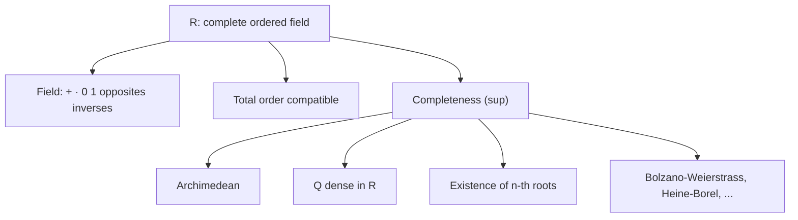

# Real numbers: the axioms

## Why this matters

Two ways to work with $\mathbb{R}$:

1. **Construct it** from $\mathbb{Q}$ — Dedekind's method (cuts) and Cauchy's (Cauchy sequences). We'll do this in section 08. Rigorous but laborious.
2. **Postulate its properties** — say "there exists a complete ordered field, call it $\mathbb{R}$" and deduce everything from there. Quicker and more operational. That's what we do here.

For 99% of analysis, the postulated approach is all you need.

## The idea: $\mathbb{R}$ is characterized by **three families of rules**

$\mathbb{R}$ is a set with:
- two operations: addition $+$ and multiplication $\cdot$;
- an order relation $\le$.

and these must satisfy **14 axioms**, grouped into three families:
- **A. Field axioms** (the usual properties of $+$ and $\cdot$).
- **B. Order axioms** (the order $\le$ is "compatible" with operations).
- **C. Completeness axiom** — *the* property that $\mathbb{Q}$ didn't have.

### A. Field axioms

$(\mathbb{R}, +, \cdot)$ is a **field**:

1. **Associativity of sum**: $\forall a, b, c \in \mathbb{R},\ (a + b) + c = a + (b + c)$.
2. **Commutativity of sum**: $\forall a, b,\ a + b = b + a$.
3. **Existence of zero**: $\exists 0 \in \mathbb{R}$ such that $\forall a,\ a + 0 = a$.
4. **Existence of opposite**: $\forall a,\ \exists (-a)$ with $a + (-a) = 0$.
5. **Associativity and commutativity of product**: $(ab)c = a(bc)$, $ab = ba$.
6. **Existence of one**: $\exists 1 \ne 0$ such that $\forall a,\ a \cdot 1 = a$.
7. **Existence of inverse** (for nonzero): $\forall a \ne 0,\ \exists a^{-1}$ with $a \cdot a^{-1} = 1$.
8. **Distributivity**: $a(b + c) = ab + ac$.

> **Glossary:**
>
> - $\forall$ = "for every" (sec. 01).
> - $\exists$ = "there exists at least one".
> - **Field** = algebraic structure allowing the 4 operations (plus, minus, times, divided, no division by zero).

### B. Order axioms

$\le$ is a **total order compatible** with operations:

9. **Reflexive**: $a \le a$.
10. **Antisymmetric**: $a \le b$ and $b \le a$ imply $a = b$.
11. **Transitive**: $a \le b$ and $b \le c$ imply $a \le c$.
12. **Totality**: $\forall a, b$, $a \le b$ or $b \le a$ (every pair comparable).
13. **Compatibility with $+$**: $a \le b \Rightarrow a + c \le b + c$.
14. **Compatibility with $\cdot$**: $0 \le a$ and $0 \le b$ imply $0 \le ab$.

> **Translation.** 9–12 are the usual less-than-or-equal rules (reflexive, transitive, etc.). 13 and 14 say operations "respect" order: adding the same thing on both sides doesn't flip; products of non-negatives are non-negative.

At this point $\mathbb{R}$ is an **ordered field**. So is $\mathbb{Q}$. To distinguish them you need the last axiom.

### C. Completeness axiom (the "real" axiom of $\mathbb{R}$)

15. **Every nonempty upper-bounded subset $A \subseteq \mathbb{R}$ has a supremum in $\mathbb{R}$.**

> **Glossary** (formalized in sec. 07, here used intuitively):
>
> - **Upper-bounded** = "there's a cap": $\exists M \in \mathbb{R}$ such that $\forall x \in A,\ x \le M$. $M$ is an **upper bound**.
> - **Supremum** ($\sup A$) = "the smallest upper bound" — the tightest cap above $A$.

In symbols: if $A$ is nonempty and has at least one upper bound, then *the minimum* among the upper bounds exists in $\mathbb{R}$.

> **Comparison.** $\mathbb{Q}$ does NOT satisfy this axiom: $\{q \in \mathbb{Q} : q^2 < 2\}$ has no sup in $\mathbb{Q}$ (it "wants" to be $\sqrt 2 \notin \mathbb{Q}$). See sec. 04. Completeness says: in $\mathbb{R}$ the sup *always* exists.

### Uniqueness of $\mathbb{R}$

**Theorem.** There exists **a unique** (up to isomorphism) complete ordered field. We call it $\mathbb{R}$.

> **Glossary.** "Up to isomorphism" = "if there are two, there's a bijection between them preserving $+$, $\cdot$, $\le$" — i.e. indistinguishable as mathematical structures.

From here on we talk about **the** real numbers, not *a* complete ordered field.

## Immediate consequences of the field axioms

All familiar (you use them in middle school), but we list them to certify the system works.

**1. $-(-a) = a$.** ("The opposite of the opposite is the original.")
*Proof.* $a + (-a) = 0$. But also $-(-a) + (-a) = 0$ (by definition of opposite of $-a$). By uniqueness of the opposite of $-a$, $-(-a) = a$. ∎

**2. $a \cdot 0 = 0$ for every $a$.**
*Proof.* $a \cdot 0 = a \cdot (0 + 0) = a \cdot 0 + a \cdot 0$ (distributive). Subtracting $a \cdot 0$ from both sides: $0 = a \cdot 0$. ∎

**3. $(-1) \cdot a = -a$.**
*Proof.* $a + (-1) \cdot a = 1 \cdot a + (-1) \cdot a = (1 + (-1)) \cdot a = 0 \cdot a = 0$. So $(-1) \cdot a$ is the opposite of $a$. ∎

**4. Zero-product law:** $ab = 0 \Rightarrow a = 0$ or $b = 0$.
*Proof.* Suppose $a \ne 0$. Then $a^{-1}$ exists. Multiplying $ab = 0$ on the left by $a^{-1}$: $b = a^{-1}(ab) = a^{-1} \cdot 0 = 0$. ∎

## Consequences of the order axioms

**5. $a \le b \iff b - a \ge 0$.**

**6. $a \le 0 \Rightarrow -a \ge 0$.**

**7. $a > 0, b > 0 \Rightarrow ab > 0$.** (Strict.)

**8. Sign rule**: $a < 0, b < 0 \Rightarrow ab > 0$.
*Proof.* $-a > 0$ and $-b > 0$, so $(-a)(-b) > 0$. But $(-a)(-b) = ab$ (check: $-a \cdot -b = (-1)a \cdot (-1)b = (-1)^2 ab = ab$). ∎

**9. For every $a \ne 0$, $a^2 > 0$.** In particular $1 = 1^2 > 0$.
*Proof.* If $a > 0$: $a^2 = a \cdot a > 0$ (rule 7). If $a < 0$: $a^2 = (-a)(-a) > 0$ (rule 8). ∎

> **Notable consequence.** $\mathbb{C}$ (complex numbers) cannot be made an ordered field: in $\mathbb{C}$ the imaginary unit $i$ would have $i^2 = -1 < 0$, contradicting "every square is $> 0$".

## Strong consequences of completeness

These are the results $\mathbb{Q}$ doesn't have, which make analysis work.

### Archimedean property: "no number is infinitely big"

**Theorem (Archimedean property).** For every $a, b \in \mathbb{R}$ with $a > 0$, there is $n \in \mathbb{N}$ with $n a > b$.

> **Translation.** Adding $a$ to itself enough times, you exceed any $b$, however big. There are no "infinitely big" or "infinitely small" numbers in $\mathbb{R}$.

*Proof.* By contradiction, suppose there's a pair $a > 0$, $b$ with $na \le b$ for every $n \in \mathbb{N}$. Then $A = \{na : n \in \mathbb{N}\}$ is nonempty and upper-bounded by $b$. By completeness, $s = \sup A$ exists.

Then $s - a < s$, so $s - a$ isn't an upper bound. So there's $n_0 \in \mathbb{N}$ with $n_0 a > s - a$, i.e. $(n_0 + 1) a > s$. But $(n_0 + 1) a \in A$, and $s$ was an upper bound of $A$. Contradiction. ∎

**Corollary.** For every $\varepsilon > 0$ there's $n \in \mathbb{N}$ with $1/n < \varepsilon$.

*Proof.* Apply Archimedes with $a = \varepsilon$ and $b = 1$: there's $n$ with $n \varepsilon > 1$, i.e. $1/n < \varepsilon$. ∎

> **Pill.** The Archimedean property seems obvious but is non-trivial: **non-Archimedean ordered fields exist** (Robinson's nonstandard analysis, 1960s). In those, "infinitesimals" $\omega > 0$ satisfy $\omega < 1/n$ for every $n$. Not so in $\mathbb{R}$.

### Floor function

**Theorem.** For every $x \in \mathbb{R}$, there is a unique $n \in \mathbb{Z}$ with $n \le x < n + 1$. Write $n = \lfloor x \rfloor$ ("**floor of $x$**" or "**integer part**").

> **Examples.** $\lfloor 3.7 \rfloor = 3$, $\lfloor 5 \rfloor = 5$, $\lfloor -2.3 \rfloor = -3$ (not $-2$!).

*Proof.* By Archimedes, $\{k \in \mathbb{Z} : k \le x\}$ is nonempty (there's $N$ with $-N \le x$) and upper-bounded (there's $M$ with $M > x$, every $k$ in the set is $\le M$). Upper-bounded subsets of $\mathbb{Z}$ have a maximum (exercise). Let $n$ be that max: $n \le x$ and $n + 1 > x$. Unique by construction. ∎

### Density of $\mathbb{Q}$ in $\mathbb{R}$

**Theorem.** Between two distinct reals there is a rational.

In symbols: $\forall a < b \in \mathbb{R},\ \exists q \in \mathbb{Q} : a < q < b$.

> **Translation.** However close two reals $a < b$ are, there's always a rational in between. Rationals are "everywhere" in $\mathbb{R}$, even though only countably many.

*Proof.* Let $a < b$. By Archimedes there's $q \in \mathbb{N}$ with $q > 1/(b - a)$, i.e. $1/q < b - a$. Let $p = \lfloor q a \rfloor + 1$. Then:
- $p > q a$ (by definition of floor), so $p/q > a$.
- $p \le q a + 1$, so $p/q \le a + 1/q < a + (b - a) = b$.

Together, $a < p/q < b$. And $p/q \in \mathbb{Q}$. ∎

### Density of irrationals

**Theorem.** Between two distinct reals there is an irrational.

*Proof.* Let $a < b$. By the previous theorem, there's $q \in \mathbb{Q}$ with $a - \sqrt 2 < q < b - \sqrt 2$. Adding $\sqrt 2$: $a < q + \sqrt 2 < b$. And $q + \sqrt 2 \notin \mathbb{Q}$ (else $\sqrt 2 = (q + \sqrt 2) - q$ would be rational, false). ∎

> **Meaning.** Both rationals and irrationals are **dense** in $\mathbb{R}$. But rationals are countable, irrationals are not ($\mathfrak{c}$). Between two reals there are few rationals (countable) and many irrationals (continuum-many) — see sec. 05.

### Existence of $\sqrt 2$

Now completeness lets us say $\sqrt 2$ *exists in $\mathbb{R}$*, while in $\mathbb{Q}$ it doesn't.

**Theorem.** There exists $r \in \mathbb{R}$, $r > 0$, with $r^2 = 2$.

*Proof.* Let $A = \{q \in \mathbb{R} : q > 0,\ q^2 < 2\}$. Nonempty ($1 \in A$) and upper-bounded (e.g. by 2, since $q > 2 \Rightarrow q^2 > 4 > 2$).

By **completeness**, $r := \sup A$ exists. Claim $r^2 = 2$. Three cases:

- **$r^2 < 2$.** Find $\varepsilon > 0$ small with $r + \varepsilon \in A$, contradicting "$r$ is upper bound". Compute: $(r + \varepsilon)^2 = r^2 + 2 r \varepsilon + \varepsilon^2$. Want $< 2$, i.e. $2 r \varepsilon + \varepsilon^2 < 2 - r^2$. For $\varepsilon \in (0, 1)$, $\varepsilon^2 < \varepsilon$, so $2 r \varepsilon + \varepsilon^2 < (2 r + 1) \varepsilon$. Take $\varepsilon < (2 - r^2)/(2 r + 1)$. Such $\varepsilon$ exists. Contradiction.
- **$r^2 > 2$.** Find $\varepsilon > 0$ with $r - \varepsilon$ still an upper bound. Want $(r - \varepsilon)^2 > 2$, i.e. $r^2 - 2 r \varepsilon + \varepsilon^2 > 2$. Enough $r^2 - 2 r \varepsilon > 2$, i.e. $\varepsilon < (r^2 - 2)/(2 r)$. Such $\varepsilon$ exists, and $r - \varepsilon$ is smaller upper bound. Contradiction.
- **$r^2 = 2$.** ✓

So $r^2 = 2$. ∎

**Generalization.** For every $x > 0$ and $n \in \mathbb{N}, n \ge 1$, there's a unique $r > 0$ with $r^n = x$. Written $r = \sqrt[n]{x}$ or $r = x^{1/n}$.

## The real line

<svg viewBox="0 0 600 200" xmlns="http://www.w3.org/2000/svg">
  <rect x="0" y="0" width="600" height="200" fill="#111a30"/>

  <line x1="30" y1="100" x2="570" y2="100" stroke="#f3eed9" stroke-width="2"/>
  <polygon points="570,100 560,95 560,105" fill="#f3eed9"/>
  <polygon points="30,100 40,95 40,105" fill="#f3eed9"/>

  <g stroke="#f3eed9" stroke-width="1">
    <line x1="100" y1="95" x2="100" y2="105"/>
    <line x1="200" y1="95" x2="200" y2="105"/>
    <line x1="300" y1="95" x2="300" y2="105"/>
    <line x1="400" y1="95" x2="400" y2="105"/>
    <line x1="500" y1="95" x2="500" y2="105"/>
  </g>
  <g fill="#f3eed9" font-family="serif" font-size="13" text-anchor="middle">
    <text x="100" y="125">−2</text>
    <text x="200" y="125">−1</text>
    <text x="300" y="125">0</text>
    <text x="400" y="125">1</text>
    <text x="500" y="125">2</text>
  </g>

  <circle cx="441" cy="100" r="3" fill="#d4af37"/>
  <text x="441" y="75" fill="#d4af37" font-family="serif" font-size="13" text-anchor="middle">√2</text>

  <circle cx="471" cy="100" r="3" fill="#6fb38a"/>
  <text x="471" y="60" fill="#6fb38a" font-family="serif" font-size="13" text-anchor="middle">e</text>

  <circle cx="514" cy="100" r="3" fill="#6aa9d8"/>
  <text x="514" y="75" fill="#6aa9d8" font-family="serif" font-size="13" text-anchor="middle">π</text>

  <text x="300" y="170" fill="#f3eed9" font-family="serif" font-size="13" text-anchor="middle">R: complete ordered field, "no holes"</text>
</svg>

$\mathbb{R}$ fills all the holes $\mathbb{Q}$ leaves: $\sqrt 2, e, \pi, \dots$ find a home.

## Absolute value

**Definition.** For $x \in \mathbb{R}$,
$$|x| := \max\{x, -x\} = \begin{cases} x & \text{if } x \ge 0 \\ -x & \text{if } x < 0 \end{cases}.$$

> **Glossary.** **Absolute value** $|x|$ is "distance of $x$ from zero": drops the sign. $|3| = 3$, $|-5| = 5$, $|0| = 0$.

Properties:

- $|x| \ge 0$, and $|x| = 0 \iff x = 0$.
- $|x y| = |x| \cdot |y|$ (multiplicative).
- **Triangle inequality**: $|x + y| \le |x| + |y|$.
- **Reverse triangle inequality**: $\big||x| - |y|\big| \le |x - y|$.

> **Triangle inequality** is the single most-used tool in analysis. Geometrically: to go from $0$ to $x + y$, taking $x$ first then $y$ (distance $|x| + |y|$) is never shorter than going directly (distance $|x + y|$).

*Proof of triangle inequality.* $-|x| \le x \le |x|$ and $-|y| \le y \le |y|$. Add: $-(|x| + |y|) \le x + y \le |x| + |y|$. So $|x + y| \le |x| + |y|$. ∎

## Summary: $\mathbb{R}$ in a nutshell

## Guided examples

**1.** Show $\sup\{1 - 1/n : n \in \mathbb{N}, n \ge 1\} = 1$ but $1$ is not a maximum.

*Solution.* Let $A = \{1 - 1/n : n \ge 1\}$. For every $n$, $1 - 1/n < 1$, so $1$ is upper bound. For every $\varepsilon > 0$, take $n > 1/\varepsilon$ (exists by Archimedes). Then $1 - 1/n > 1 - \varepsilon$, so $1 - \varepsilon$ isn't an upper bound. Hence $\sup = 1$. But $1 \notin A$ (would need $1/n = 0$, impossible for finite $n$), so no max.

**2.** Compute $\sup\{x \in \mathbb{R} : x^2 < 2\}$.

*Solution.* It's $\sqrt 2$, by the theorem above.

**3.** Show $\inf\{1/n : n \ge 1\} = 0$.

*Solution.* $1/n > 0$ for every $n$, so $0$ is lower bound. For every $\varepsilon > 0$, by Archimedes $\exists n$ with $1/n < \varepsilon$, so $\varepsilon$ isn't a lower bound. The greatest lower bound is $0$. ∎

## Exercises

Exercise 1 — Uniqueness of sup

Show that if $A \subseteq \mathbb{R}$ has a supremum, it is unique.

**Solution.** Let $s_1, s_2$ both be $\sup A$ (i.e. least upper bounds). Then $s_1$ is upper bound, $s_2$ is the least, so $s_2 \le s_1$. Symmetrically $s_1 \le s_2$. By antisymmetry, $s_1 = s_2$. ∎

Exercise 2 — Reverse triangle inequality

Prove: $\big||x| - |y|\big| \le |x - y|$ for every $x, y \in \mathbb{R}$.

**Solution.** $|x| = |(x - y) + y| \le |x - y| + |y|$ (triangle), so $|x| - |y| \le |x - y|$. Swap $x, y$: $|y| - |x| \le |y - x| = |x - y|$. So $-(|x - y|) \le |x| - |y| \le |x - y|$, hence $\big||x| - |y|\big| \le |x - y|$. ∎

Exercise 3 — $\sqrt[3]{2}$ irrational

Prove $\sqrt[3]{2}$ is irrational.

**Solution.** By contradiction, $\sqrt[3]{2} = p/q$ with $\gcd(p, q) = 1$. Then $p^3 = 2 q^3$, so $2 \mid p^3$, so $2 \mid p$ (since 2 prime). Write $p = 2m$. Substituting: $8 m^3 = 2 q^3 \Rightarrow q^3 = 4 m^3$, so $2 \mid q^3$, so $2 \mid q$. Then $2 \mid \gcd(p, q) = 1$, absurd. ∎

Exercise 4 — Rationals and irrationals in $(\sqrt 2, \sqrt 3)$

Explicitly find a rational and an irrational in $(\sqrt 2,\ \sqrt 3)$.

**Solution.** $\sqrt 2 \approx 1.4142$ and $\sqrt 3 \approx 1.7321$.

*Rational*: $3/2 = 1.5 \in (\sqrt 2, \sqrt 3)$. ✓

*Irrational*: $\sqrt 2 + 1/10 \approx 1.5142$. In $(\sqrt 2, \sqrt 3)$ (since $\sqrt 2 < \sqrt 2 + 0.1 < \sqrt 2 + 0.32 \approx \sqrt 3$). And irrational: if it were rational, $\sqrt 2 = (\sqrt 2 + 1/10) - 1/10$ would be difference of two rationals, hence rational — contradiction.

Exercise 5 — Archimedean property is essential

Non-Archimedean ordered fields exist. Give an example.

**Solution (idea).** Consider $\mathbb{R}(t)$, the field of **rational functions in $t$** (ratios of polynomials with real coefficients). Define order: $f > 0$ if the **leading coefficient** (highest-degree term) is positive.

Then $t > n$ for every $n \in \mathbb{N}$: $t - n$ is a degree-1 polynomial with leading coefficient 1 positive, so $t - n > 0$.

Equivalently, $1/t$ is "infinitesimal": $0 < 1/t < 1/n$ for every $n$. I.e. $1/t$ is positive but smaller than every positive rational.

$\mathbb{R}(t)$ is NOT Archimedean (hence not isomorphic to $\mathbb{R}$). Only **complete** ordered fields are Archimedean.

## Common pitfalls

- **Confusing "bounded" with "has max/min"**. A set can be bounded without having max or min. Example: $(0, 1)$ is bounded (sup = 1, inf = 0) but neither 0 nor 1 are inside.
- **Thinking completeness follows from the other axioms**. **No**: $\mathbb{Q}$ satisfies all but completeness. Completeness is **independent**.
- **Confusing decimal-representation uniqueness with $\mathbb{R}$-uniqueness**. $\mathbb{R}$ is unique "up to isomorphism": *any* complete ordered field is isomorphic to $\mathbb{R}$.
- **Thinking $\sup A \in A$ always**. **No**: $\sup(0, 1) = 1 \notin (0, 1)$. The sup is the *smallest upper bound*, and bounds can be outside $A$.

> **Operating pill.** When a theorem invokes "completeness", always ask yourself: *which equivalent form am I using*? Sup, nested intervals, Cauchy, Dedekind, Bolzano-Weierstrass, Heine-Borel — all equivalent in an ordered field. Knowing which is most useful in context is half the work.

## One-line takeaway

$\mathbb{R}$ is the **complete ordered field** — unique up to isomorphism — and its crucial property over $\mathbb{Q}$ is **completeness**: every nonempty upper-bounded subset has a supremum in $\mathbb{R}$.
