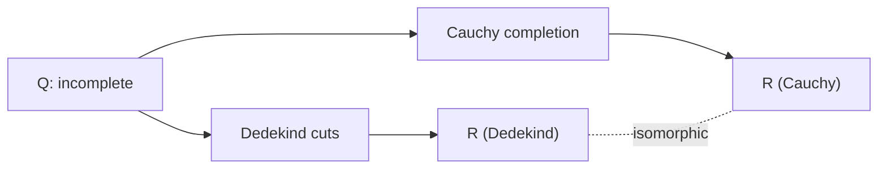
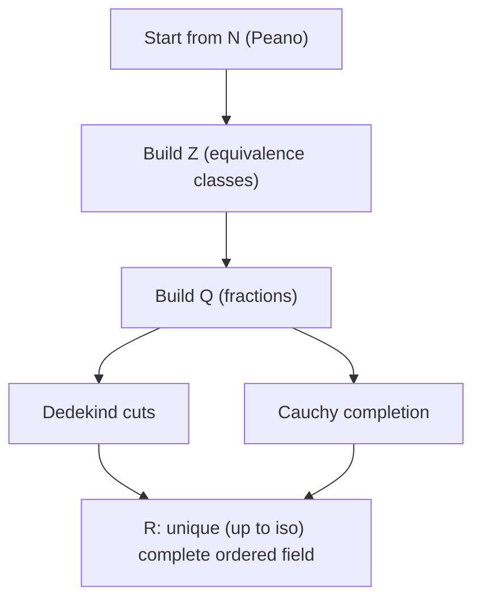

# Construction of $\mathbb{R}$: Dedekind and Cauchy

## Why this matters

In sections 06–07 we **postulated** the existence of a complete ordered field (called $\mathbb{R}$) and studied its properties. Now we take the missing step: **actually construct it** from $\mathbb{Q}$, proving $\mathbb{R}$ exists and isn't just a consoling abstraction.

Two classical routes:
1. **Dedekind (1872)** — a real number is a "cut" of the rational line.
2. **Cauchy (formalized by Méray, Cantor, ~1870)** — a real number is a "class of rational sequences that cluster".

Both lead to the same $\mathbb{R}$ (up to isomorphism, sec. 06). Cauchy's completion is also a **general technique**, which you'll reapply for plugging holes in other spaces ($L^p$ in functional analysis, $\mathbb{Q}_p$ in number theory).

## The general idea

$\mathbb{Q}$ has **holes** (ch. 04): e.g. $\sqrt 2$ "should" sit among the rationals but isn't there. We want to build $\mathbb{R}$ by filling the holes. Two ways:

1. **Dedekind**: every real $r$ cuts $\mathbb{Q}$ into two sets — rationals $< r$ and rationals $\ge r$. We can *identify* $r$ with its left half of the cut. Same for $\sqrt 2$: define $\sqrt 2$ as the set $\{q \in \mathbb{Q} : q^2 < 2\ \lor\ q \le 0\}$.

2. **Cauchy**: the sequence $1, 1.4, 1.41, 1.414, \dots$ "wants to converge to $\sqrt 2$" but the limit isn't in $\mathbb{Q}$. Identify $\sqrt 2$ with the sequence itself, modulo equivalence with other sequences having the same "ideal limit".

## Construction 1: Dedekind cuts

### Definition of a cut

**Definition.** A **Dedekind cut** is a subset $\alpha \subseteq \mathbb{Q}$ satisfying:

- **(D1)** $\alpha \ne \emptyset$ and $\alpha \ne \mathbb{Q}$ (it's "something, but not everything").
- **(D2)** If $p \in \alpha$ and $q < p$ (in $\mathbb{Q}$), then $q \in \alpha$. (Closed "downward".)
- **(D3)** $\alpha$ has **no maximum**.

The set of all cuts is $\mathbb{R}_D$ ("R Dedekind").

> **Glossary:**
>
> - $\alpha$ ("alpha") = a subset of $\mathbb{Q}$ — the "left half" of the cut.
> - "Closed downward" = if you take an element, every smaller rational is also inside.
> - "No max" = no element greater than all others within the cut (but can have an external sup).

### Examples

**1.** For $r \in \mathbb{Q}$, define
$$\alpha_r := \{q \in \mathbb{Q} : q < r\}.$$
It's a cut. (D1)✓ (D2)✓ (D3): if $q < r$, by density of $\mathbb{Q}$ there's $q'$ with $q < q' < r$, so $q' \in \alpha_r$ and $q' > q$, hence $q$ isn't max.

**So every rational is "represented" by a cut**.

**2.** The cut corresponding to $\sqrt 2$:
$$\alpha_{\sqrt 2} := \{q \in \mathbb{Q} : q \le 0\} \cup \{q \in \mathbb{Q}^+ : q^2 < 2\}.$$

It's a cut (verify D1, D2, D3). **It's not of type $\alpha_r$ with $r \in \mathbb{Q}$**, because no rational has square 2. This is the "hole" — and Dedekind says: the hole *is* the number $\sqrt 2$.

### Order

**Definition.** $\alpha \le \beta \iff \alpha \subseteq \beta$ (set inclusion).

Verify total order (nontrivial but direct exercise).

### Sum

**Definition.** $\alpha + \beta := \{p + q : p \in \alpha,\ q \in \beta\}$.

Verify it's still a cut. Zero is $\alpha_0 = \{q \in \mathbb{Q} : q < 0\}$. The opposite $-\alpha$ needs a small technical tweak (to ensure (D3)): $-\alpha = \{-p : p \in \mathbb{Q} \setminus \alpha,\ p \text{ not min of } \mathbb{Q} \setminus \alpha\}$.

### Product

More technical, defined case-by-case by sign. **Case $\alpha, \beta \ge \alpha_0$**:
$$\alpha \cdot \beta := \alpha_0 \cup \{p q : p \in \alpha, q \in \beta, p \ge 0, q \ge 0\}.$$
Multiplicative identity: $\alpha_1 = \{q < 1\}$.

### Key point: completeness is automatic

**Theorem (completeness of $\mathbb{R}_D$).** Every nonempty upper-bounded family of cuts has a supremum.

*Proof (surprisingly simple).* Let $\mathcal F$ be a family of cuts with upper bound $\gamma$ (i.e. $\alpha \subseteq \gamma$ for every $\alpha \in \mathcal F$). Define
$$\sigma := \bigcup_{\alpha \in \mathcal F} \alpha.$$

Claim: $\sigma$ is a cut, and is the sup of $\mathcal F$.

- **(D1)** $\sigma$ nonempty (inherits from any $\alpha \in \mathcal F$); $\sigma \subseteq \gamma \ne \mathbb{Q}$, so $\sigma \ne \mathbb{Q}$.
- **(D2)** If $p \in \sigma$, then $p \in \alpha$ for some $\alpha$; every $q < p$ is in $\alpha \subseteq \sigma$.
- **(D3)** If $p \in \sigma$, it's in some $\alpha$ that has no max; so there's $q \in \alpha$ with $q > p$, and $q \in \sigma$.

*Upper bound*: $\alpha \subseteq \sigma$ for every $\alpha \in \mathcal F$ (trivial).
*Least upper bound*: if $\tau$ is an upper bound, $\alpha \subseteq \tau$ for every $\alpha$, so $\sigma = \bigcup \alpha \subseteq \tau$. ∎

> **Elegance.** The sup of a family of cuts is **simply the union**. Nothing more. Completeness is built into the set-theoretic structure. Beautiful.

<svg viewBox="0 0 600 300" xmlns="http://www.w3.org/2000/svg">
  <rect x="0" y="0" width="600" height="300" fill="#111a30"/>
  <line x1="30" y1="180" x2="570" y2="180" stroke="#f3eed9" stroke-width="2"/>
  <text x="300" y="210" fill="#f3eed9" font-family="serif" font-size="13" text-anchor="middle">Q</text>
  <rect x="30" y="170" width="270" height="20" fill="#d4af37" fill-opacity="0.4"/>
  <text x="160" y="155" fill="#d4af37" font-family="serif" font-size="14">α (cut)</text>
  <rect x="300" y="170" width="270" height="20" fill="#6aa9d8" fill-opacity="0.3"/>
  <text x="430" y="155" fill="#6aa9d8" font-family="serif" font-size="14">Q ∖ α</text>
  <line x1="300" y1="100" x2="300" y2="220" stroke="#e07a8d" stroke-width="2" stroke-dasharray="4 4"/>
  <text x="300" y="90" fill="#e07a8d" font-family="serif" font-size="14" text-anchor="middle">cut = √2 (irrational!)</text>
  <text x="300" y="260" fill="#f3eed9" font-family="serif" font-size="13" text-anchor="middle">A Dedekind cut is the left half of a cut</text>
</svg>

Dedekind cut: the left half of a cut of $\mathbb{Q}$. The "cut point" may not exist in $\mathbb{Q}$ (like $\sqrt 2$), and this same cut *is* the new real number.

### Embedding $\mathbb{Q}$ into $\mathbb{R}_D$

$r \mapsto \alpha_r$ is injective and preserves order, sum, product. So $\mathbb{Q}$ identifies with a subset of $\mathbb{R}_D$, and "old" $\mathbb{Q}$ lives inside "new" $\mathbb{R}_D$.

## Construction 2: Cauchy completion

### The idea

$\sqrt 2$ isn't in $\mathbb{Q}$, but the rational sequence
$$1,\ 1.4,\ 1.41,\ 1.414,\ 1.4142,\ \dots$$
*wants* to converge to $\sqrt 2$. Its terms "cluster" but have no limit in $\mathbb{Q}$.

Cauchy's idea: **identify reals with such sequences**, modulo equivalence saying "two sequences represent the same real if their terms converge to the same ideal limit".

### Cauchy sequences in $\mathbb{Q}$

**Definition.** A sequence $(a_n) \subseteq \mathbb{Q}$ is **Cauchy** if its terms cluster arbitrarily close:
$$\forall \varepsilon \in \mathbb{Q}^+,\ \exists N \in \mathbb{N} : \forall n, m \ge N,\ |a_n - a_m| < \varepsilon.$$

> **Glossary for the formula:**
>
> - $\varepsilon$ = a small positive distance (rational, staying in $\mathbb{Q}$).
> - $\forall \varepsilon \in \mathbb{Q}^+$ = "for every positive rational closeness threshold".
> - $\exists N$ = "there's an index $N$" (the "time threshold" after which it holds).
> - $\forall n, m \ge N$ = "for every pair of indices past $N$".
> - $|a_n - a_m| < \varepsilon$ = "$a_n$ and $a_m$ are within $\varepsilon$".
>
> **Translation:** however small you set $\varepsilon$, **from some point $N$ on** all terms are within $\varepsilon$ of each other. The sequence "clusters".

Example: $1, 1.4, 1.41, 1.414, \dots$ is Cauchy in $\mathbb{Q}$ (verify: $|a_n - a_m| \le 10^{-\min(n,m)}$, tending to zero).

### Equivalence

**Definition.** $(a_n) \sim (b_n)$ if the difference tends to zero:
$$\forall \varepsilon > 0,\ \exists N : \forall n \ge N,\ |a_n - b_n| < \varepsilon.$$

> **Translation:** two Cauchy sequences represent the same "ideal limit" if their difference vanishes.

Verify it's an equivalence relation: reflexive and symmetric obvious; transitive via triangle inequality $|a_n - c_n| \le |a_n - b_n| + |b_n - c_n|$.

### Definition of $\mathbb{R}_C$

$$\mathbb{R}_C := \frac{\{\text{Cauchy sequences in } \mathbb{Q}\}}{\sim}.$$

I.e. "Cauchy reals" are **equivalence classes of rational Cauchy sequences**. The class $[(a_n)]$ represents "the ideal limit" of the sequence.

### Operations

- **Sum**: $[(a_n)] + [(b_n)] := [(a_n + b_n)]$.
- **Product**: $[(a_n)] \cdot [(b_n)] := [(a_n b_n)]$.

Well-defined: sum and product of Cauchy sequences are Cauchy (some technical work), and equivalence is preserved.

### Order

$[(a_n)] < [(b_n)]$ if there's $\varepsilon \in \mathbb{Q}^+$ and $N \in \mathbb{N}$ with $b_n - a_n \ge \varepsilon$ for $n \ge N$.

> **In words:** "$(b_n)$ is eventually at least $\varepsilon$ above $(a_n)$". Technical, but the right definition to be representative-independent.

### Completeness

**Theorem.** $\mathbb{R}_C$ is complete: every Cauchy sequence *in $\mathbb{R}_C$* converges *in $\mathbb{R}_C$*.

*Idea.* Given a Cauchy sequence $(\xi_n)$ of reals (classes of rational Cauchys), pick a "close" rational representative for each: $r_n \in \mathbb{Q}$ with $|\xi_n - r_n| < 1/n$. Verify $(r_n)$ is a rational Cauchy sequence. Let $\xi = [(r_n)]$. Then $\xi_n \to \xi$. ∎

> **Generalization.** This scheme (take Cauchy sequences in a metric space $X$, identify them modulo equivalence, get a new complete space $\hat X$ containing $X$ densely) is called **metric completion** and applies to *any* metric space. You'll use it in functional analysis.

## Equivalence of the two constructions

**Theorem.** $\mathbb{R}_D$ and $\mathbb{R}_C$ are both complete ordered fields. By the uniqueness theorem (sec. 06), they're **isomorphic**.

**Explicit isomorphism (idea).** A cut $\alpha$ corresponds to the class of the sequence $(a_n)$, where $a_n$ = "the largest rational with denominator $n$ inside $\alpha$".

Conversely: a Cauchy sequence $(a_n)$ corresponds to the cut $\{q \in \mathbb{Q} : q < a_n \text{ eventually}\}$.

## The final result

$\mathbb{R}$ **exists**, is **unique**, is **complete**, and all properties postulated in section 06 are in fact **provable**. Now we know the mathematics of upcoming chapters rests on solid foundations.

## Why two constructions?

**Dedekind**: more direct, completeness built in (just take unions). But limited: doesn't generalize much beyond $\mathbb{R}$.

**Cauchy**: more general technique. Applies to:
- $p$-adic numbers $\mathbb{Q}_p$ (with another metric on $\mathbb{Q}$, you get *another* complete field);
- completion of normed vector spaces;
- functional analysis ($L^p$ spaces as completions of step functions).

In modern analysis, Cauchy's technique is almost always used.

## Numerical examples

**1.** $\sqrt 2$ Dedekind: $\alpha = \{q \in \mathbb{Q} : q \le 0\} \cup \{q > 0 : q^2 < 2\}$.

**2.** $\sqrt 2$ Cauchy (Heron's method): $a_0 = 1$, $a_{n+1} = \dfrac{a_n + 2/a_n}{2}$. Rational Cauchy sequence whose class is $\sqrt 2$.

**3.** $e$ Cauchy: $a_n = \sum_{k=0}^n \frac{1}{k!}$. Rational Cauchy sequence, class = $e$.

**4.** $\pi$ Cauchy: various methods (Leibniz–Madhava $4(1 - \frac 1 3 + \frac 1 5 - \frac 1 7 + \dots)$, Machin's formula, etc.).

## $p$-adic numbers (brief)

On $\mathbb{Q}$, metrics other than $|\cdot|$ exist. Fixed a prime $p$:
$$|x|_p := p^{-v_p(x)}$$
where $v_p(x)$ is the exponent of $p$ in the factorization of $x$.

> **Example.** $v_2(12) = 2$ (since $12 = 4 \cdot 3 = 2^2 \cdot 3$). So $|12|_2 = 2^{-2} = 1/4$.

With the $p$-adic metric, "$x$ is small" means "$x$ is divisible by many powers of $p$". Strange, but a real metric.

**Cauchy completion** of $\mathbb{Q}$ w.r.t. $|\cdot|_p$ gives a field $\mathbb{Q}_p$ — the $p$-adic numbers. Complete, cardinality $\mathfrak{c}$, but **different** from $\mathbb{R}$ (not even orderable).

**Ostrowski's theorem.** On $\mathbb{Q}$ there exist *only*: the trivial metric, $|\cdot|$ (giving $\mathbb{R}$), and $|\cdot|_p$ for $p$ prime (giving $\mathbb{Q}_p$). Nothing else.

## Exercises

Exercise 1 — Why (D3)?

Explain why we require "$\alpha$ has no maximum" in the definition of a cut.

**Solution.** Without (D3), $\alpha_r$ for rational $r$ would have **two** representations as a cut: $\{q < r\}$ and $\{q \le r\}$. Different sets but representing the same real $r$, complicating the correspondence. (D3) picks a canonical choice, ensuring each real has a **unique** cut.

Exercise 2 — Cauchy in $\mathbb{Q}$ that doesn't converge in $\mathbb{Q}$

Give an explicit example.

**Solution.** $a_n$ = decimal approximation of $\sqrt 2$ to $n$ digits: $1, 1.4, 1.41, 1.414, 1.4142, \dots$

Rational Cauchy: $|a_n - a_m| \le 10^{-\min(n, m)} \to 0$.

Doesn't converge in $\mathbb{Q}$: if it converged to $r \in \mathbb{Q}$, then $a_n^2 \to r^2$ but also $a_n^2 \to 2$, so $r^2 = 2$ with $r \in \mathbb{Q}$ — impossible (sec. 04).

Exercise 3 — Cut representing $-\sqrt 2$

Write the Dedekind cut corresponding to $-\sqrt 2$.

**Solution.** $\alpha_{-\sqrt 2} = \{q \in \mathbb{Q} : q < -\sqrt 2\} = \{q \in \mathbb{Q} : q < 0\ \text{and}\ q^2 > 2\}$.

In words: all strictly negative rationals with square $> 2$. Verify (D1)–(D3).

Exercise 4 — Sum of cuts

Compute $\alpha_{1/2} + \alpha_{1/3}$ and verify it equals $\alpha_{5/6}$.

**Solution.** By definition, $\alpha_{1/2} + \alpha_{1/3} = \{p + q : p < 1/2,\ q < 1/3\}$.

- **$\subseteq$**: if $p < 1/2$ and $q < 1/3$, then $p + q < 5/6$.
- **$\supseteq$**: given $s < 5/6$, let $\delta = (5/6 - s)/2 > 0$. Take $p = 1/2 - \delta$ and $q = s - p$. Then $p < 1/2$, and $q = s - 1/2 + \delta < (s + 5/6)/2 - 1/2 = (s - 1/6)/2$. For $s < 5/6$, $q < 1/3$. ✓

So $s = p + q$ with $p \in \alpha_{1/2}$ and $q \in \alpha_{1/3}$.

Exercise 5 — Completion of a general metric space

Generalize Cauchy's construction: given a metric space $(X, d)$, formally define the completion $\hat X$.

**Solution (schema).**

- Let $\mathcal C$ be the set of all Cauchy sequences in $(X, d)$.
- Relation: $(x_n) \sim (y_n) \iff d(x_n, y_n) \to 0$.
- $\hat X := \mathcal C / \sim$.
- Metric: $\hat d([(x_n)], [(y_n)]) := \lim_n d(x_n, y_n)$. (Limit exists because $(d(x_n, y_n))$ is a Cauchy real sequence, and $\mathbb{R}$ is complete.)
- Embedding: $X \hookrightarrow \hat X$, $x \mapsto [(x, x, x, \dots)]$ (constant sequence).
- $\hat X$ is complete (same logic as $\mathbb{R}_C$).
- $X$ is dense in $\hat X$.

Standard construction of **metric completion**, foundation of all functional analysis.

## Common pitfalls

- **Cut ≠ arbitrary set**: all three properties (D1)–(D3) are needed.
- **Rational Cauchy ≠ rationally convergent**. Every sequence that converges in $\mathbb{Q}$ is Cauchy, but the reverse is false (precisely the failure of $\mathbb{Q}$'s completeness).
- **Confusing "Cauchy" with "convergent"**: in a generic metric space, Cauchy sequences may not converge. **Completeness** = "every Cauchy converges".
- **Forgetting uniqueness up to isomorphism**: once we've shown a complete ordered field exists, uniqueness tells us $\mathbb{R}_D$ and $\mathbb{R}_C$ are "the same object" described in two languages.

> **Pill.** When a book says "consider $\mathbb{R}$", it tacitly assumes one of these constructions. For daily analysis it doesn't matter which: you just need $\mathbb{R}$ to exist. But the day you need to complete $L^2$ or understand $\mathbb{Q}_p$, having seen Cauchy will pay off.

## One-line takeaway

$\mathbb{R}$ is built from $\mathbb{Q}$ in two equivalent ways: **Dedekind cuts** (cuts on the rational line) or **Cauchy completion** (classes of clustering rational sequences) — both produce the same unique complete ordered field.
